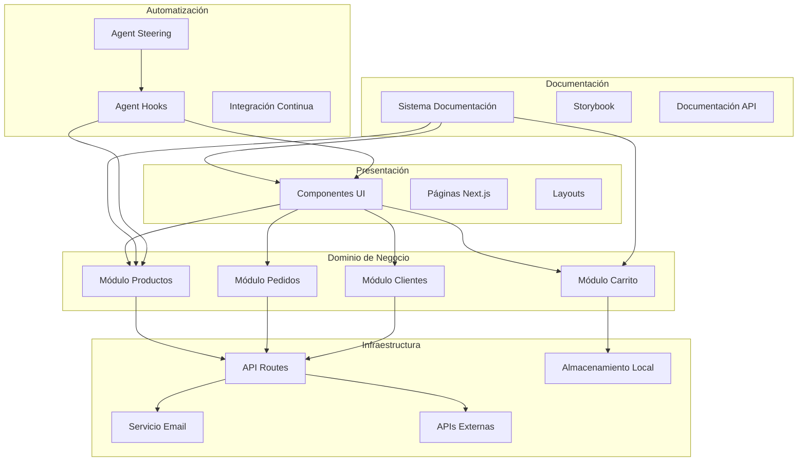

# Documento de Diseño - Documentación y Arquitectura Modular

## Visión General

El diseño propone una arquitectura modular basada en Domain-Driven Design (DDD) para el e-commerce "Mandorla", implementando principios SOLID y clean code. La solución incluye un sistema de documentación interactiva, configuración de agent hooks y steering rules para mantener la calidad y consistencia del código.

## Arquitectura

### Arquitectura de Alto Nivel



### Arquitectura Modular por Dominios

La aplicación se organizará en módulos independientes siguiendo el patrón de arquitectura hexagonal:

```
src/
├── modules/
│   ├── productos/
│   │   ├── domain/          # Entidades y reglas de negocio
│   │   ├── application/     # Casos de uso y servicios
│   │   ├── infrastructure/  # Implementaciones concretas
│   │   └── presentation/    # Componentes UI específicos
│   ├── carrito/
│   ├── pedidos/
│   └── clientes/
├── shared/                  # Código compartido
│   ├── components/         # Componentes UI reutilizables
│   ├── hooks/             # Hooks personalizados
│   ├── utils/             # Utilidades generales
│   └── types/             # Tipos compartidos
└── docs/                   # Sistema de documentación
```

## Componentes y Interfaces

### 1. Sistema de Documentación Interactiva

#### Componente DocumentationSystem

```typescript
interface DocumentationSystem {
  // Generación automática de documentación
  generateComponentDocs(componentPath: string): ComponentDocumentation
  generateAPIDocumentation(apiPath: string): APIDocumentation
  generateArchitectureDiagrams(): ArchitectureDiagram[]
  
  // Documentación interactiva
  renderInteractiveExample(component: React.Component): InteractiveExample
  createPlayground(component: React.Component): ComponentPlayground
}

interface ComponentDocumentation {
  name: string
  description: string
  props: PropDefinition[]
  examples: CodeExample[]
  useCases: UseCase[]
  relatedComponents: string[]
}
```

#### Estructura de Documentación

```typescript
interface DocumentationStructure {
  arquitectura: {
    vision: string
    principios: string[]
    patrones: DesignPattern[]
    diagramas: Diagram[]
  }
  modulos: ModuleDocumentation[]
  componentes: ComponentDocumentation[]
  apis: APIDocumentation[]
  guias: {
    desarrollo: DevelopmentGuide
    testing: TestingGuide
    deployment: DeploymentGuide
  }
}
```

### 2. Módulos de Dominio

#### Módulo de Productos

```typescript
// Domain Layer
interface ProductEntity {
  id: ProductId
  name: string
  description: string
  price: Money
  category: ProductCategory
  availability: ProductAvailability
  
  // Métodos de dominio
  updatePrice(newPrice: Money): void
  changeAvailability(available: boolean): void
  addToCategory(category: ProductCategory): void
}

// Application Layer
interface ProductService {
  getAllProducts(): Promise<Product[]>
  getProductById(id: ProductId): Promise<Product>
  searchProducts(criteria: SearchCriteria): Promise<Product[]>
  updateProduct(id: ProductId, updates: ProductUpdates): Promise<void>
}

// Infrastructure Layer
interface ProductRepository {
  findAll(): Promise<ProductEntity[]>
  findById(id: ProductId): Promise<ProductEntity | null>
  save(product: ProductEntity): Promise<void>
  delete(id: ProductId): Promise<void>
}
```

#### Módulo de Carrito

```typescript
// Domain Layer
interface CartEntity {
  id: CartId
  items: CartItem[]
  customer: CustomerId
  
  // Métodos de dominio
  addItem(product: ProductEntity, quantity: number): void
  removeItem(productId: ProductId): void
  updateQuantity(productId: ProductId, quantity: number): void
  calculateTotal(): Money
  clear(): void
}

// Application Layer
interface CartService {
  getCart(customerId: CustomerId): Promise<CartEntity>
  addToCart(customerId: CustomerId, productId: ProductId, quantity: number): Promise<void>
  removeFromCart(customerId: CustomerId, productId: ProductId): Promise<void>
  clearCart(customerId: CustomerId): Promise<void>
}
```

### 3. Sistema de Agent Hooks

#### Configuración de Hooks

```typescript
interface AgentHookConfiguration {
  name: string
  trigger: HookTrigger
  actions: HookAction[]
  conditions?: HookCondition[]
  enabled: boolean
}

interface HookTrigger {
  type: 'file-save' | 'git-commit' | 'manual' | 'schedule'
  pattern?: string
  files?: string[]
}

interface HookAction {
  type: 'lint' | 'format' | 'test' | 'document' | 'build'
  command: string
  options?: Record<string, any>
}
```

#### Hooks Específicos

```typescript
const developmentHooks: AgentHookConfiguration[] = [
  {
    name: 'auto-format-on-save',
    trigger: { type: 'file-save', pattern: '**/*.{ts,tsx,js,jsx}' },
    actions: [
      { type: 'format', command: 'prettier --write' },
      { type: 'lint', command: 'eslint --fix' }
    ],
    enabled: true
  },
  {
    name: 'update-component-docs',
    trigger: { type: 'file-save', pattern: 'src/components/**/*.tsx' },
    actions: [
      { type: 'document', command: 'generate-component-docs' }
    ],
    enabled: true
  },
  {
    name: 'run-related-tests',
    trigger: { type: 'file-save', pattern: 'src/**/*.{ts,tsx}' },
    actions: [
      { type: 'test', command: 'jest --findRelatedTests' }
    ],
    enabled: true
  }
]
```

### 4. Sistema de Agent Steering

#### Reglas de Steering

```typescript
interface SteeringRule {
  name: string
  description: string
  scope: 'global' | 'module' | 'component'
  pattern?: string
  rules: Rule[]
  examples: CodeExample[]
}

interface Rule {
  type: 'naming' | 'structure' | 'pattern' | 'documentation'
  rule: string
  severity: 'error' | 'warning' | 'info'
}
```

#### Configuración de Steering

```typescript
const steeringRules: SteeringRule[] = [
  {
    name: 'Convenciones de Nomenclatura',
    description: 'Reglas para nombres de archivos, componentes y variables en español',
    scope: 'global',
    rules: [
      {
        type: 'naming',
        rule: 'Los componentes deben usar PascalCase y nombres descriptivos en español',
        severity: 'error'
      },
      {
        type: 'naming',
        rule: 'Los archivos de módulos deben usar kebab-case',
        severity: 'error'
      }
    ]
  },
  {
    name: 'Arquitectura Modular',
    description: 'Reglas para mantener la separación de responsabilidades',
    scope: 'module',
    rules: [
      {
        type: 'structure',
        rule: 'Cada módulo debe tener carpetas domain, application, infrastructure y presentation',
        severity: 'error'
      },
      {
        type: 'pattern',
        rule: 'Los componentes de presentación no deben importar directamente de infrastructure',
        severity: 'error'
      }
    ]
  }
]
```

## Modelos de Datos

### Estructura de Documentación

```typescript
interface DocumentationModel {
  id: string
  title: string
  content: string
  type: 'component' | 'module' | 'api' | 'guide'
  tags: string[]
  lastUpdated: Date
  author: string
  examples: InteractiveExample[]
  relatedDocs: string[]
}

interface InteractiveExample {
  id: string
  title: string
  description: string
  code: string
  preview: React.Component
  editable: boolean
}
```

### Configuración de Módulos

```typescript
interface ModuleConfiguration {
  name: string
  description: string
  domain: DomainDefinition
  dependencies: string[]
  exports: ExportDefinition[]
  documentation: DocumentationConfig
}

interface DomainDefinition {
  entities: EntityDefinition[]
  valueObjects: ValueObjectDefinition[]
  services: ServiceDefinition[]
  repositories: RepositoryDefinition[]
}
```

## Manejo de Errores

### Sistema de Errores Tipados

```typescript
// Errores de dominio
abstract class DomainError extends Error {
  abstract readonly code: string
  abstract readonly type: 'validation' | 'business' | 'not-found'
}

class ProductNotFoundError extends DomainError {
  readonly code = 'PRODUCT_NOT_FOUND'
  readonly type = 'not-found'
  
  constructor(productId: string) {
    super(`Producto con ID ${productId} no encontrado`)
  }
}

class InvalidQuantityError extends DomainError {
  readonly code = 'INVALID_QUANTITY'
  readonly type = 'validation'
  
  constructor(quantity: number) {
    super(`Cantidad inválida: ${quantity}. Debe ser mayor a 0`)
  }
}
```

### Manejo de Errores en Servicios

```typescript
interface ErrorHandler {
  handleDomainError(error: DomainError): ErrorResponse
  handleInfrastructureError(error: Error): ErrorResponse
  logError(error: Error, context: ErrorContext): void
}

interface ErrorResponse {
  success: false
  error: {
    code: string
    message: string
    details?: any
  }
}
```

## Estrategia de Testing

### Estructura de Testing

```typescript
interface TestingStrategy {
  unit: {
    domain: 'Pruebas de entidades y value objects'
    application: 'Pruebas de casos de uso y servicios'
    infrastructure: 'Pruebas de repositorios y adaptadores'
  }
  integration: {
    api: 'Pruebas de endpoints'
    database: 'Pruebas de persistencia'
    external: 'Pruebas de servicios externos'
  }
  e2e: {
    user_flows: 'Flujos completos de usuario'
    critical_paths: 'Caminos críticos del negocio'
  }
}
```

### Configuración de Testing

```typescript
interface TestConfiguration {
  framework: 'jest' | 'vitest'
  coverage: {
    threshold: number
    exclude: string[]
  }
  mocks: {
    external_apis: boolean
    database: boolean
    file_system: boolean
  }
  fixtures: {
    products: ProductFixture[]
    customers: CustomerFixture[]
    orders: OrderFixture[]
  }
}
```

## Code Splitting y Optimización

### Estrategia de Code Splitting

```typescript
interface CodeSplittingStrategy {
  route_based: {
    description: 'División por rutas principales'
    implementation: 'Next.js automatic code splitting'
  }
  component_based: {
    description: 'División por componentes pesados'
    implementation: 'React.lazy() y Suspense'
  }
  feature_based: {
    description: 'División por módulos de funcionalidad'
    implementation: 'Dynamic imports por módulo'
  }
}
```

### Configuración de Optimización

```typescript
interface OptimizationConfig {
  bundling: {
    splitChunks: {
      vendor: 'Librerías de terceros'
      common: 'Código compartido'
      modules: 'Módulos de dominio'
    }
  }
  loading: {
    preload: string[]
    prefetch: string[]
    lazy: string[]
  }
  caching: {
    static: 'Recursos estáticos'
    api: 'Respuestas de API'
    components: 'Componentes renderizados'
  }
}
```

## Implementación de Documentación

### Generador de Documentación

```typescript
interface DocumentationGenerator {
  generateFromComponents(path: string): ComponentDocs[]
  generateFromTypes(path: string): TypeDocs[]
  generateFromAPIs(path: string): APIDocs[]
  generateArchitectureDiagrams(): Diagram[]
  
  // Documentación interactiva
  createPlayground(component: React.Component): Playground
  generateExamples(component: React.Component): Example[]
}
```

### Sistema de Plantillas

```typescript
interface DocumentationTemplate {
  component: {
    header: string
    description: string
    props_table: string
    examples: string
    usage_notes: string
  }
  module: {
    overview: string
    architecture: string
    api_reference: string
    examples: string
  }
  api: {
    endpoint_description: string
    parameters: string
    responses: string
    examples: string
  }
}
```

Este diseño proporciona una base sólida para implementar una arquitectura modular completa con documentación interactiva, siguiendo principios SOLID y clean code, mientras mantiene la flexibilidad para el crecimiento futuro del proyecto Mandorla.