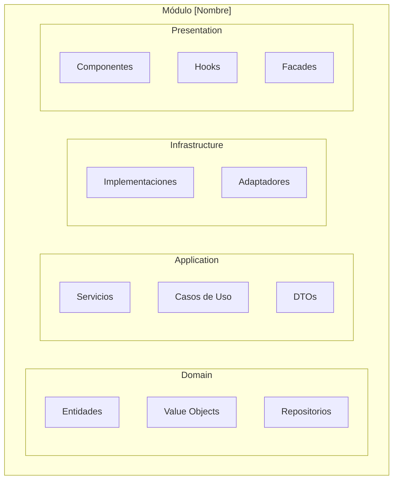

# Reglas de Documentación Consistente - Proyecto Mandorla

## Propósito

Estas reglas aseguran que toda la documentación generada automáticamente mantenga un formato consistente, esté en español y siga los estándares establecidos para el proyecto e-commerce Mandorla.

## Estructura de Documentación Obligatoria

### Documentación de Componentes React

**Formato Estándar para Componentes**

```markdown
# [NombreComponente]

## Descripción
[Descripción clara del propósito del componente en el contexto de la panadería Mandorla]

## Uso Básico
```tsx
import { [NombreComponente] } from '@/components/[ruta]'

function EjemploUso() {
  return (
    <[NombreComponente]
      // props básicas con valores de ejemplo
    />
  )
}
```

## Props

| Prop | Tipo | Requerida | Default | Descripción |
|------|------|-----------|---------|-------------|
| prop1 | string | ✅ | - | Descripción en español |
| prop2 | number | ❌ | 0 | Descripción en español |

## Ejemplos de Uso

### Ejemplo 1: Caso Básico

```tsx
// Ejemplo con datos reales de la panadería
<ListaProductos 
  productos={productosGalletas}
  mostrarPrecios={true}
/>
```

### Ejemplo 2: Caso Avanzado

```tsx
// Ejemplo con funcionalidad completa
<FormularioCliente
  onSubmit={manejarEnvio}
  validacionTiempoReal={true}
  mostrarCamposOpcionales={false}
/>
```

## Variantes

[Si el componente tiene variantes usando class-variance-authority]

## Accesibilidad

- [Características de accesibilidad implementadas]
- [Soporte para lectores de pantalla]
- [Navegación por teclado]

## Notas de Implementación

- [Detalles técnicos importantes]
- [Patrones de diseño utilizados]
- [Consideraciones de rendimiento]

## Componentes Relacionados

- [Enlaces a componentes relacionados]

## Changelog

- [Fecha]: [Cambios realizados]

```

### Documentación de APIs

**Formato Estándar para APIs**
```markdown
# API: [Nombre del Endpoint]

## Información General
- **Método**: [GET/POST/PUT/DELETE]
- **Ruta**: `/api/[ruta]`
- **Descripción**: [Propósito del endpoint en el contexto de Mandorla]
- **Autenticación**: [Requerida/No requerida]
- **Versión**: v1

## Parámetros

### Parámetros de Ruta
| Parámetro | Tipo | Descripción | Ejemplo |
|-----------|------|-------------|---------|
| id | string | ID del recurso | "prod-123" |

### Parámetros de Query
| Parámetro | Tipo | Requerido | Default | Descripción |
|-----------|------|-----------|---------|-------------|
| categoria | string | ❌ | "todos" | Filtrar por categoría |
| limite | number | ❌ | 10 | Elementos por página |

### Body (POST/PUT)
```json
{
  "nombre": "Pan Integral",
  "precio": 2500,
  "categoria": "panes",
  "disponible": true
}
```

## Respuestas

### Respuesta Exitosa (200/201)

```json
{
  "success": true,
  "data": {
    "id": "prod-123",
    "nombre": "Pan Integral",
    "precio": 2500,
    "categoria": "panes"
  },
  "message": "Operación completada exitosamente"
}
```

### Respuestas de Error

#### 400 - Solicitud Inválida

```json
{
  "success": false,
  "error": {
    "code": "VALIDATION_ERROR",
    "message": "Datos de entrada inválidos",
    "details": {
      "precio": "El precio debe ser mayor a 0"
    }
  }
}
```

## Ejemplos de Uso

### Ejemplo con cURL

```bash
# Obtener productos de galletas
curl -X GET "http://localhost:3000/api/productos?categoria=galletas" \
  -H "Content-Type: application/json"

# Crear nuevo producto
curl -X POST "http://localhost:3000/api/productos" \
  -H "Content-Type: application/json" \
  -d '{
    "nombre": "Galletas de Chocolate",
    "precio": 1500,
    "categoria": "galletas"
  }'
```

### Ejemplo con JavaScript/TypeScript

```typescript
// Usando fetch para obtener productos
const obtenerProductos = async (categoria?: string) => {
  const url = categoria 
    ? `/api/productos?categoria=${categoria}`
    : '/api/productos'
    
  const response = await fetch(url)
  const data = await response.json()
  
  if (data.success) {
    return data.data
  } else {
    throw new Error(data.error.message)
  }
}

// Crear nuevo producto
const crearProducto = async (datosProducto: CrearProductoDto) => {
  const response = await fetch('/api/productos', {
    method: 'POST',
    headers: {
      'Content-Type': 'application/json',
    },
    body: JSON.stringify(datosProducto)
  })
  
  const result = await response.json()
  
  if (!result.success) {
    throw new Error(result.error.message)
  }
  
  return result.data
}
```

## Validaciones

[Esquemas Zod si aplican]

## Integración con Módulos

[Servicios y repositorios utilizados]

## Testing

[Ejemplos de tests para el endpoint]

```

### Documentación de Módulos

**Formato Estándar para Módulos**
```markdown
# Módulo: [Nombre del Módulo]

## Descripción
[Descripción del módulo en el contexto del negocio de panadería]

## Arquitectura del Módulo



## Entidades de Dominio

### [NombreEntidad]

- **Propósito**: [Descripción de la entidad]
- **Responsabilidades**: [Lista de responsabilidades]
- **Reglas de Negocio**: [Reglas específicas]

## Servicios de Aplicación

### [NombreServicio]

- **Casos de Uso**: [Lista de casos de uso]
- **Dependencias**: [Repositorios e interfaces utilizadas]

## Componentes de Presentación

### [NombreComponente]

- **Propósito**: [Función en la UI]
- **Integración**: [Cómo se conecta con servicios]

## Flujos de Datos

[Descripción de cómo fluyen los datos en el módulo]

## APIs Expuestas

[Lista de endpoints que expone el módulo]

## Eventos de Dominio

[Eventos que emite o escucha el módulo]

## Testing

[Estrategia de testing del módulo]

```

## Reglas de Contenido

### 1. Idioma y Terminología

**Uso Consistente del Español**
```markdown
// ✅ CORRECTO: Documentación en español
## Descripción
Este componente muestra la lista de productos disponibles en la panadería Mandorla, 
permitiendo a los clientes navegar por las diferentes categorías como galletas, 
pasteles, panes y productos de temporada.

## Props
| Prop | Tipo | Descripción |
|------|------|-------------|
| productos | Producto[] | Lista de productos a mostrar |
| mostrarPrecios | boolean | Si se deben mostrar los precios |

// ❌ INCORRECTO: Mezcla de idiomas
## Description
Este component shows the lista de productos available en la bakery.

## Props
| Prop | Type | Descripción |
|------|------|-------------|
| products | Product[] | List de productos to show |
```

**Terminología Específica del Negocio**

```markdown
// ✅ CORRECTO: Usar terminología de panadería
- "productos horneados" en lugar de "items"
- "carrito de compras" en lugar de "shopping cart"
- "pedido" en lugar de "order"
- "cliente" en lugar de "user"
- "panadería" en lugar de "store"

// ✅ Ejemplos específicos del negocio
```tsx
// Ejemplo con productos reales de panadería
<ListaProductos 
  productos={[
    { nombre: "Croissants de Mantequilla", precio: 1200, categoria: "pasteles" },
    { nombre: "Pan Integral", precio: 2500, categoria: "panes" },
    { nombre: "Galletas de Chocolate", precio: 800, categoria: "galletas" }
  ]}
/>
```

```

### 2. Ejemplos de Código

**Ejemplos Realistas y Funcionales**
```markdown
// ✅ CORRECTO: Ejemplos con datos reales del negocio
```tsx
// Ejemplo de uso en página de productos
function PaginaProductos() {
  const [productos, setProductos] = useState<Producto[]>([])
  const [categoria, setCategoria] = useState<CategoriaProducto>('todos')
  
  useEffect(() => {
    const cargarProductos = async () => {
      try {
        const productosObtenidos = await productoService.obtenerPorCategoria(categoria)
        setProductos(productosObtenidos)
      } catch (error) {
        console.error('Error al cargar productos:', error)
      }
    }
    
    cargarProductos()
  }, [categoria])
  
  return (
    <div className="pagina-productos">
      <FiltroCategoria 
        categoriaActual={categoria}
        onCambiarCategoria={setCategoria}
      />
      <ListaProductos 
        productos={productos}
        onAgregarAlCarrito={manejarAgregarAlCarrito}
      />
    </div>
  )
}
```

// ❌ INCORRECTO: Ejemplos genéricos sin contexto

```tsx
// Ejemplo básico
function Example() {
  return <Component data={data} />
}
```

```

### 3. Estructura de Metadatos

**Metadatos Obligatorios**
```yaml
---
title: [Título del documento]
category: [components/apis/modules/guides]
tags: [panaderia, e-commerce, react, typescript]
lastUpdated: [fecha ISO]
author: Sistema de documentación automática
version: [versión]
status: [stable/beta/deprecated]
businessContext: [contexto específico del negocio]
related:
  - [documento-relacionado-1.md]
  - [documento-relacionado-2.md]
---
```

### 4. Enlaces y Referencias

**Sistema de Enlaces Cruzados**

```markdown
// ✅ CORRECTO: Enlaces descriptivos y contextualizados
## Componentes Relacionados
- [TarjetaProducto](./tarjeta-producto.docs.md) - Muestra información individual de cada producto
- [FiltroCategoria](./filtro-categoria.docs.md) - Permite filtrar productos por categoría
- [BotonAgregarCarrito](../carrito/boton-agregar-carrito.docs.md) - Botón para agregar productos al carrito

## APIs Utilizadas
- [API de Productos](../apis/productos.api.md) - Para obtener lista de productos
- [API de Carrito](../apis/carrito.api.md) - Para agregar productos al carrito

## Flujos de Negocio
- [Flujo de Compra](../flows/flujo-compra.md) - Proceso completo desde selección hasta pago
```

## Validaciones de Calidad

### Checklist de Documentación

**Para Componentes React**

- [ ] Título descriptivo en español
- [ ] Descripción clara del propósito
- [ ] Tabla completa de props con tipos
- [ ] Al menos 2 ejemplos de uso funcionales
- [ ] Información de accesibilidad
- [ ] Enlaces a componentes relacionados
- [ ] Ejemplos con datos reales de panadería

**Para APIs**

- [ ] Información completa del endpoint
- [ ] Documentación de todos los parámetros
- [ ] Ejemplos de respuestas exitosas y de error
- [ ] Ejemplos de uso con cURL y JavaScript
- [ ] Códigos de estado HTTP documentados
- [ ] Esquemas de validación (Zod)

**Para Módulos**

- [ ] Diagrama de arquitectura actualizado
- [ ] Descripción de entidades de dominio
- [ ] Lista de servicios y casos de uso
- [ ] Flujos de datos documentados
- [ ] APIs expuestas listadas
- [ ] Estrategia de testing definida

### Validaciones Automáticas

**Detección de Problemas**

```typescript
// Reglas conceptuales para validar documentación
{
  rules: {
    'mandorla/documentation-language': {
      'require-spanish': true,
      'detect-mixed-languages': true,
      'business-terminology': true
    },
    'mandorla/documentation-completeness': {
      'require-description': true,
      'require-examples': true,
      'require-props-table': true,
      'require-related-links': true
    },
    'mandorla/documentation-quality': {
      'realistic-examples': true,
      'business-context': true,
      'functional-code': true
    }
  }
}
```

## Plantillas de Documentación

### Plantilla para Componentes UI Base

```markdown
# [NombreComponente] (UI Base)

## Descripción
Componente UI base del sistema de diseño de Mandorla, construido sobre Radix UI primitives.

## Instalación
Este componente es parte del sistema de componentes base y se instala automáticamente.

## Uso Básico
[Ejemplo mínimo]

## Variantes
[Documentar todas las variantes disponibles]

## Personalización
[Cómo personalizar el componente con Tailwind CSS]

## Accesibilidad
[Características de accesibilidad heredadas de Radix UI]
```

### Plantilla para Componentes de Dominio

```markdown
# [NombreComponente] (Dominio: [Módulo])

## Descripción
[Descripción específica del contexto de negocio]

## Integración con Servicios
[Cómo se conecta con servicios de dominio]

## Estados de Carga y Error
[Manejo de estados asíncronos]

## Casos de Uso del Negocio
[Escenarios específicos de la panadería]
```

### Plantilla para Hooks Personalizados

```markdown
# [nombreHook]

## Descripción
[Propósito del hook en el contexto de Mandorla]

## Uso
```tsx
const { data, loading, error } = [nombreHook](parametros)
```

## Parámetros

[Documentar parámetros de entrada]

## Valores de Retorno

[Documentar objeto de retorno]

## Ejemplos de Uso

[Ejemplos en contexto de panadería]

## Dependencias

[Otros hooks o servicios utilizados]

```

## Automatización de Documentación

### Generación Automática
```typescript
// Configuración para generación automática
interface DocumentationConfig {
  language: 'es'
  businessContext: 'panaderia-ecommerce'
  includeExamples: true
  exampleDataSource: 'mandorla-mock-data'
  linkGeneration: 'automatic'
  metadataGeneration: true
  qualityValidation: true
}
```

### Actualización Continua

```typescript
// Triggers para actualización automática
const documentationTriggers = {
  onComponentChange: 'update-component-docs',
  onAPIChange: 'update-api-docs',
  onModuleStructureChange: 'update-module-docs',
  onTypeChange: 'update-type-docs'
}
```

## Beneficios de la Documentación Consistente

### Para Desarrolladores

- Documentación predecible y fácil de navegar
- Ejemplos funcionales que se pueden copiar y usar
- Contexto de negocio claro en cada componente

### Para el Equipo

- Onboarding más rápido con documentación en español
- Estándares consistentes en todo el proyecto
- Menos tiempo buscando información

### Para el Negocio

- Documentación alineada con el dominio de panadería
- Ejemplos realistas que reflejan casos de uso reales
- Mantenimiento más eficiente de la documentación

### Para Mantenimiento

- Documentación siempre actualizada automáticamente
- Validación de calidad integrada
- Enlaces cruzados que se mantienen sincronizados
