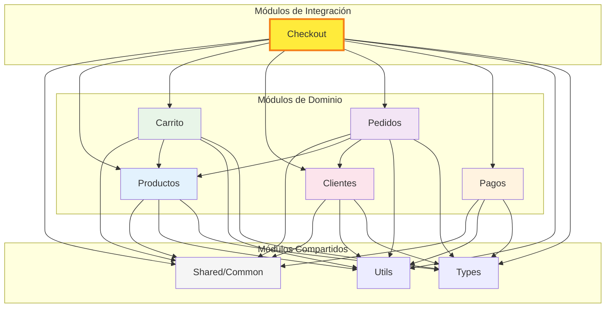
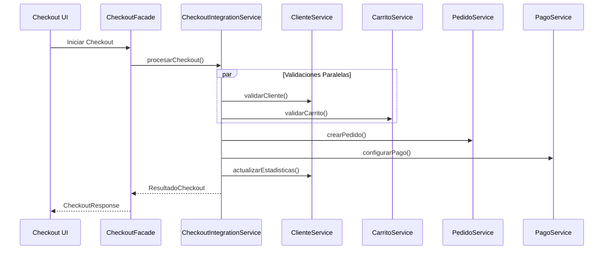
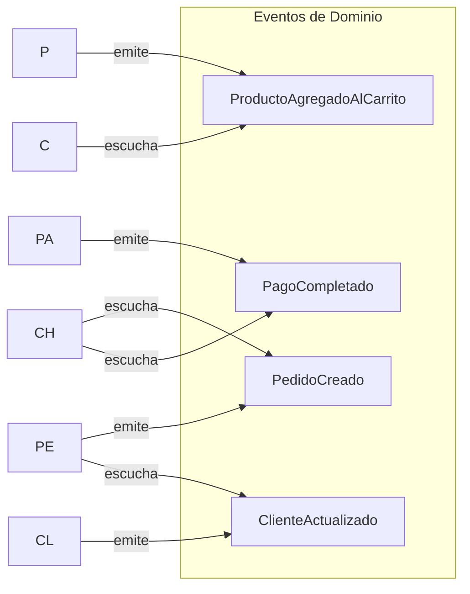

# Dependencias entre Módulos - Proyecto Mandorla

## Descripción

Este diagrama muestra las dependencias entre todos los módulos del sistema, incluyendo el nuevo módulo de checkout que actúa como integrador.

## Diagrama de Dependencias Actualizado



## Análisis de Dependencias por Módulo

### Módulo Checkout (Integrador)

**Dependencias Directas:**

- ✅ Productos: Para validar disponibilidad y obtener información
- ✅ Carrito: Para obtener items y calcular totales
- ✅ Clientes: Para validar cliente y actualizar estadísticas
- ✅ Pedidos: Para crear y gestionar pedidos
- ✅ Pagos: Para procesar pagos y configurar métodos de pago

**Rol:** Orquestador que coordina el flujo completo de checkout

### Módulos de Dominio Principal

#### Productos

**Dependencias:**

- Shared/Common (tipos base, utilidades)
- Utils (funciones de validación, formateo)
- Types (definiciones de tipos)

**Dependientes:**

- Carrito, Pedidos, Checkout

#### Carrito

**Dependencias:**

- Productos (para validar items)
- Shared/Common, Utils, Types

**Dependientes:**

- Checkout

#### Clientes

**Dependencias:**

- Shared/Common, Utils, Types

**Dependientes:**

- Pedidos, Checkout

#### Pedidos

**Dependencias:**

- Productos (información de items)
- Clientes (datos del cliente)
- Shared/Common, Utils, Types

**Dependientes:**

- Checkout

#### Pagos

**Dependencias:**

- Shared/Common, Utils, Types

**Dependientes:**

- Checkout

## Reglas de Dependencias

### ✅ Dependencias Permitidas

1. **Módulos de Dominio → Shared/Common**: Todos los módulos pueden usar utilidades compartidas
2. **Módulos de Dominio → Utils**: Funciones utilitarias comunes
3. **Módulos de Dominio → Types**: Tipos compartidos
4. **Carrito → Productos**: Para validar y obtener información de productos
5. **Pedidos → Productos**: Para crear items de pedido
6. **Pedidos → Clientes**: Para asociar pedidos con clientes
7. **Checkout → Todos**: Como módulo integrador puede depender de todos los demás

### ❌ Dependencias Prohibidas

1. **Productos → Carrito**: Los productos no deben conocer el carrito
2. **Productos → Pedidos**: Los productos no deben conocer los pedidos
3. **Clientes → Productos**: Los clientes no deben depender directamente de productos
4. **Dependencias Circulares**: Ningún módulo debe crear ciclos de dependencia

## Comunicación entre Módulos

### Patrón de Integración Usado por Checkout



### Eventos de Dominio (Comunicación Asíncrona)



## Validaciones de Arquitectura

### Detección Automática de Violaciones

```typescript
// Reglas de validación implementadas
const dependencyRules = {
  // Módulos que NO pueden importar de otros módulos de dominio
  'productos': {
    forbidden: ['carrito', 'pedidos', 'clientes', 'pagos', 'checkout']
  },
  'clientes': {
    forbidden: ['productos', 'carrito', 'pedidos', 'pagos', 'checkout']
  },
  'pagos': {
    forbidden: ['productos', 'carrito', 'pedidos', 'clientes', 'checkout']
  },
  
  // Módulos con dependencias limitadas
  'carrito': {
    allowed: ['productos'],
    forbidden: ['pedidos', 'clientes', 'pagos', 'checkout']
  },
  'pedidos': {
    allowed: ['productos', 'clientes'],
    forbidden: ['carrito', 'pagos', 'checkout']
  },
  
  // Módulo integrador
  'checkout': {
    allowed: ['productos', 'carrito', 'clientes', 'pedidos', 'pagos'],
    forbidden: [] // Puede depender de todos como integrador
  }
};
```

### Métricas de Dependencias

| Módulo | Dependencias Salientes | Dependencias Entrantes | Estabilidad |
|--------|----------------------|----------------------|-------------|
| Productos | 3 (shared, utils, types) | 4 (carrito, pedidos, checkout, pagos) | Estable |
| Clientes | 3 (shared, utils, types) | 2 (pedidos, checkout) | Estable |
| Pagos | 3 (shared, utils, types) | 1 (checkout) | Estable |
| Carrito | 4 (productos + shared) | 1 (checkout) | Semi-estable |
| Pedidos | 5 (productos, clientes + shared) | 1 (checkout) | Semi-estable |
| Checkout | 8 (todos los módulos) | 0 | Inestable (por diseño) |

## Beneficios de esta Arquitectura

### 1. Separación Clara de Responsabilidades

- Cada módulo tiene un propósito específico
- El checkout actúa como orquestador sin duplicar lógica

### 2. Mantenibilidad

- Cambios en un módulo no afectan otros (excepto checkout)
- Fácil testing unitario por módulo

### 3. Escalabilidad

- Nuevos módulos pueden agregarse sin afectar existentes
- El patrón de integración es reutilizable

### 4. Flexibilidad

- Diferentes implementaciones de servicios
- Fácil intercambio de componentes

## Última Actualización

- **Fecha**: 2025-01-19
- **Cambios**:
  - Agregado módulo Checkout como integrador
  - Documentadas dependencias del checkout con todos los módulos
  - Actualizado diagrama de comunicación entre módulos
  - Agregadas métricas de estabilidad de módulos
