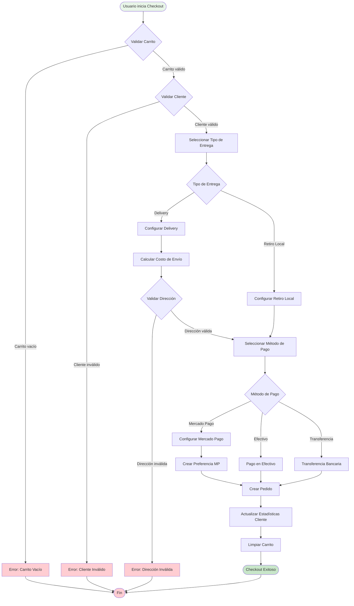
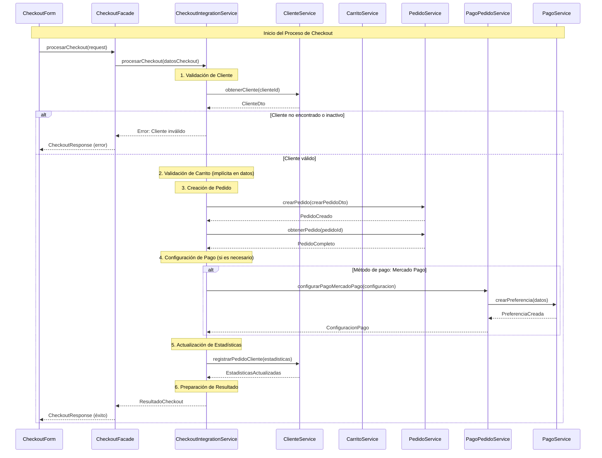
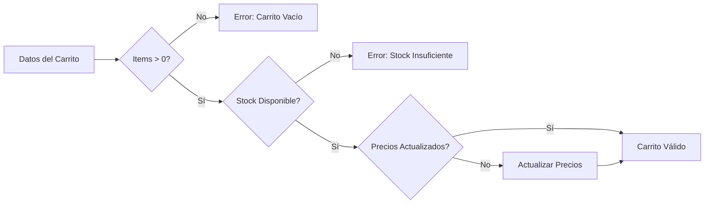
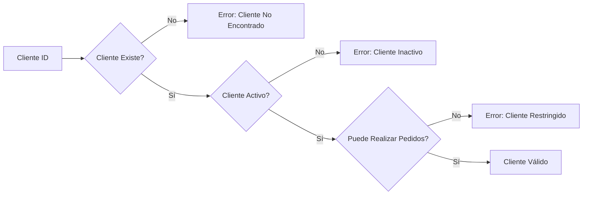
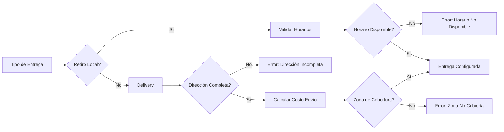
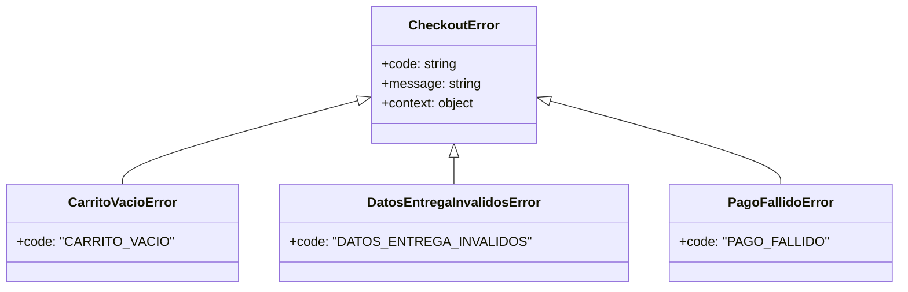
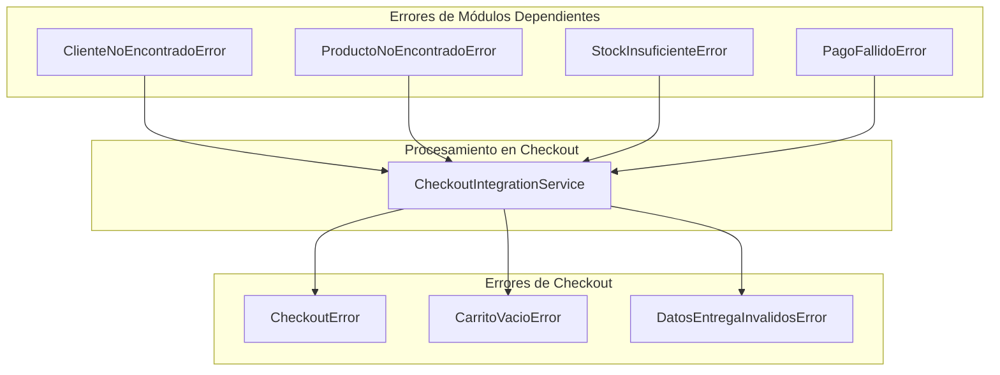
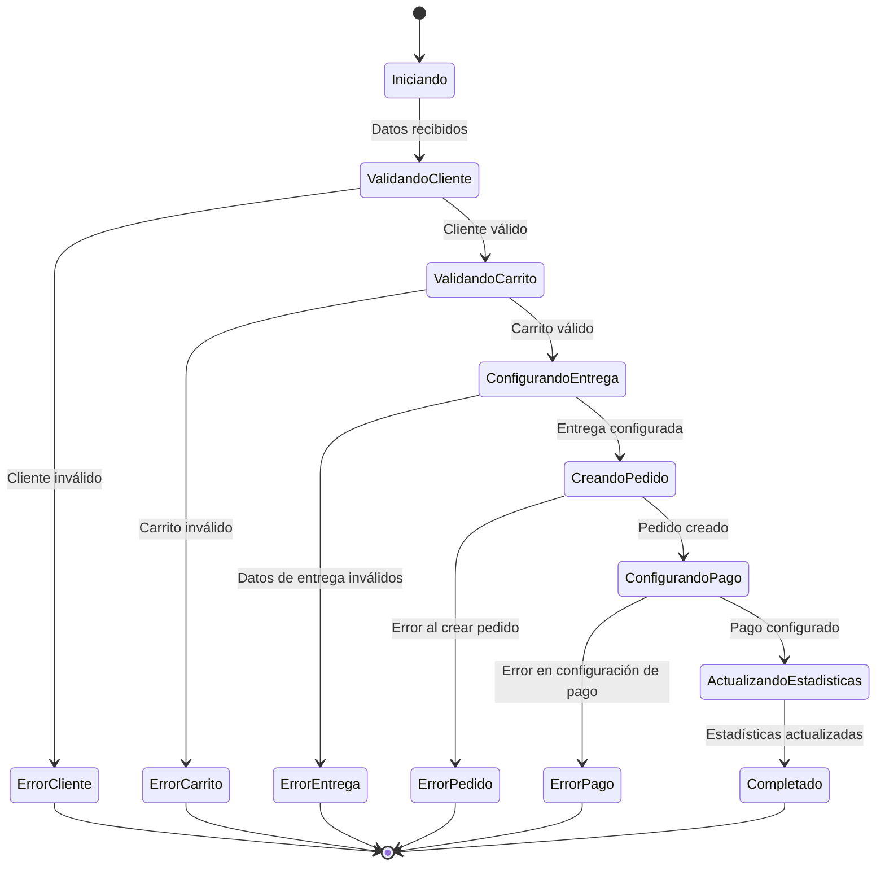
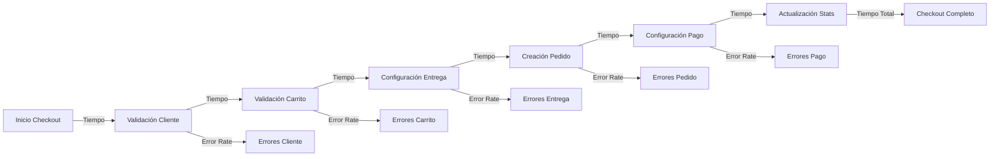

# Flujo de Checkout - Proceso Completo

## Descripción

Este diagrama documenta el flujo completo del proceso de checkout, desde la iniciación hasta la confirmación del pedido, mostrando todas las integraciones entre módulos.

## Flujo Principal de Checkout

## Flujo Detallado por Servicios

## Validaciones en Cada Paso

### 1. Validación de Carrito

### 2. Validación de Cliente

### 3. Validación de Entrega

## Manejo de Errores por Módulo

### Errores del Módulo Checkout

### Propagación de Errores entre Módulos

## Estados del Proceso de Checkout

## Métricas y Monitoreo

### Puntos de Medición

### KPIs del Checkout

| Métrica | Descripción | Objetivo |
|---------|-------------|----------|
| Tiempo Total | Tiempo promedio de checkout completo | < 5 segundos |
| Tasa de Éxito | % de checkouts completados exitosamente | > 95% |
| Tasa de Abandono | % de checkouts iniciados pero no completados | < 10% |
| Errores por Módulo | Distribución de errores por módulo dependiente | Monitoreo |
| Métodos de Pago | Distribución de uso por método de pago | Análisis |

## Optimizaciones Implementadas

### 1. Validaciones Paralelas

- Validación de cliente y carrito en paralelo cuando es posible
- Validaciones tempranas para fallar rápido

### 2. Caching

- Cache de información de cliente frecuentemente accedida
- Cache de cálculos de envío por zona

### 3. Manejo de Errores

- Errores específicos con contexto detallado
- Logging estructurado para debugging
- Rollback automático en caso de fallas

## Última Actualización

- **Fecha**: 2025-01-19
- **Cambios**:
  - Documentado flujo completo de checkout con integraciones
  - Agregados diagramas de validación por paso
  - Documentado manejo de errores entre módulos
  - Agregadas métricas y puntos de monitoreo
