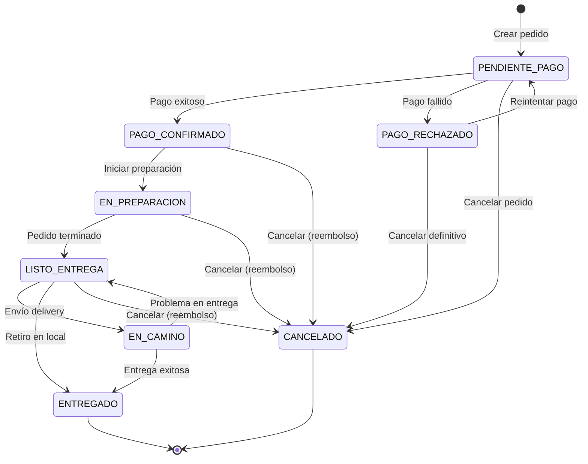
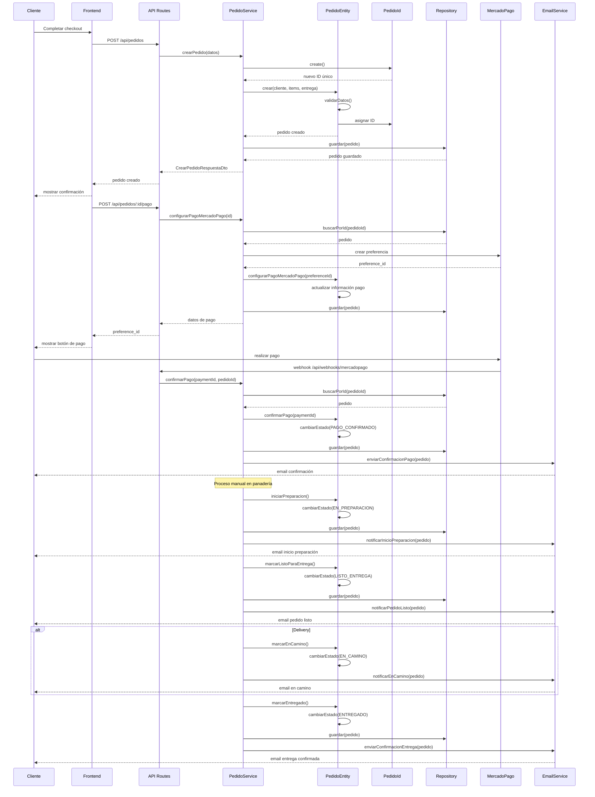
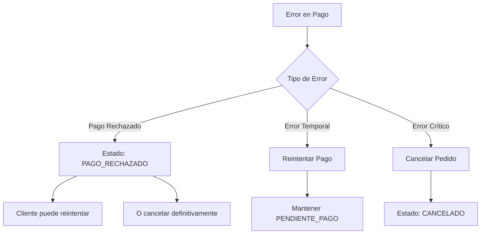

# Flujo del Ciclo de Vida del Pedido

## Descripción

Documentación completa del flujo de estados y procesos que sigue un pedido desde su creación hasta su finalización en el sistema Mandorla.

## Diagrama de Estados del Pedido



## Flujo Completo de Creación y Procesamiento



## Detalle de Estados y Transiciones

### PENDIENTE_PAGO

**Descripción**: Estado inicial del pedido, esperando confirmación de pago

**Acciones Permitidas**:

- Configurar método de pago
- Cancelar pedido
- Modificar datos de entrega (limitado)

**Transiciones Válidas**:

- → `PAGO_CONFIRMADO`: Cuando se confirma el pago
- → `PAGO_RECHAZADO`: Cuando el pago es rechazado
- → `CANCELADO`: Cuando el cliente cancela

**Validaciones**:

```typescript
// En PedidoEntity
configurarPagoMercadoPago(preferenceId: string): void {
  if (!this._estado.esPendientePago()) {
    throw new Error('Solo se puede configurar pago en pedidos pendientes');
  }
  // ... lógica de configuración
}
```

### PAGO_CONFIRMADO

**Descripción**: Pago procesado exitosamente, pedido confirmado

**Acciones Permitidas**:

- Iniciar preparación
- Cancelar con reembolso
- Ver detalles de pago

**Transiciones Válidas**:

- → `EN_PREPARACION`: Cuando se inicia la preparación
- → `CANCELADO`: Cancelación con reembolso

**Reglas de Negocio**:

- Debe existir información de pago válida
- El monto pagado debe coincidir con el total del pedido

### EN_PREPARACION

**Descripción**: Pedido siendo preparado en la panadería

**Acciones Permitidas**:

- Marcar como listo
- Cancelar con reembolso (excepcional)
- Actualizar tiempo estimado

**Transiciones Válidas**:

- → `LISTO_ENTREGA`: Cuando la preparación está completa
- → `CANCELADO`: Cancelación excepcional

**Validaciones**:

```typescript
iniciarPreparacion(): void {
  if (!this._estado.estaPagado()) {
    throw new Error('No se puede iniciar preparación sin pago confirmado');
  }
  // ... lógica de preparación
}
```

### LISTO_ENTREGA

**Descripción**: Pedido preparado y listo para entrega o retiro

**Acciones Permitidas**:

- Marcar en camino (delivery)
- Marcar como entregado (retiro)
- Cancelar (excepcional)

**Transiciones Válidas**:

- → `EN_CAMINO`: Para pedidos de delivery
- → `ENTREGADO`: Para retiro en local
- → `CANCELADO`: Cancelación excepcional

**Lógica Específica**:

```typescript
marcarEnCamino(): void {
  if (this._datosEntrega.tipo === 'RETIRO_LOCAL') {
    throw new Error('Los pedidos para retiro no pueden estar "en camino"');
  }
  this.cambiarEstado(EstadoPedidoEnum.EN_CAMINO, 'Pedido en camino al cliente');
}
```

### EN_CAMINO

**Descripción**: Pedido en camino al cliente (solo delivery)

**Acciones Permitidas**:

- Marcar como entregado
- Reportar problema en entrega

**Transiciones Válidas**:

- → `ENTREGADO`: Entrega exitosa
- → `LISTO_ENTREGA`: Problema en entrega, volver a local

### ENTREGADO

**Descripción**: Pedido entregado exitosamente al cliente

**Características**:

- Estado final del flujo exitoso
- No permite más transiciones
- Genera métricas de satisfacción

### CANCELADO

**Descripción**: Pedido cancelado por cualquier motivo

**Características**:

- Estado final del flujo
- Puede requerir reembolso según el estado anterior
- Registra motivo de cancelación

## Integración con PedidoId

### Trazabilidad del Pedido

```mermaid
graph LR
    subgraph "Generación de ID"
        A[Cliente crea pedido] --> B[PedidoId.create()]
        B --> C[ID: PED-ABC123DEF]
    end
    
    subgraph "Uso en Estados"
        C --> D[PENDIENTE_PAGO]
        D --> E[PAGO_CONFIRMADO]
        E --> F[EN_PREPARACION]
        F --> G[LISTO_ENTREGA]
        G --> H[ENTREGADO]
    end
    
    subgraph "Referencias Externas"
        C --> I[MercadoPago external_reference]
        C --> J[Email notifications]
        C --> K[Logs de auditoría]
    end
```

### Búsqueda y Consultas

```typescript
// Buscar pedido por ID en cualquier estado
const pedidoId = PedidoId.fromString("PED-ABC123DEF");
const pedido = await pedidoRepository.buscarPorId(pedidoId);

// Filtrar pedidos por estado
const pedidosEnPreparacion = await pedidoRepository.buscarPorEstado(
  EstadoPedidoEnum.EN_PREPARACION
);

// Historial de cambios de estado
const historial = pedido.historialEstados.map(estado => ({
  estado: estado.estado,
  fecha: estado.fechaCambio,
  motivo: estado.motivo
}));
```

## Manejo de Errores en el Flujo

### Errores de Transición de Estado

```typescript
// Error al intentar transición inválida
try {
  pedido.marcarEnCamino(); // Pedido en estado PENDIENTE_PAGO
} catch (error) {
  // Error: No se puede cambiar el estado de PENDIENTE_PAGO a EN_CAMINO
}

// Error de validación de negocio
try {
  pedido.iniciarPreparacion(); // Sin pago confirmado
} catch (error) {
  // Error: No se puede iniciar preparación sin pago confirmado
}
```

### Recuperación de Errores



## Métricas y Monitoreo

### KPIs del Flujo

```typescript
interface MetricasFlujo {
  tiempoPromedioPorEstado: {
    pendientePago: number; // minutos
    enPreparacion: number; // minutos
    listoEntrega: number;  // minutos
    enCamino: number;      // minutos
  };
  
  tasasConversion: {
    pagoExitoso: number;     // %
    preparacionCompleta: number; // %
    entregaExitosa: number;  // %
  };
  
  motivosCancelacion: {
    [motivo: string]: number; // cantidad
  };
}
```

### Alertas Automáticas

- Pedidos en PENDIENTE_PAGO > 30 minutos
- Pedidos en EN_PREPARACION > tiempo estimado
- Pedidos EN_CAMINO > tiempo máximo delivery
- Tasa de cancelación > umbral configurado

## Notificaciones por Estado

### Email Templates por Estado

```typescript
interface NotificacionesPorEstado {
  PAGO_CONFIRMADO: {
    template: 'confirmacion-pago';
    datos: { pedidoId: string; total: string; items: string };
  };
  
  EN_PREPARACION: {
    template: 'inicio-preparacion';
    datos: { pedidoId: string; tiempoEstimado: string };
  };
  
  LISTO_ENTREGA: {
    template: 'pedido-listo';
    datos: { pedidoId: string; tipoEntrega: string; direccion?: string };
  };
  
  EN_CAMINO: {
    template: 'en-camino';
    datos: { pedidoId: string; tiempoEstimado: string; repartidor?: string };
  };
  
  ENTREGADO: {
    template: 'entrega-confirmada';
    datos: { pedidoId: string; fechaEntrega: string; encuesta?: string };
  };
}
```

## Testing del Flujo

### Tests de Integración

```typescript
describe('Flujo Completo de Pedido', () => {
  it('debería completar flujo exitoso de retiro en local', async () => {
    // Crear pedido
    const pedido = await pedidoService.crearPedido(datosPedido);
    expect(pedido.estado).toBe('PENDIENTE_PAGO');
    
    // Confirmar pago
    await pedidoService.confirmarPago(pedido.id, paymentData);
    const pedidoConPago = await pedidoService.obtenerPedido(pedido.id);
    expect(pedidoConPago.estado).toBe('PAGO_CONFIRMADO');
    
    // Iniciar preparación
    await pedidoService.cambiarEstadoPedido(pedido.id, 'EN_PREPARACION');
    
    // Marcar listo
    await pedidoService.cambiarEstadoPedido(pedido.id, 'LISTO_ENTREGA');
    
    // Entregar (retiro)
    await pedidoService.cambiarEstadoPedido(pedido.id, 'ENTREGADO');
    
    const pedidoFinal = await pedidoService.obtenerPedido(pedido.id);
    expect(pedidoFinal.estado).toBe('ENTREGADO');
  });
});
```

## Última Actualización

- **Fecha**: 2024-12-19
- **Cambios**: Actualización automática por modificación en PedidoId value object
- **Impacto**: Mejor trazabilidad y consistencia en identificadores a lo largo del flujo
- **Versión**: 2.1.0
