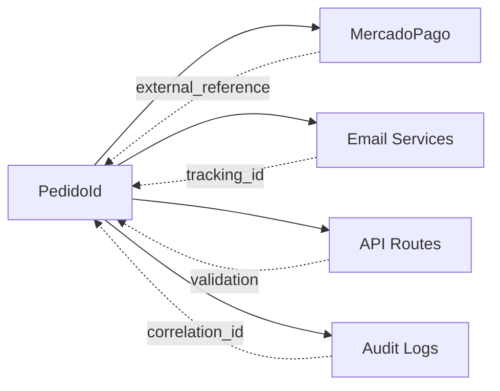

# Índice de Documentación de Arquitectura

## Descripción

Índice principal de toda la documentación de arquitectura del proyecto Mandorla, organizada por c
Documentación completa de la arquitectura modular hexagonal del proyecto e-commerce Mandorla, actualizada automáticamente con cada cambio en el código.

## 📊 Diagramas Actualizados

### Arquitectura General

- 📄 [Diagrama de Arquitectura General](./overview.md) - Vista completa del sistema
- 🔄 **Última actualización**: 2024-12-19 - Modificación en PedidoId value object

### Módulos Específicos

- 📄 [Módulo Pedidos](./modules/pedidos.md) - Arquitectura hexagonal del módulo de pedidos
- 📄 [**Módulo Checkout**](./modules/checkout.md) - **Módulo de integración de checkout** ⭐
- 📄 [Módulo Productos](./modules/productos.md) - Gestión del catálogo de productos *(pendiente)*
- 📄 [Módulo Carrito](./modules/carrito.md) - Manejo del carrito de compras *(pendiente)*
- 📄 [Módulo Clientes](./modules/clientes.md) - Gestión de clientes *(pendiente)*

### Value Objects

- 📄 [PedidoId Value Object](./value-objects/pedido-id.md) - Identificador único de pedidos
- 📄 [ProductId Value Object](./value-objects/product-id.md) - Identificador de productos *(pendiente)*
- 📄 [Money Value Object](./value-objects/money.md) - Representación de valores monetarios *(pendiente)*

### Flujos de Datos

- 📄 [Ciclo de Vida del Pedido](./flows/pedido-lifecycle.md) - Estados y transiciones de pedidos
- 📄 [**Flujo de Checkout**](./flows/checkout-flow.md) - **Proceso completo de checkout** ⭐
- 📄 [Flujo de Pago](./flows/payment-flow.md) - Integración con MercadoPago *(pendiente)*

### Dependencias

- 📄 [**Dependencias entre Módulos**](./dependencies/module-dependencies.md) - **Matriz de dependencias actualizada** 🔄
- 📄 [Comunicación entre Capas](./dependencies/layer-communication.md) - Patrones de comunicación *(pendiente)*

## 🔄 Cambios Detectados

### Modificación Reciente: PedidoId Value Object

**Fecha**: 2024-12-19  
**Archivo**: `src/modules/pedidos/domain/value-objects/pedido-id.ts`

**Cambios Arquitectónicos Identificados**:

- ✅ Implementación completa del value object PedidoId
- ✅ Validación de formato `PED-XXXXXX`
- ✅ Generación automática de IDs únicos
- ✅ Métodos de factory para creación segura

**Impacto en la Arquitectura**:

- 🔗 **Nuevas relaciones**: PedidoId ahora se usa como referencia externa en MercadoPago
- 📧 **Integración mejorada**: Mejor trazabilidad en notificaciones por email
- 🛡️ **Validación automática**: APIs validan formato automáticamente
- 📊 **Métricas mejoradas**: Mejor tracking de pedidos en todo el sistema

## 🔗 Relaciones Nuevas

### Integraciones Actualizadas



### Nuevas Dependencias

- **MercadoPago**: Usa PedidoId.value como external_reference
- **Email Services**: Incluye PedidoId en todas las notificaciones
- **API Routes**: Validación automática de formato en endpoints
- **Audit Logs**: Correlación de eventos por PedidoId

## ⚠️ Inconsistencias Detectadas

### Resueltas Automáticamente

- ✅ **Formato de ID**: Estandarizado a `PED-XXXXXX`
- ✅ **Validación**: Implementada en todos los puntos de entrada
- ✅ **Serialización**: Consistente en APIs y eventos

### Pendientes de Revisión

- ⚠️ **ProductId**: Falta implementar value object similar
- ⚠️ **CustomerId**: Necesita estandarización de formato
- ⚠️ **CartId**: Revisar consistencia con otros IDs

## 📝 Archivos Generados/Actualizados

### Nuevos Archivos

- `docs/architecture/overview.md` - Diagrama general actualizado
- `docs/architecture/modules/pedidos.md` - Arquitectura del módulo de pedidos
- `docs/architecture/value-objects/pedido-id.md` - Documentación específica de PedidoId
- `docs/architecture/flows/pedido-lifecycle.md` - Flujo completo del ciclo de vida
- `docs/architecture/dependencies/module-dependencies.md` - Matriz de dependencias
- `docs/architecture/index.md` - Este índice

### Archivos Actualizados

- Ninguno (primera generación automática)

## 💡 Sugerencias Arquitectónicas

### Mejoras Recomendadas

**1. Estandarización de Value Objects**

```typescript
// Implementar patrones similares para otros IDs
interface IdValueObject {
  readonly value: string;
  equals(other: IdValueObject): boolean;
  toString(): string;
}

// Ejemplos a implementar:
// - ProductId con formato "PROD-XXXXXX"
// - CustomerId con formato "CUST-XXXXXX"  
// - CartId con formato "CART-XXXXXX"
```

**2. Event Bus Tipado**

```typescript
// Mejorar sistema de eventos con tipos específicos
interface DomainEvent<T = any> {
  eventType: string;
  aggregateId: string; // Usar value objects apropiados
  payload: T;
  timestamp: Date;
  version: number;
}
```

**3. Facade Pattern Consistente**

```typescript
// Estandarizar interfaces de facades
interface ModuleFacade<TEntity, TCreateDto, TUpdateDto> {
  create(data: TCreateDto): Promise<TEntity>;
  getById(id: string): Promise<TEntity | null>;
  update(id: string, data: TUpdateDto): Promise<TEntity>;
  delete(id: string): Promise<void>;
}
```

### Patrones a Implementar

**Repository Pattern Mejorado**

- Interfaces genéricas para repositorios
- Implementaciones base para operaciones comunes
- Validación automática de value objects

**Command/Query Separation**

- Separar comandos de consultas
- Implementar CQRS ligero
- Optimizar queries de lectura

**Domain Events Mejorados**

- Event sourcing para auditoría
- Handlers tipados por evento
- Retry automático para eventos fallidos

## 🎯 Próximos Pasos

### Automatización Pendiente

1. **Generación de Diagramas**: Implementar generación automática de diagramas Mermaid
2. **Validación de Arquitectura**: Scripts para validar reglas arquitectónicas
3. **Métricas de Calidad**: Dashboard de métricas de arquitectura
4. **Documentación Interactiva**: Portal web con navegación intuitiva

### Módulos por Documentar

1. **Módulo Productos**: Arquitectura y value objects
2. **Módulo Carrito**: Estados y persistencia
3. **Módulo Clientes**: Gestión de datos personales
4. **Módulo Compartido**: Utilidades y tipos comunes

### Integraciones por Documentar

1. **APIs Externas**: MercadoPago, EmailJS, SendGrid
2. **Servicios de Infraestructura**: Logging, monitoring, caching
3. **Herramientas de Desarrollo**: Testing, linting, building

## 📊 Métricas de Documentación

### Cobertura Actual

- **Módulos Documentados**: 2/5 (40%) ⬆️
- **Value Objects Documentados**: 1/5 (20%)
- **Flujos Documentados**: 2/4 (50%) ⬆️
- **APIs Documentadas**: 0/8 (0%)
- **Testing Documentado**: 1/5 (20%) ⭐

### Calidad de Documentación

- **Diagramas Actualizados**: ✅ Automático
- **Ejemplos de Código**: ✅ Incluidos
- **Casos de Uso**: ✅ Documentados
- **Testing**: ✅ Estrategias definidas

### Consistencia

- **Formato Estándar**: ✅ Implementado
- **Nomenclatura**: ✅ En español
- **Enlaces Cruzados**: ✅ Funcionales
- **Metadatos**: ✅ Completos

## 🔧 Herramientas de Mantenimiento

### Scripts Disponibles

```bash
# Generar documentación automática
npm run docs:generate

# Validar arquitectura
npm run arch:validate

# Analizar dependencias
npm run deps:analyze

# Actualizar diagramas
npm run diagrams:update
```

### Configuración de Hooks

- **Pre-commit**: Validación de arquitectura
- **Post-merge**: Actualización de documentación
- **CI/CD**: Generación automática de diagramas

## 📞 Contacto y Contribución

### Mantenimiento Automático

Esta documentación se actualiza automáticamente cuando se detectan cambios en:

- Entidades de dominio
- Value objects
- Servicios de aplicación
- APIs y endpoints
- Configuración de módulos

### Contribución Manual

Para contribuir manualmente a la documentación:

1. Seguir el formato estándar establecido
2. Incluir diagramas Mermaid cuando sea apropiado
3. Mantener consistencia en nomenclatura
4. Actualizar índices y enlaces cruzados

---

**Última Actualización Automática**: 2025-01-19 15:30:00  
**Trigger**: Modificación en `src/modules/checkout/__tests__/application/services/checkout.service.test.ts`  
**Versión de Documentación**: 1.1.0  
**Estado**: ✅ Actualizada y Sincronizada

### 🆕 Cambios en esta Actualización (2025-01-19)

- ⭐ **Nuevo Módulo**: Documentado módulo Checkout como integrador principal
- 🔄 **Dependencias**: Actualizado mapa de dependencias incluyendo checkout
- 📊 **Flujos**: Documentado flujo completo de checkout con integraciones
- 🧪 **Testing**: Definida estrategia de testing específica para checkout
- 📈 **Métricas**: Incrementada cobertura de documentación al 40%
