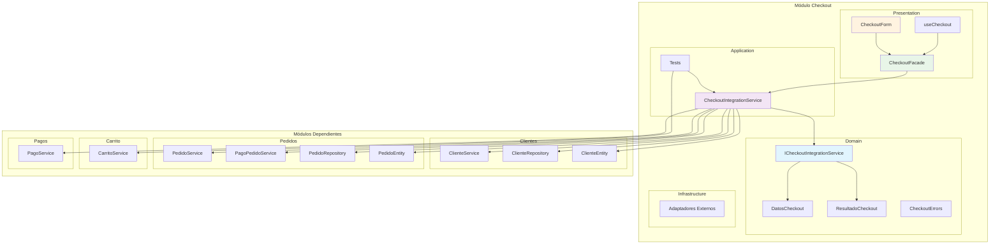
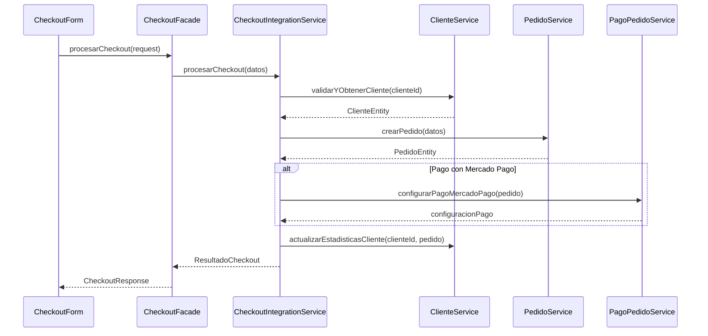
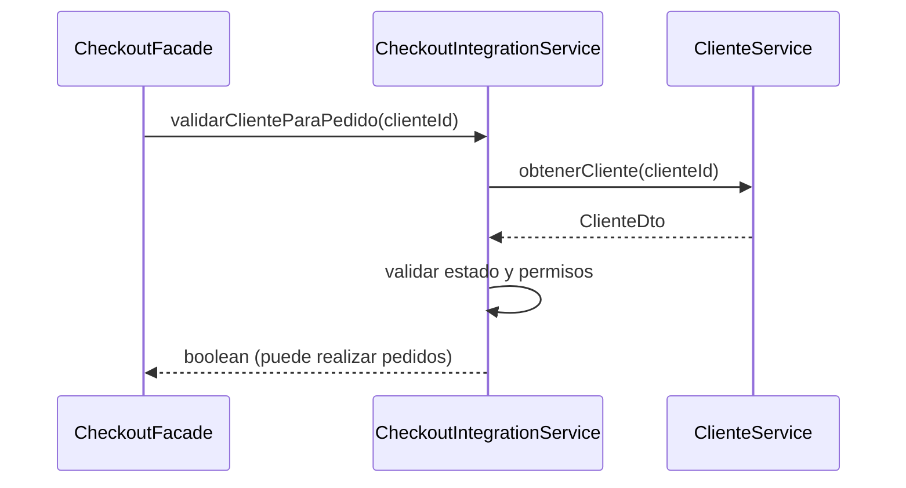

# Módulo Checkout - Arquitectura Hexagonal

## Descripción

El módulo de checkout maneja el proceso completo de finalización de compras, integrando los módulos de clientes, pedidos, carrito y pagos para crear una experiencia de checkout unificada.

## Diagrama de Arquitectura del Módulo

## Componentes Principales

### Domain Layer

- **ICheckoutIntegrationService**: Interface que define el contrato para la integración del checkout
- **DatosCheckout**: DTO que encapsula todos los datos necesarios para procesar un checkout
- **ResultadoCheckout**: DTO que contiene el resultado completo del proceso de checkout
- **CheckoutErrors**: Errores específicos del dominio de checkout

### Application Layer

- **CheckoutIntegrationService**: Servicio principal que orquesta el proceso de checkout integrando múltiples módulos
- **Tests**: Suite de tests unitarios para validar la lógica de negocio

### Presentation Layer

- **CheckoutFacade**: Facade que simplifica la interacción con el sistema de checkout para la UI
- **CheckoutForm**: Componente React para el formulario de checkout
- **useCheckout**: Hook personalizado para manejar el estado del checkout

## Flujos Principales

### 1. Proceso de Checkout Completo

### 2. Validación de Cliente

## Integraciones con Otros Módulos

### Módulo de Clientes

- **Validación**: Verifica que el cliente esté activo y pueda realizar pedidos
- **Estadísticas**: Actualiza las estadísticas del cliente post-pedido
- **Historial**: Obtiene el historial de pedidos del cliente

### Módulo de Pedidos

- **Creación**: Crea nuevos pedidos con todos los datos necesarios
- **Configuración de Pago**: Configura pagos con Mercado Pago
- **Gestión**: Maneja el estado y seguimiento de pedidos

### Módulo de Carrito

- **Validación**: Valida disponibilidad de productos
- **Cálculos**: Obtiene totales y datos del carrito
- **Limpieza**: Limpia el carrito después del checkout exitoso

### Módulo de Pagos

- **Procesamiento**: Procesa pagos según el método seleccionado
- **Configuración**: Configura preferencias de pago externas

## Patrones de Diseño Implementados

### 1. Integration Service Pattern

El `CheckoutIntegrationService` actúa como orquestador que coordina múltiples servicios de dominio para completar el proceso de checkout.

### 2. Facade Pattern

El `CheckoutFacade` proporciona una interfaz simplificada para la UI, ocultando la complejidad de la integración entre módulos.

### 3. Repository Pattern

Utiliza repositorios de otros módulos a través de inyección de dependencias para mantener la separación de responsabilidades.

### 4. DTO Pattern

Utiliza DTOs específicos (`DatosCheckout`, `ResultadoCheckout`) para transferir datos entre capas y módulos.

## Testing

### Tests Unitarios

- **CheckoutService.test.ts**: Tests para la lógica de integración del checkout
- **Mocks**: Utiliza mocks de todos los servicios dependientes
- **Cobertura**: Valida todos los flujos principales y casos de error

### Casos de Prueba Principales

1. Checkout exitoso con diferentes métodos de pago
2. Validación de cliente inactivo
3. Manejo de errores de pago
4. Actualización de estadísticas de cliente
5. Configuración de Mercado Pago

## Notas de Implementación

### Separación de Responsabilidades

- El módulo no maneja lógica de negocio específica de otros dominios
- Actúa como coordinador e integrador
- Mantiene interfaces claras con otros módulos

### Manejo de Errores

- Propaga errores específicos de cada módulo
- Envuelve errores inesperados con contexto de checkout
- Logging de errores para debugging

### Performance

- Operaciones asíncronas optimizadas
- Validaciones tempranas para fallar rápido
- Actualización de estadísticas no bloquea el flujo principal

## Última Actualización

- **Fecha**: 2025-01-19
- **Cambios**:
  - Agregado test del CheckoutService
  - Documentada integración con múltiples módulos
  - Actualizado diagrama de dependencias
  - Documentados patrones de diseño implementados
