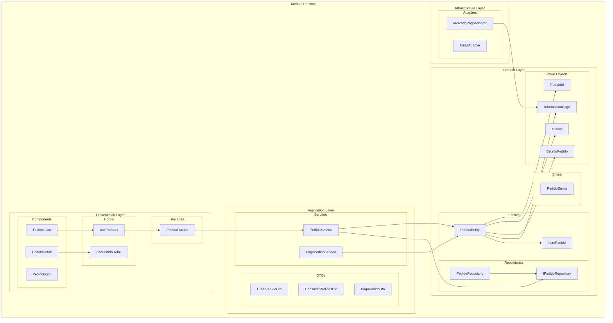
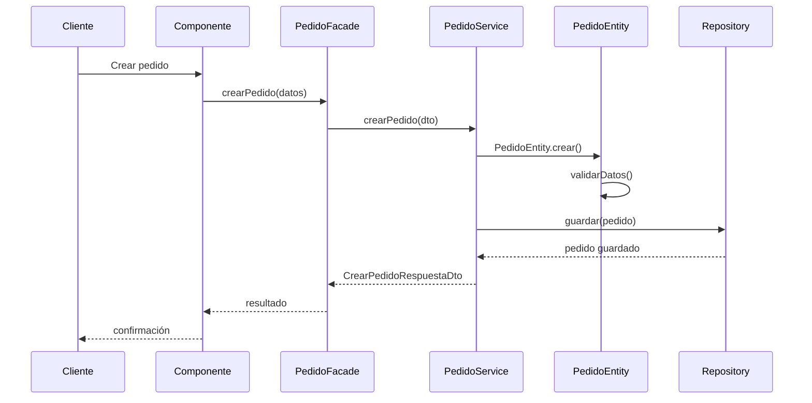
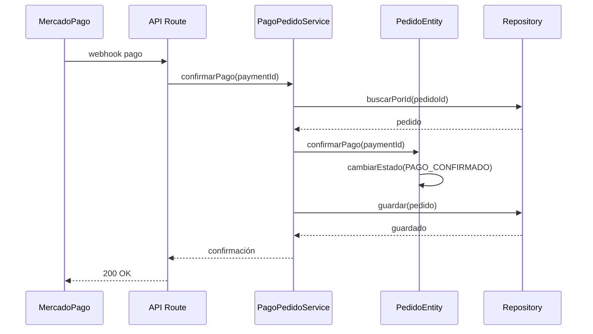
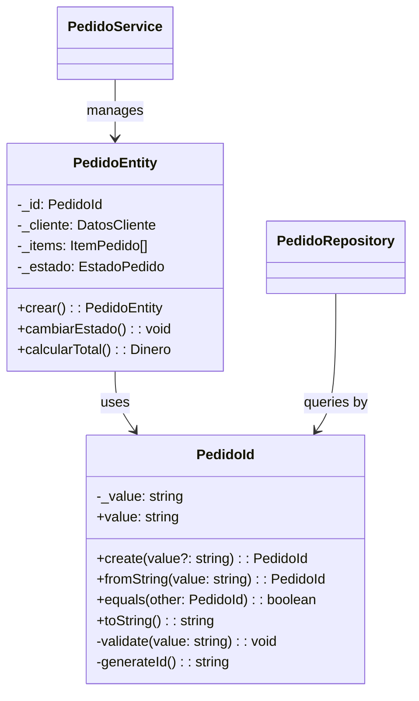

# Módulo Pedidos - Arquitectura Hexagonal

## Descripción

Módulo responsable de la gestión completa del ciclo de vida de pedidos en la panadería Mandorla, desde la creación hasta la entrega final.

## Diagrama de Arquitectura del Módulo



## Entidades de Dominio

### PedidoEntity

- **Propósito**: Agregado raíz que representa un pedido completo
- **Responsabilidades**:
  - Gestionar el ciclo de vida del pedido
  - Calcular totales y subtotales
  - Validar transiciones de estado
  - Manejar información de pago
- **Reglas de Negocio**:
  - Un pedido debe tener al menos un item
  - Los estados siguen un flujo específico
  - Solo se puede cancelar en ciertos estados
  - El pago debe confirmarse antes de preparación

### ItemPedido

- **Propósito**: Representa un producto específico dentro del pedido
- **Responsabilidades**:
  - Mantener información del producto
  - Calcular subtotales por item
  - Validar cantidades

## Value Objects

### PedidoId (Actualizado)

```typescript
export class PedidoId {
  private readonly _value: string;

  static create(value?: string): PedidoId
  static fromString(value: string): PedidoId
  
  get value(): string
  equals(other: PedidoId): boolean
  toString(): string
}
```

**Características**:

- **Formato**: `PED-XXXXXX` (PED- seguido de código alfanumérico)
- **Validación**: Entre 3 y 50 caracteres
- **Generación**: Timestamp + random para unicidad
- **Inmutabilidad**: Value object inmutable

### Dinero

- **Propósito**: Representar valores monetarios con precisión
- **Operaciones**: Suma, resta, multiplicación, formateo

### EstadoPedido

- **Estados Válidos**:
  - `PENDIENTE_PAGO`: Pedido creado, esperando pago
  - `PAGO_CONFIRMADO`: Pago procesado exitosamente
  - `EN_PREPARACION`: Pedido siendo preparado en panadería
  - `LISTO_ENTREGA`: Pedido listo para entrega/retiro
  - `EN_CAMINO`: Pedido en camino (solo delivery)
  - `ENTREGADO`: Pedido entregado exitosamente
  - `CANCELADO`: Pedido cancelado
  - `PAGO_RECHAZADO`: Pago rechazado

### InformacionPago

- **Métodos Soportados**: Mercado Pago
- **Estados**: Pendiente, Confirmado, Rechazado
- **Datos**: Payment ID, tipo de pago, cuotas

## Servicios de Aplicación

### PedidoService

- **Casos de Uso**:
  - `crearPedido()`: Crear nuevo pedido
  - `obtenerPedido()`: Obtener pedido por ID
  - `consultarPedidos()`: Buscar pedidos con filtros
  - `cambiarEstadoPedido()`: Cambiar estado del pedido
  - `cancelarPedido()`: Cancelar pedido
  - `obtenerEstadisticas()`: Estadísticas de pedidos

### PagoPedidoService

- **Casos de Uso**:
  - `configurarPagoMercadoPago()`: Configurar pago con MP
  - `confirmarPago()`: Confirmar pago recibido
  - `rechazarPago()`: Manejar pago rechazado

## Flujos de Datos

### Creación de Pedido



### Procesamiento de Pago



## APIs Expuestas

### Endpoints Principales

- `POST /api/pedidos` - Crear pedido
- `GET /api/pedidos/:id` - Obtener pedido
- `GET /api/pedidos` - Listar pedidos con filtros
- `PATCH /api/pedidos/:id/estado` - Cambiar estado
- `DELETE /api/pedidos/:id` - Cancelar pedido
- `POST /api/pedidos/:id/pago` - Configurar pago
- `POST /api/webhooks/mercadopago` - Webhook de pago

### DTOs de Entrada y Salida

```typescript
// Crear Pedido
interface CrearPedidoDto {
  cliente: DatosClienteDto;
  items: ItemPedidoDto[];
  datosEntrega: DatosEntregaDto;
  notas?: string;
}

// Respuesta Pedido
interface PedidoDetalleDto {
  id: string;
  cliente: DatosClienteDto;
  items: ItemPedidoDetalleDto[];
  estado: EstadoPedidoDto;
  totales: TotalesPedidoDto;
  fechaCreacion: string;
  // ... más campos
}
```

## Eventos de Dominio

### Eventos Emitidos

- `PedidoCreadoEvent`: Cuando se crea un pedido
- `PagoConfirmadoEvent`: Cuando se confirma el pago
- `EstadoPedidoCambiadoEvent`: Cuando cambia el estado
- `PedidoCanceladoEvent`: Cuando se cancela un pedido

### Eventos Escuchados

- `ProductoAgotadoEvent`: Para validar stock
- `ClienteActualizadoEvent`: Para actualizar datos

## Testing

### Estrategia de Testing

- **Unit Tests**: Entidades y value objects
- **Integration Tests**: Servicios con repositorios
- **E2E Tests**: Flujos completos de pedidos

### Casos de Prueba Críticos

- Creación de pedido con datos válidos/inválidos
- Transiciones de estado válidas/inválidas
- Cálculos de totales correctos
- Procesamiento de pagos
- Cancelación de pedidos

## Cambios Recientes

### PedidoId Value Object (19/12/2024)

- **Actualización**: Implementación completa del value object PedidoId
- **Mejoras**:
  - Validación de formato `PED-XXXXXX`
  - Generación automática de IDs únicos
  - Métodos de factory para creación
  - Validaciones robustas de entrada
- **Impacto**:
  - Mejor consistencia en identificadores
  - Validación automática de formato
  - Generación determinística de IDs

### Relaciones Actualizadas



## Notas de Implementación

### Patrones Utilizados

- **Aggregate Root**: PedidoEntity como raíz del agregado
- **Value Objects**: Para conceptos inmutables (PedidoId, Dinero)
- **Repository Pattern**: Para persistencia
- **Factory Pattern**: Para creación de entidades
- **State Pattern**: Para gestión de estados

### Consideraciones de Performance

- Lazy loading de historial de estados
- Paginación en consultas de pedidos
- Índices en campos de búsqueda frecuente

### Seguridad

- Validación de permisos por cliente
- Sanitización de datos de entrada
- Logs de auditoría para cambios críticos

## Última Actualización

- **Fecha**: 2024-12-19
- **Cambios**: Actualización automática por modificación en PedidoId value object
- **Archivos Afectados**:
  - `src/modules/pedidos/domain/value-objects/pedido-id.ts`
  - Diagramas de arquitectura del módulo
  - Documentación de value objects
