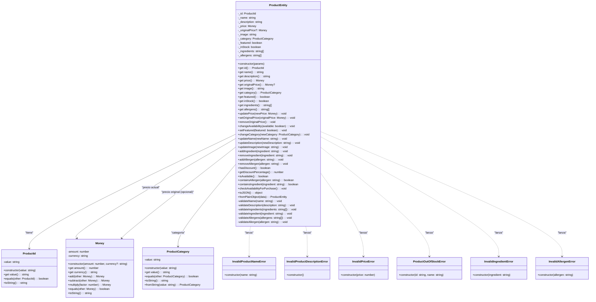

# Diagrama: Entidad ProductEntity - Dominio

## Descripción

Diagrama de la entidad ProductEntity del módulo de productos, mostrando su estructura, métodos de dominio y relaciones con value objects. Esta entidad encapsula toda la lógica de negocio relacionada con los productos de la panadería Mandorla.

## Diagrama de Clase

## Diagrama de Testing

```mermaid
graph TB
    subgraph "Test Suite: ProductEntity"
        subgraph "Creación de producto"
            T1[✅ crear producto válido correctamente]
            T2[✅ crear producto con valores por defecto]
        end
        
        subgraph "Actualización de precio"
            T3[✅ actualizar precio correctamente]
            T4[✅ lanzar error con precio inválido]
            T5[✅ lanzar error con precio cero]
        end
        
        subgraph "Gestión de stock"
            T6[✅ reducir stock correctamente]
            T7[✅ lanzar error si no hay stock suficiente]
            T8[✅ lanzar error con cantidad inválida]
            T9[✅ aumentar stock correctamente]
            T10[✅ verificar disponibilidad de stock]
        end
        
        subgraph "Disponibilidad del producto"
            T11[✅ marcar producto como no disponible]
            T12[✅ marcar producto como disponible]
            T13[✅ verificar si está disponible para venta]
        end
        
        subgraph "Serialización"
            T14[✅ convertir a objeto de persistencia]
            T15[✅ crear desde objeto de persistencia]
        end
    end
    
    T1 --> ProductEntity
    T2 --> ProductEntity
    T3 --> ProductEntity
    T4 --> InvalidProductPriceError
    T5 --> InvalidProductPriceError
    T6 --> ProductEntity
    T7 --> ProductOutOfStockError
    T8 --> InvalidQuantityError
    T9 --> ProductEntity
    T10 --> ProductEntity
    T11 --> ProductEntity
    T12 --> ProductEntity
    T13 --> ProductEntity
    T14 --> ProductEntity
    T15 --> ProductEntity
```

## Componentes

### Entidad Principal

- **ProductEntity**: Entidad de dominio que encapsula toda la lógica de negocio de los productos de la panadería
- **Responsabilidades**: Validaciones, cálculos de descuentos, gestión de stock, manejo de ingredientes y alérgenos

### Value Objects

- **ProductId**: Identificador único del producto con validaciones
- **Money**: Representa valores monetarios con operaciones matemáticas
- **ProductCategory**: Categoría del producto (galletas, pasteles, panes, temporada)

### Errores de Dominio

- **InvalidProductNameError**: Error cuando el nombre del producto es inválido
- **InvalidProductDescriptionError**: Error cuando la descripción es inválida
- **InvalidPriceError**: Error cuando el precio no es válido
- **ProductOutOfStockError**: Error cuando no hay stock suficiente
- **InvalidIngredientError**: Error cuando un ingrediente es inválido
- **InvalidAllergenError**: Error cuando un alérgeno es inválido

## Flujos Principales

### 1. Creación de Producto

1. Validar datos de entrada (nombre, descripción, precio)
2. Validar ingredientes y alérgenos
3. Crear instancia con value objects
4. Asignar valores por defecto si es necesario

### 2. Actualización de Precio

1. Validar que el nuevo precio sea mayor a 0
2. Actualizar precio actual
3. Recalcular porcentaje de descuento si hay precio original

### 3. Gestión de Stock

1. Verificar disponibilidad antes de reducir stock
2. Validar cantidades (deben ser positivas)
3. Actualizar stock disponible
4. Verificar disponibilidad para venta

### 4. Manejo de Descuentos

1. Establecer precio original si hay descuento
2. Calcular porcentaje de descuento automáticamente
3. Permitir remover descuento

## Reglas de Negocio Implementadas

### Validaciones de Producto

- Nombre no puede estar vacío y máximo 200 caracteres
- Descripción obligatoria, máximo 1000 caracteres
- Precio debe ser mayor a 0
- Ingredientes y alérgenos no pueden estar vacíos

### Gestión de Stock

- Stock no puede ser negativo
- Cantidad a reducir debe ser positiva
- Producto disponible para venta solo si tiene stock y está marcado como disponible

### Descuentos

- Precio original debe ser mayor al precio actual
- Porcentaje de descuento se calcula automáticamente
- Se puede remover el descuento eliminando el precio original

## Cobertura de Testing

### Tests Implementados (15 casos)

- ✅ **Creación**: 2 tests - casos válidos y valores por defecto
- ✅ **Precios**: 3 tests - actualización válida y errores
- ✅ **Stock**: 5 tests - reducción, aumento, validaciones y disponibilidad
- ✅ **Disponibilidad**: 3 tests - marcar disponible/no disponible, verificar venta
- ✅ **Serialización**: 2 tests - conversión a/desde objetos de persistencia

### Casos de Error Cubiertos

- Precios inválidos (negativos, cero)
- Stock insuficiente
- Cantidades inválidas
- Validaciones de entrada

## Notas de Implementación

### Patrones de Diseño Utilizados

- **Value Objects**: Para ProductId, Money y ProductCategory
- **Domain Errors**: Errores específicos del dominio con contexto
- **Encapsulation**: Propiedades privadas con getters públicos
- **Factory Method**: Método estático `fromPlainObject` para creación

### Consideraciones de Rendimiento

- Arrays de ingredientes y alérgenos se copian en getters para inmutabilidad
- Validaciones se ejecutan en constructor y métodos de actualización
- Cálculos de descuento se realizan bajo demanda

### Principios SOLID Aplicados

- **SRP**: Entidad solo maneja lógica de producto
- **OCP**: Extensible a través de herencia o composición
- **LSP**: Cumple contratos de interfaces
- **ISP**: No depende de interfaces que no usa
- **DIP**: Depende de abstracciones (value objects)

## Componentes Relacionados

- [Value Objects del Módulo Productos](./productos-value-objects.md)
- [Errores de Dominio](./productos-domain-errors.md)
- [Repositorio de Productos](./productos-repository.md)
- [Servicio de Aplicación](./productos-service.md)

## Changelog

- **2024-01-20**: Creación inicial del diagrama
- **2024-01-20**: Actualización con tests completos de la entidad
- **2024-01-20**: Agregado diagrama de testing y cobertura completa
