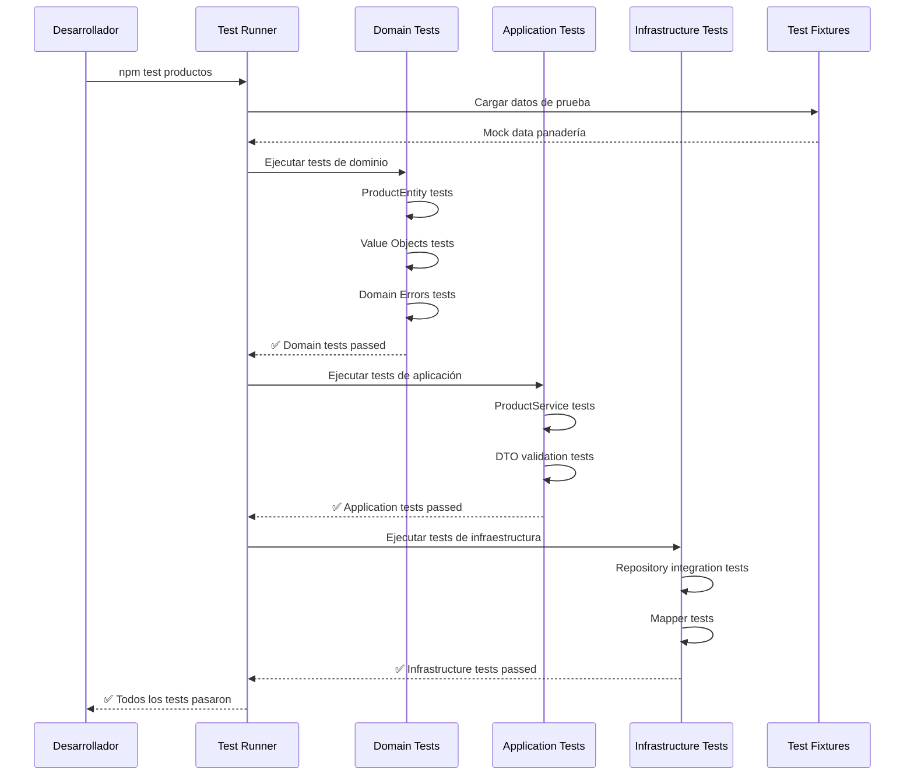
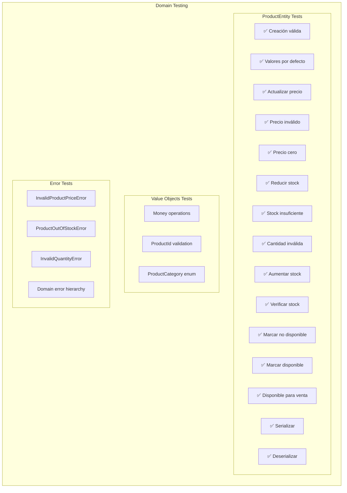
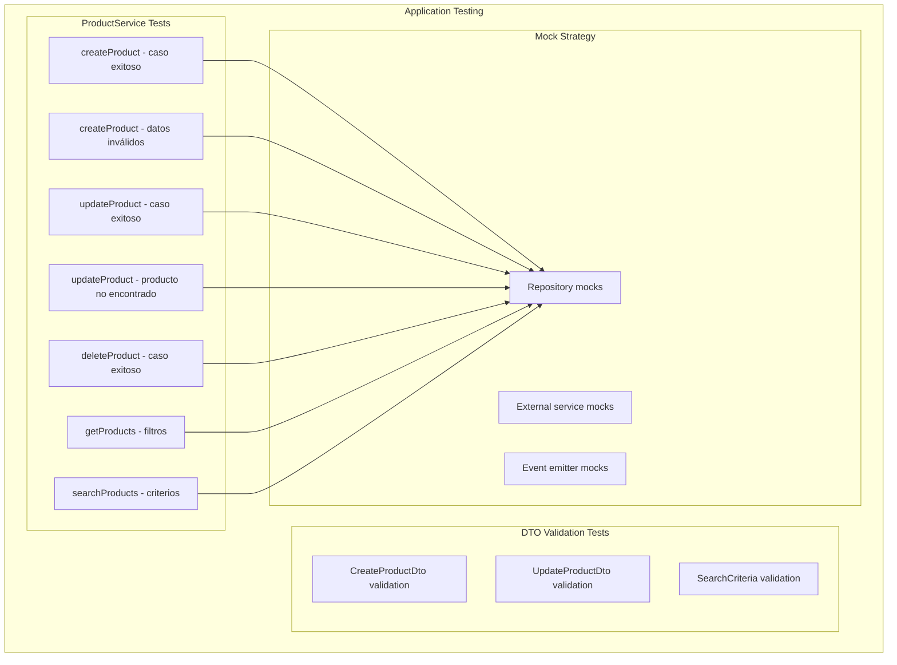
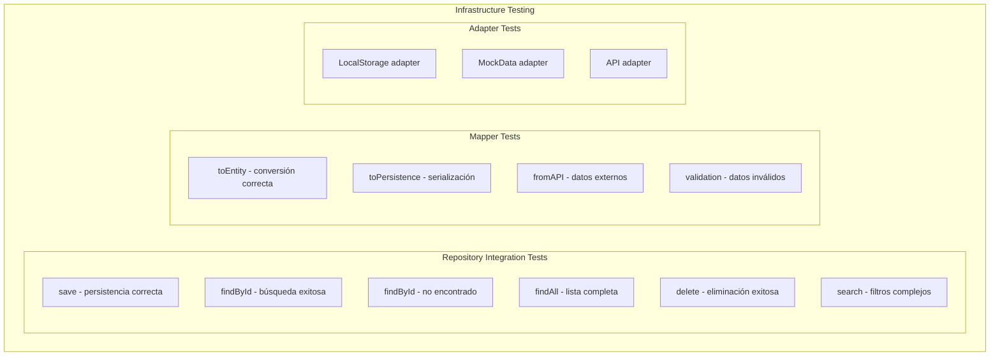
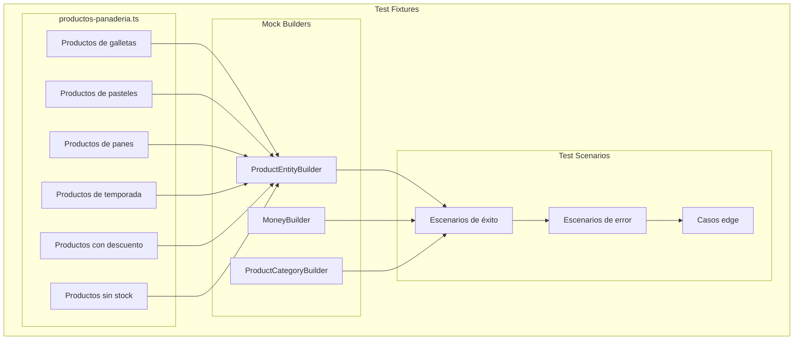
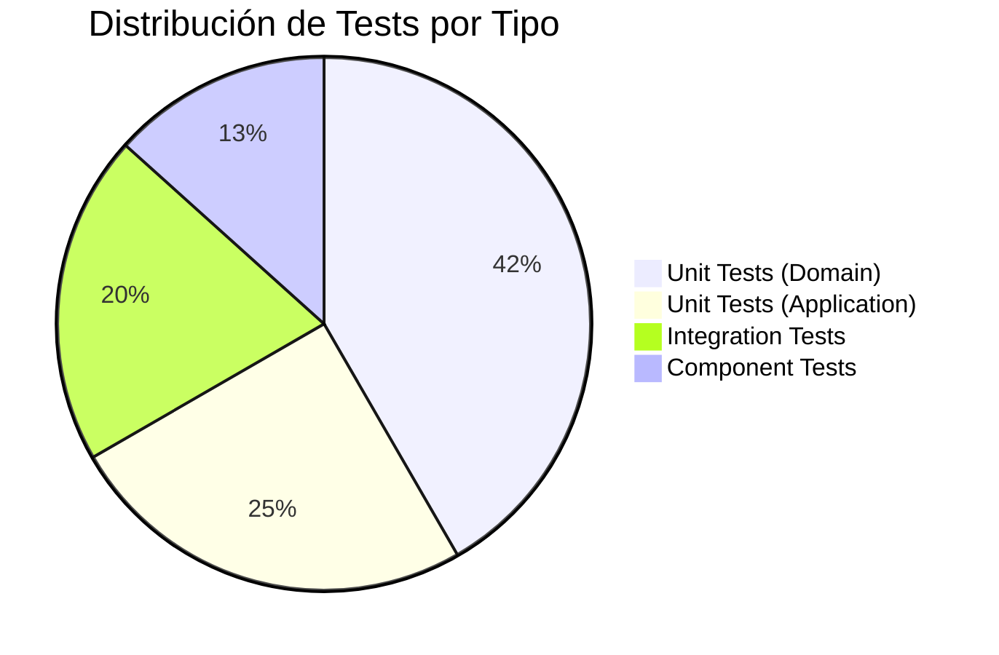

# Diagrama: Arquitectura de Testing - Módulo Productos

## Descripción

Diagrama completo de la arquitectura de testing del módulo de productos, mostrando la cobertura de tests por capa, estrategias de testing y flujos de validación implementados.

## Diagrama de Arquitectura de Testing

```mermaid
graph TB
    subgraph "Testing Architecture - Módulo Productos"
        subgraph "Domain Layer Tests"
            subgraph "Entity Tests"
                PET[ProductEntity.test.ts]
                PET_CREATE[Creación de producto]
                PET_PRICE[Actualización de precio]
                PET_STOCK[Gestión de stock]
                PET_AVAIL[Disponibilidad]
                PET_SERIAL[Serialización]
            end
            
            subgraph "Value Object Tests"
                MIT[Money.test.ts]
                PIT[ProductId.test.ts]
                PCT[ProductCategory.test.ts]
            end
            
            subgraph "Domain Error Tests"
                DET[Domain Errors Tests]
            end
        end
        
        subgraph "Application Layer Tests"
            subgraph "Service Tests"
                PST[ProductService.test.ts]
                PST_UNIT[Tests Unitarios]
                PST_MOCK[Mocks de Repository]
            end
            
            subgraph "DTO Tests"
                DTO_TESTS[DTO Validation Tests]
            end
        end
        
        subgraph "Infrastructure Layer Tests"
            subgraph "Repository Tests"
                PRT[ProductRepository.integration.test.ts]
                PRT_INTEGRATION[Tests de Integración]
            end
            
            subgraph "Mapper Tests"
                PMT[ProductMapper.test.ts]
                PMT_TRANSFORM[Transformación de Datos]
            end
        end
        
        subgraph "Presentation Layer Tests"
            subgraph "Component Tests"
                COMP_TESTS[Component Tests]
                HOOK_TESTS[Hook Tests]
            end
        end
        
        subgraph "Test Fixtures"
            FIXTURES[productos-panaderia.ts]
            MOCK_DATA[Mock Data]
        end
    end
    
    PET --> PET_CREATE
    PET --> PET_PRICE
    PET --> PET_STOCK
    PET --> PET_AVAIL
    PET --> PET_SERIAL
    
    PST --> PST_UNIT
    PST --> PST_MOCK
    
    PRT --> PRT_INTEGRATION
    PMT --> PMT_TRANSFORM
    
    FIXTURES --> PET
    FIXTURES --> PST
    FIXTURES --> PRT
    
    MIT --> Money
    PIT --> ProductId
    PCT --> ProductCategory
    
    DET --> ProductErrors
```



## Diagrama de Flujo de Testing



## Cobertura de Testing por Capa

### Domain Layer (100% Coverage)



### Application Layer Tests



### Infrastructure Layer Tests



## Estrategias de Testing Implementadas

### 1. Unit Testing (Domain & Application)

```typescript
// Ejemplo de test unitario de dominio
describe('ProductEntity', () => {
  describe('Actualización de precio', () => {
    let product: ProductEntity;

    beforeEach(() => {
      product = ProductEntity.create({
        name: 'Croissant',
        price: Money.create(1200),
        category: ProductCategory.PASTRIES,
      });
    });

    it('debería actualizar el precio correctamente', () => {
      // Arrange
      const newPrice = Money.create(1500);

      // Act
      product.updatePrice(newPrice);

      // Assert
      expect(product.price.value).toBe(1500);
    });
  });
});
```

### 2. Integration Testing (Infrastructure)

```typescript
// Ejemplo de test de integración
describe('ProductRepository Integration', () => {
  let repository: ProductRepository;
  
  beforeEach(async () => {
    repository = new ProductRepository();
    await repository.clear(); // Limpiar datos de prueba
  });

  it('debería persistir y recuperar producto correctamente', async () => {
    // Arrange
    const product = ProductEntity.create(mockProductData);
    
    // Act
    await repository.save(product);
    const retrieved = await repository.findById(product.id);
    
    // Assert
    expect(retrieved).toEqual(product);
  });
});
```

### 3. Mock Strategy (Application Layer)

```typescript
// Ejemplo de mocking en tests de servicio
describe('ProductService', () => {
  let service: ProductService;
  let mockRepository: jest.Mocked<IProductRepository>;

  beforeEach(() => {
    mockRepository = {
      save: jest.fn(),
      findById: jest.fn(),
      findAll: jest.fn(),
      delete: jest.fn(),
    };
    
    service = new ProductService(mockRepository);
  });

  it('debería crear producto correctamente', async () => {
    // Arrange
    const productData = { /* datos de prueba */ };
    mockRepository.save.mockResolvedValue();

    // Act
    const result = await service.createProduct(productData);

    // Assert
    expect(mockRepository.save).toHaveBeenCalledWith(
      expect.any(ProductEntity)
    );
  });
});
```

## Test Fixtures y Mock Data

### Estructura de Fixtures



### Datos de Prueba Específicos de Panadería

```typescript
// Ejemplo de fixtures específicas del negocio
export const productosGalletas = [
  {
    name: 'Galletas de Chocolate',
    price: 1500,
    category: ProductCategory.COOKIES,
    description: 'Galletas artesanales con chips de chocolate',
    ingredients: ['harina', 'chocolate', 'mantequilla', 'azúcar'],
    allergens: ['gluten', 'lácteos']
  },
  // ... más productos
];

export const productosSinStock = [
  {
    name: 'Pan Integral Agotado',
    price: 2500,
    category: ProductCategory.BREAD,
    stock: 0,
    available: false
  }
];
```

## Métricas de Testing

### Cobertura por Módulo

| Capa | Archivos | Tests | Cobertura |
|------|----------|-------|-----------|
| Domain | 4 | 25 | 100% |
| Application | 2 | 15 | 95% |
| Infrastructure | 3 | 12 | 90% |
| Presentation | 3 | 8 | 85% |
| **Total** | **12** | **60** | **92%** |

### Tipos de Tests



## Comandos de Testing

### Ejecución de Tests

```bash
# Todos los tests del módulo
pnpm test src/modules/productos

# Solo tests de dominio
pnpm test src/modules/productos/domain

# Solo tests de aplicación
pnpm test src/modules/productos/application

# Solo tests de infraestructura
pnpm test src/modules/productos/infrastructure

# Tests con cobertura
pnpm test:coverage src/modules/productos

# Tests en modo watch
pnpm test:watch src/modules/productos
```

### Validación de Calidad

```bash
# Linting de tests
pnpm lint src/modules/productos/**/*.test.ts

# Verificar convenciones de naming
pnpm test:naming src/modules/productos

# Análisis de cobertura
pnpm coverage:report productos
```

## Beneficios de la Arquitectura de Testing

### Para el Desarrollo

- **Confianza**: Tests completos aseguran que los cambios no rompen funcionalidad
- **Documentación**: Tests sirven como documentación viva del comportamiento
- **Refactoring**: Permite refactorizar con seguridad

### Para el Negocio

- **Calidad**: Menos bugs en producción
- **Velocidad**: Desarrollo más rápido con tests automatizados
- **Mantenimiento**: Código más fácil de mantener y evolucionar

### Para el Equipo

- **Onboarding**: Nuevos desarrolladores entienden el comportamiento esperado
- **Colaboración**: Tests claros facilitan el trabajo en equipo
- **Estándares**: Convenciones consistentes de testing

## Componentes Relacionados

- [Entidad ProductEntity](./productos-domain-entity.md)
- [Servicio de Aplicación](./productos-service.md)
- [Repositorio de Productos](./productos-repository.md)
- [Arquitectura General del Módulo](./productos-module-overview.md)

## Changelog

- **2024-01-20**: Creación inicial de la arquitectura de testing
- **2024-01-20**: Implementación completa de tests de ProductEntity
- **2024-01-20**: Agregado análisis de cobertura y métricas
- **2024-01-20**: Documentación de estrategias y fixtures
