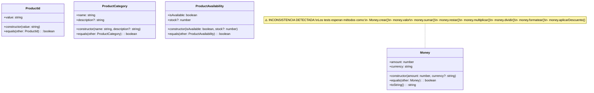
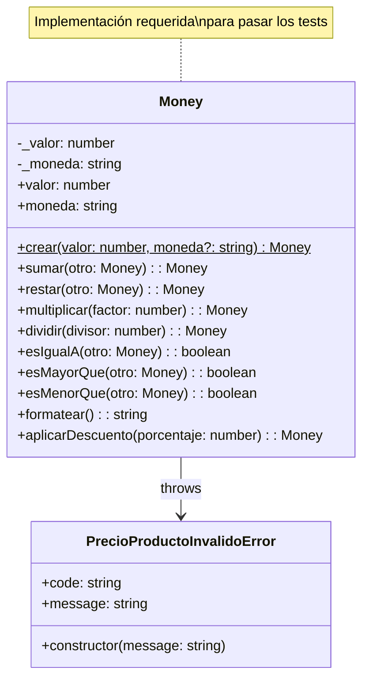
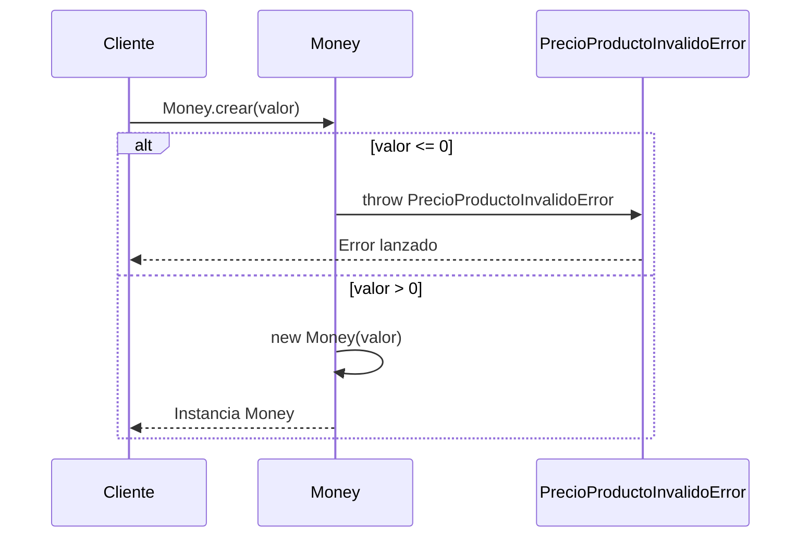
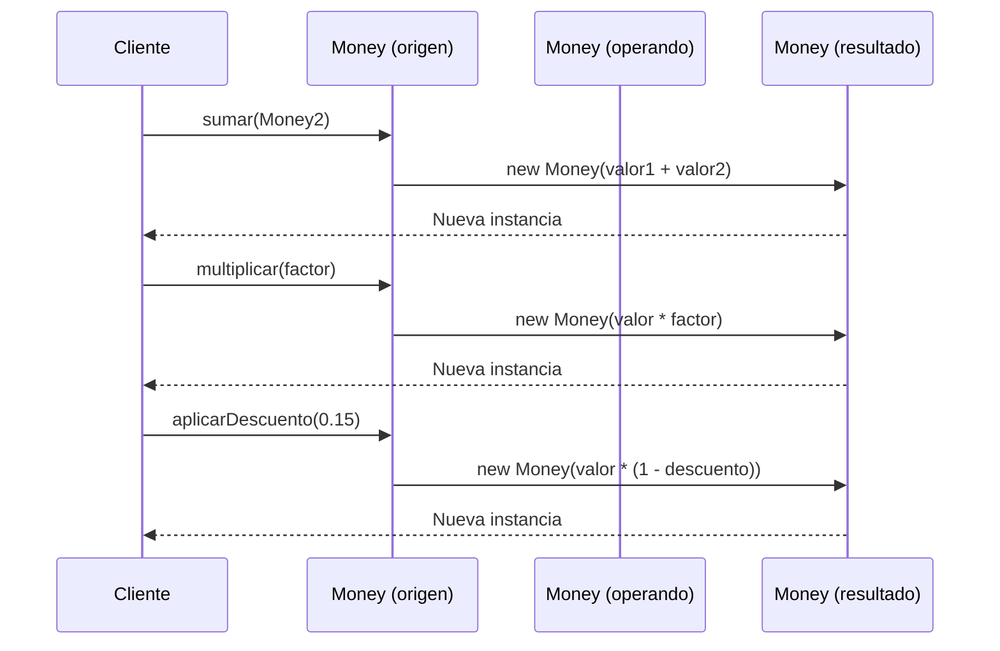

# Diagrama: Value Objects del Módulo Productos

## Descripción

Este diagrama muestra la estructura y relaciones de los Value Objects en el módulo de productos, incluyendo las inconsistencias detectadas entre la implementación y los tests.

## Diagrama de Clases - Estado Actual



## Diagrama de Clases - Implementación Esperada por Tests



## Componentes

### Value Objects Implementados

- **ProductId**: Identificador único de producto con validación
- **Money**: Representación de dinero (implementación básica)
- **ProductCategory**: Categoría de producto con nombre y descripción
- **ProductAvailability**: Estado de disponibilidad y stock

### Inconsistencias Detectadas

- **Money**: La implementación actual no coincide con los tests
- **Métodos faltantes**: crear(), sumar(), restar(), multiplicar(), dividir(), formatear(), aplicarDescuento()
- **Propiedades faltantes**: valor (getter), validaciones específicas

## Flujos Principales

### Flujo de Creación de Money (Esperado por Tests)



### Flujo de Operaciones Matemáticas



## Notas de Implementación

### Problemas Detectados

1. **Implementación incompleta**: La clase Money actual solo tiene constructor básico y métodos equals/toString
2. **API inconsistente**: Los tests esperan una API más rica con operaciones matemáticas
3. **Validaciones faltantes**: Los tests esperan validaciones específicas para valores negativos/cero
4. **Patrón Factory**: Los tests usan `Money.crear()` en lugar del constructor directo

### Patrones Utilizados

- **Value Object**: Inmutabilidad y comparación por valor
- **Factory Method**: Método estático `crear()` para construcción
- **Fluent Interface**: Métodos que retornan nuevas instancias para encadenamiento

### Consideraciones de Diseño

- **Inmutabilidad**: Todas las operaciones deben retornar nuevas instancias
- **Validación**: Validar valores en construcción y operaciones
- **Precisión**: Manejar decimales correctamente para cálculos monetarios
- **Localización**: Formateo específico para moneda colombiana (COP)

## Recomendaciones de Corrección

### 1. Actualizar Implementación de Money

```typescript
export class Money {
  private constructor(private readonly _valor: number, private readonly _moneda: string = 'COP') {
    // Validaciones según tests
  }
  
  static crear(valor: number, moneda?: string): Money {
    // Factory method con validaciones
  }
  
  get valor(): number { return this._valor; }
  get moneda(): string { return this._moneda; }
  
  // Implementar métodos matemáticos
  sumar(otro: Money): Money { /* ... */ }
  restar(otro: Money): Money { /* ... */ }
  multiplicar(factor: number): Money { /* ... */ }
  dividir(divisor: number): Money { /* ... */ }
  
  // Implementar métodos de comparación
  esIgualA(otro: Money): boolean { /* ... */ }
  esMayorQue(otro: Money): boolean { /* ... */ }
  esMenorQue(otro: Money): boolean { /* ... */ }
  
  // Implementar formateo y descuentos
  formatear(): string { /* ... */ }
  aplicarDescuento(porcentaje: number): Money { /* ... */ }
}
```

### 2. Crear Errores Específicos

```typescript
export class PrecioProductoInvalidoError extends Error {
  constructor(message: string) {
    super(message);
    this.name = 'PrecioProductoInvalidoError';
  }
}
```

## Última Actualización

- **Fecha**: 2025-01-19
- **Cambios**: Detectada inconsistencia entre implementación de Money y tests
- **Archivos afectados**:
  - `src/modules/productos/domain/value-objects/money.ts`
  - `src/modules/productos/domain/value-objects/__tests__/money.test.ts`
  - `src/modules/productos/domain/value-objects/index.ts`

## Estado

- ⚠️ **INCONSISTENCIA CRÍTICA**: Los tests no pueden pasar con la implementación actual
- 🔧 **ACCIÓN REQUERIDA**: Actualizar implementación de Money para coincidir con tests
- 📋 **PRIORIDAD**: Alta - Bloquea el desarrollo del módulo de productos
