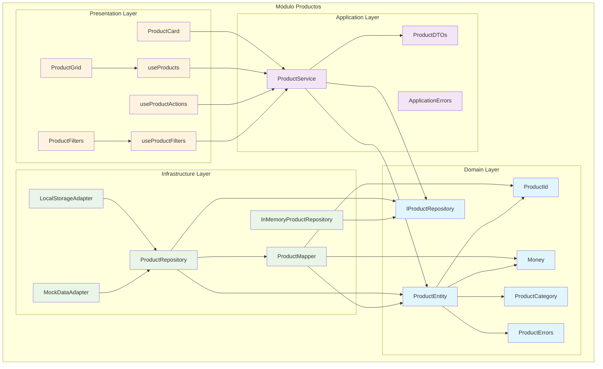
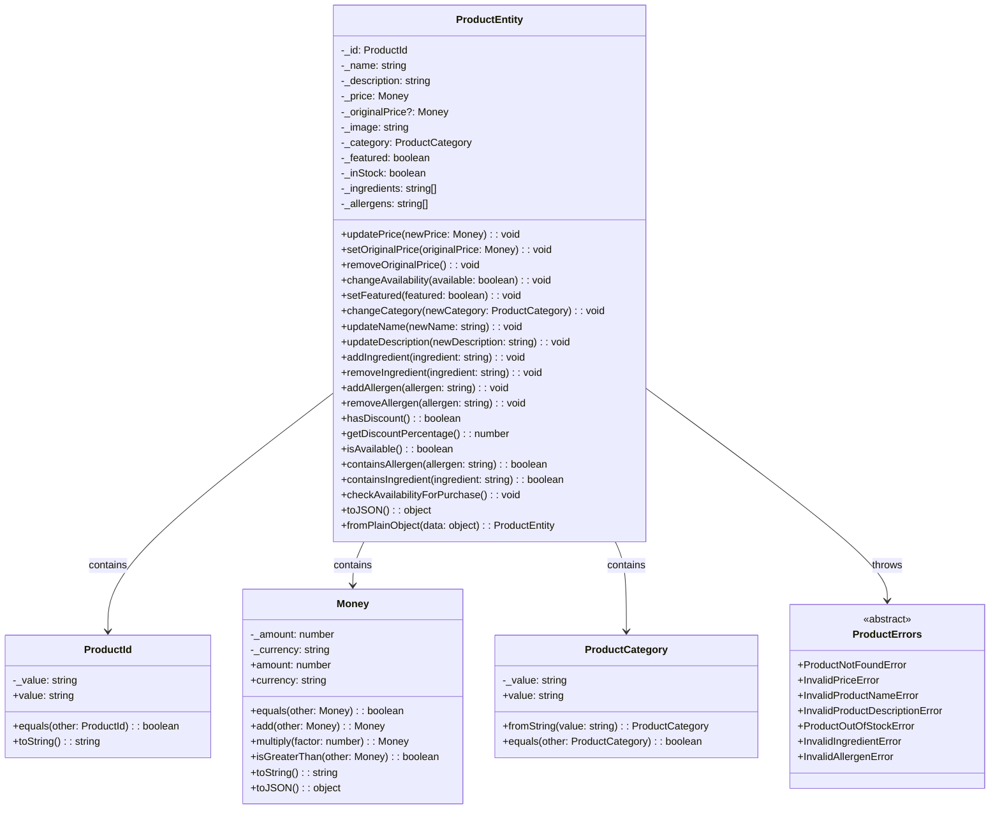
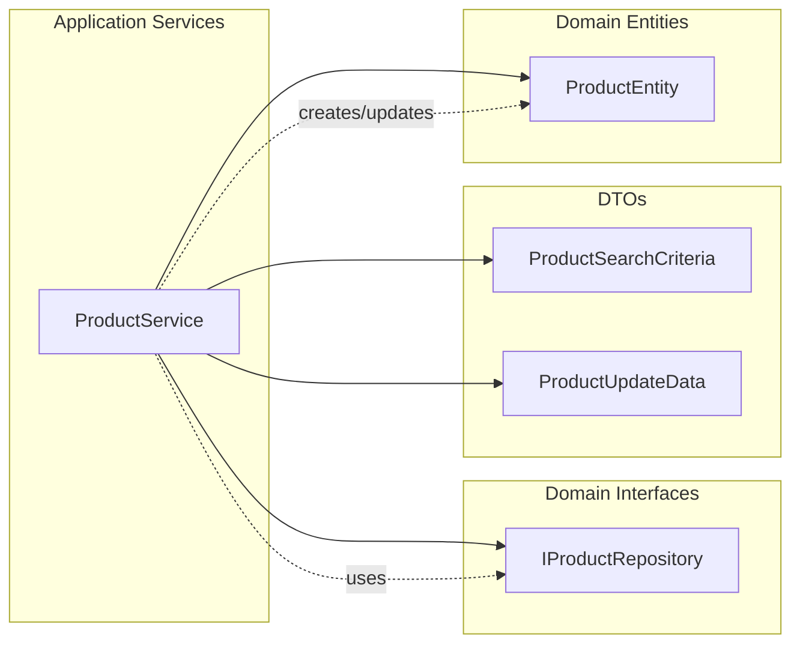
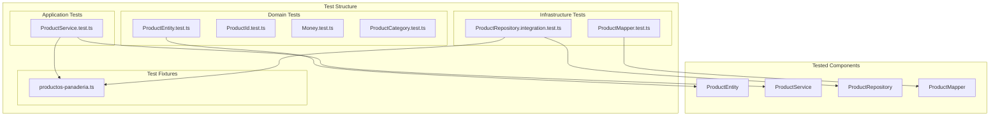
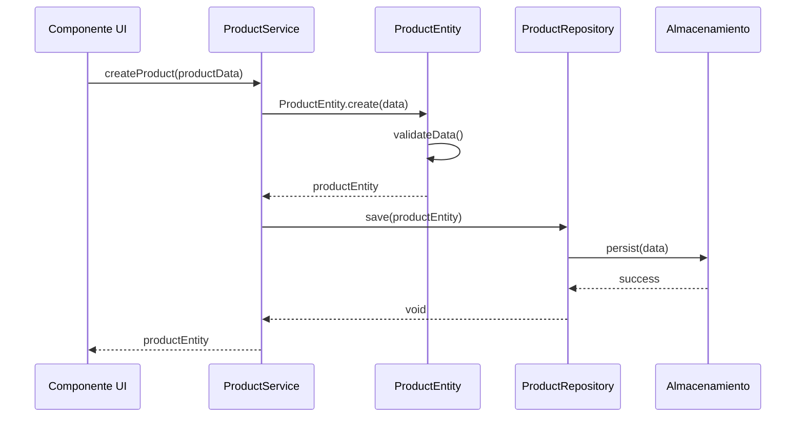
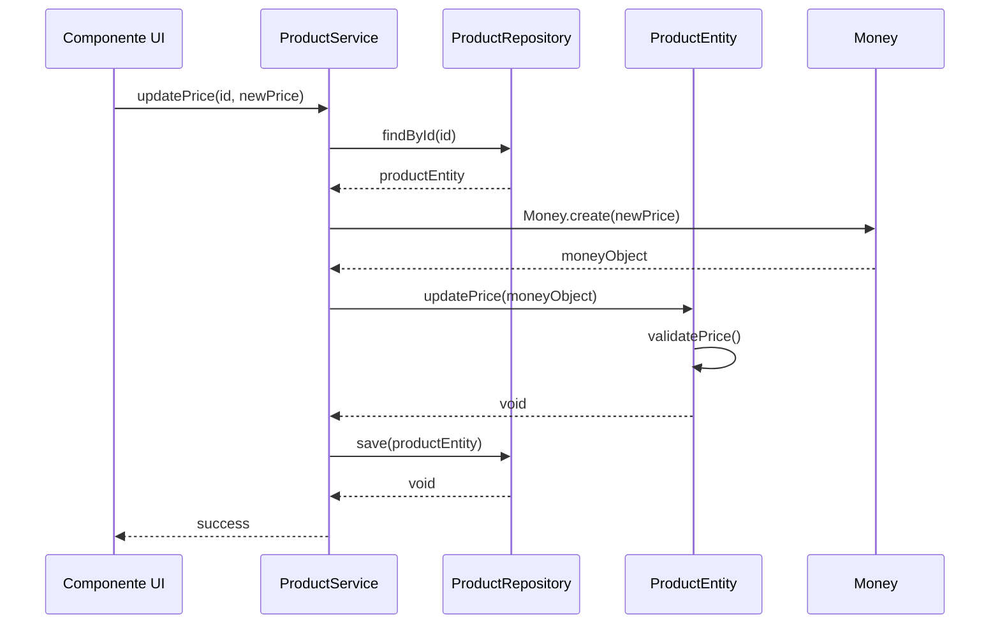

# Diagrama de Arquitectura: Módulo Productos

## Descripción

Este diagrama muestra la arquitectura hexagonal del módulo de productos de la panadería Mandorla, incluyendo las capas de dominio, aplicación, infraestructura y presentación, así como sus interacciones y dependencias.

## Diagrama de Arquitectura Hexagonal

## Diagrama de Entidades de Dominio

## Diagrama de Servicios de Aplicación

## Diagrama de Testing

## Flujos de Datos Principales

### Flujo de Creación de Producto

### Flujo de Actualización de Precio

## Componentes y Responsabilidades

### Domain Layer

- **ProductEntity**: Entidad principal que encapsula la lógica de negocio de productos
- **ProductId**: Value Object para identificadores únicos de productos
- **Money**: Value Object para manejo de precios y monedas
- **ProductCategory**: Value Object para categorías de productos
- **ProductErrors**: Errores específicos del dominio de productos
- **IProductRepository**: Interface que define el contrato para persistencia

### Application Layer

- **ProductService**: Servicio que orquesta casos de uso de productos
- **ProductDTOs**: Objetos de transferencia de datos para la capa de aplicación
- **ApplicationErrors**: Errores específicos de la capa de aplicación

### Infrastructure Layer

- **ProductRepository**: Implementación concreta del repositorio de productos
- **ProductMapper**: Mapea entre entidades de dominio y datos de persistencia
- **LocalStorageAdapter**: Adaptador para almacenamiento local
- **MockDataAdapter**: Adaptador para datos de prueba
- **InMemoryProductRepository**: Implementación en memoria para testing

### Presentation Layer

- **ProductCard**: Componente para mostrar información de un producto
- **ProductGrid**: Componente para mostrar lista de productos
- **ProductFilters**: Componente para filtrar productos
- **useProducts**: Hook para gestionar estado de productos
- **useProductActions**: Hook para acciones de productos
- **useProductFilters**: Hook para filtros de productos

## Patrones de Diseño Implementados

### Repository Pattern

- Interface `IProductRepository` en Domain
- Implementación `ProductRepository` en Infrastructure
- Permite intercambiar implementaciones sin afectar la lógica de negocio

### Value Objects Pattern

- `ProductId`, `Money`, `ProductCategory`
- Encapsulan validaciones y comportamientos específicos
- Garantizan inmutabilidad y validez de datos

### Domain Events Pattern

- Errores específicos del dominio
- Validaciones en entidades
- Separación clara de responsabilidades

### Dependency Injection Pattern

- Servicios dependen de interfaces, no implementaciones
- Facilita testing y intercambio de implementaciones
- Inversión de control en capas superiores

## Testing Strategy

### Unit Tests

- **Domain**: Tests de entidades, value objects y errores
- **Application**: Tests de servicios con mocks de repositorios
- **Infrastructure**: Tests de mappers y adaptadores

### Integration Tests

- **Repository**: Tests con almacenamiento real
- **Service**: Tests end-to-end de casos de uso

### Test Fixtures

- Datos de prueba específicos para panadería
- Productos realistas (panes, galletas, pasteles)
- Escenarios de negocio comunes

## Notas de Implementación

### Validaciones de Dominio

- Precios deben ser positivos
- Nombres de productos no pueden estar vacíos
- Ingredientes y alérgenos deben ser válidos
- Stock debe ser manejado correctamente

### Manejo de Errores

- Errores específicos por tipo de validación
- Jerarquía clara de errores de dominio
- Mensajes descriptivos en español

### Persistencia

- Mapeo entre entidades de dominio y DTOs
- Soporte para múltiples adaptadores de almacenamiento
- Serialización/deserialización consistente

## Última Actualización

- **Fecha**: 2024-12-19
- **Cambios**:
  - Actualización basada en modificaciones en tests de ProductEntity
  - Corrección de imports en tests (value-objects path)
  - Validación de estructura de testing completa
  - Documentación de patrones de testing implementados

## Archivos Relacionados

- [Documentación de ProductEntity](../entities/product-entity.md)
- [Documentación de ProductService](../services/product-service.md)
- [API de Productos](../apis/products-api.md)
- [Flujo de Gestión de Productos](../flows/product-management-flow.md)
