# Arquitectura General - Proyecto Mandorla

## Descripción

Diagrama de arquitectura general del e-commerce de panadería Mandorla, mostrando la organización modular, las capas de la aplicación y las interacciones entre módulos.

## Diagrama de Arquitectura General

```mermaid
graph TB
    subgraph "Frontend - Next.js App"
        subgraph "Presentation Layer"
            UI[Componentes UI]
            Pages[Páginas Next.js]
            Layouts[Layouts]
            Hooks[Custom Hooks]
        end
        
        subgraph "Application Modules"
            subgraph "Productos Module"
                PM_D[Domain]
                PM_A[Application]
                PM_I[Infrastructure]
                PM_P[Presentation]
            end
            
            subgraph "Carrito Module"
                CM_D[Domain]
                CM_A[Application]
                CM_I[Infrastructure]
                CM_P[Presentation]
            end
            
            subgraph "Pedidos Module"
                OM_D[Domain]
                OM_A[Application]
                OM_I[Infrastructure]
                OM_P[Presentation]
            end
            
            subgraph "Clientes Module"
                CLM_D[Domain]
                CLM_A[Application]
                CLM_I[Infrastructure]
                CLM_P[Presentation]
            end
        end
        
        subgraph "Shared Layer"
            Utils[Utilities]
            Types[Shared Types]
            Components[UI Components]
            Stores[Zustand Stores]
        end
    end
    
    subgraph "API Layer"
        API[Next.js API Routes]
        Middleware[Middleware]
        Validation[Validation]
    end
    
    subgraph "External Services"
        Email[Email Services]
        Payment[Payment Gateway]
        Storage[File Storage]
    end
    
    subgraph "Data Layer"
        LocalStorage[Local Storage]
        SessionStorage[Session Storage]
        MockData[Mock Data]
    end
    
    %% Connections
    UI --> PM_P
    UI --> CM_P
    UI --> OM_P
    UI --> CLM_P
    
    Pages --> API
    API --> PM_A
    API --> CM_A
    API --> OM_A
    API --> CLM_A
    
    PM_A --> PM_D
    CM_A --> CM_D
    OM_A --> OM_D
    CLM_A --> CLM_D
    
    PM_I --> LocalStorage
    CM_I --> LocalStorage
    OM_I --> Email
    OM_I --> Payment
    
    Hooks --> Stores
    
    classDef moduleClass fill:#e3f2fd
    classDef sharedClass fill:#f3e5f5
    classDef apiClass fill:#e8f5e8
    classDef externalClass fill:#fff3e0
    classDef dataClass fill:#fce4ec
    
    class PM_D,PM_A,PM_I,PM_P,CM_D,CM_A,CM_I,CM_P,OM_D,OM_A,OM_I,OM_P,CLM_D,CLM_A,CLM_I,CLM_P moduleClass
    class Utils,Types,Components,Stores sharedClass
    class API,Middleware,Validation apiClass
    class Email,Payment,Storage externalClass
    class LocalStorage,SessionStorage,MockData dataClass
```

## Arquitectura Hexagonal por Módulo

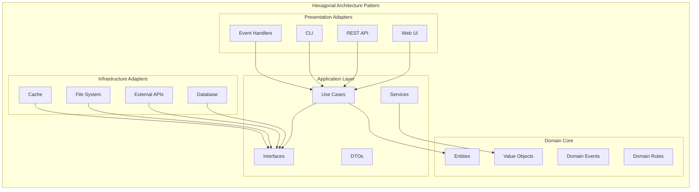

## Flujo de Datos Principal

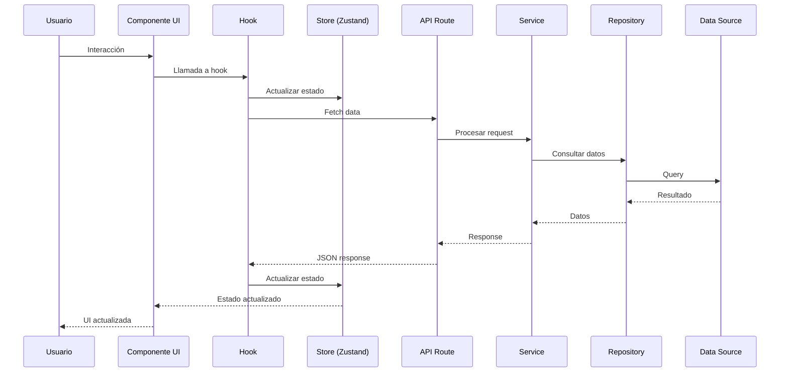

## Dependencias entre Módulos

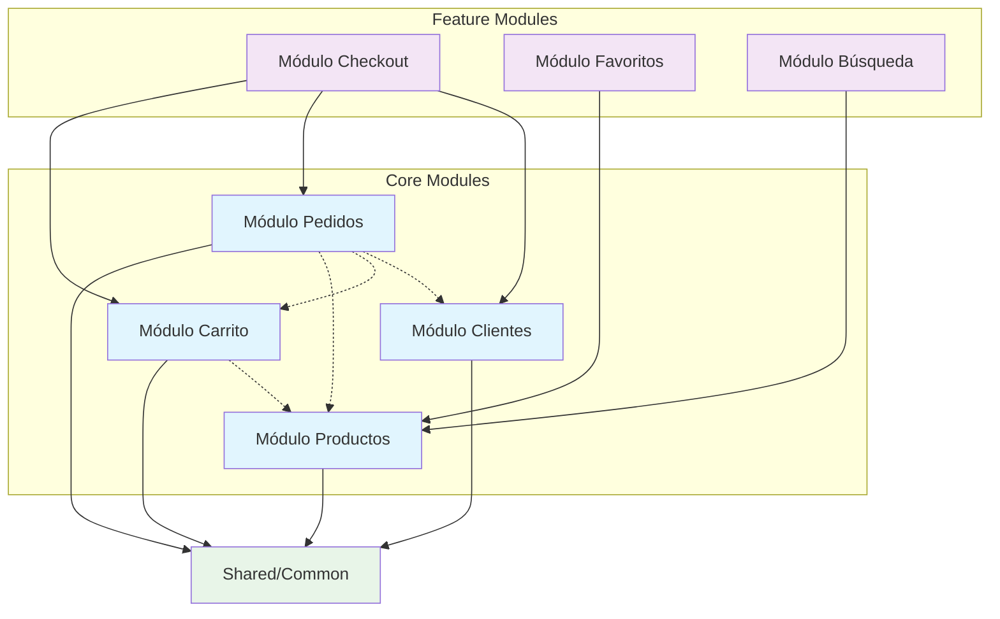

## Stack Tecnológico

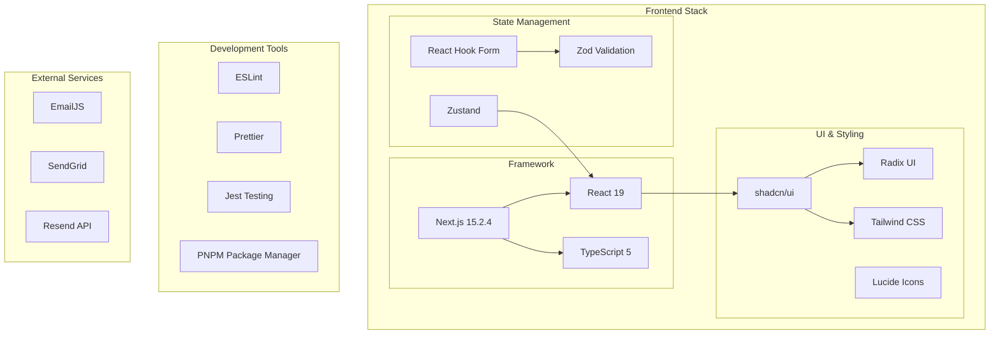

## Patrones Arquitectónicos Implementados

### 1. Hexagonal Architecture (Ports & Adapters)

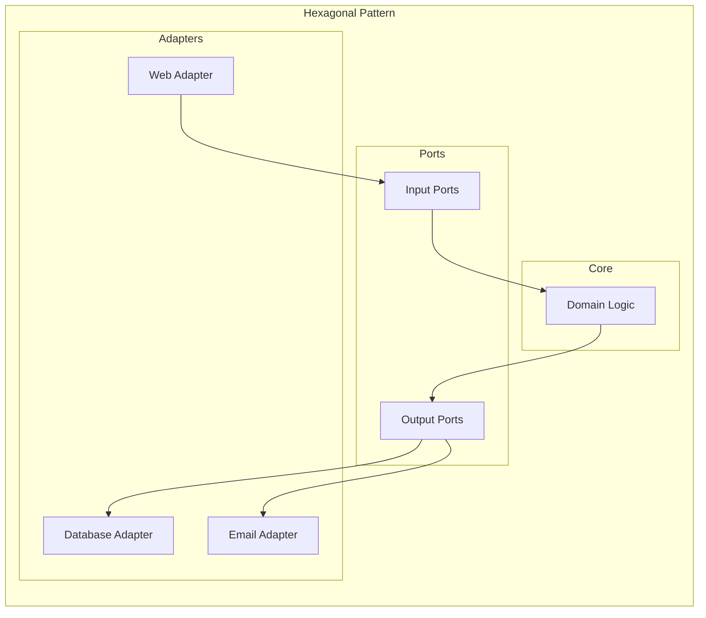

### 2. Repository Pattern

```mermaid
graph LR
    Service[Application Service] --> IRepo[Repository Interface]
    IRepo <|-- MemRepo[In-Memory Repository]
    IRepo <|-- LocalRepo[LocalStorage Repository]
    IRepo <|-- APIRepo[API Repository]
```

### 3. Facade Pattern

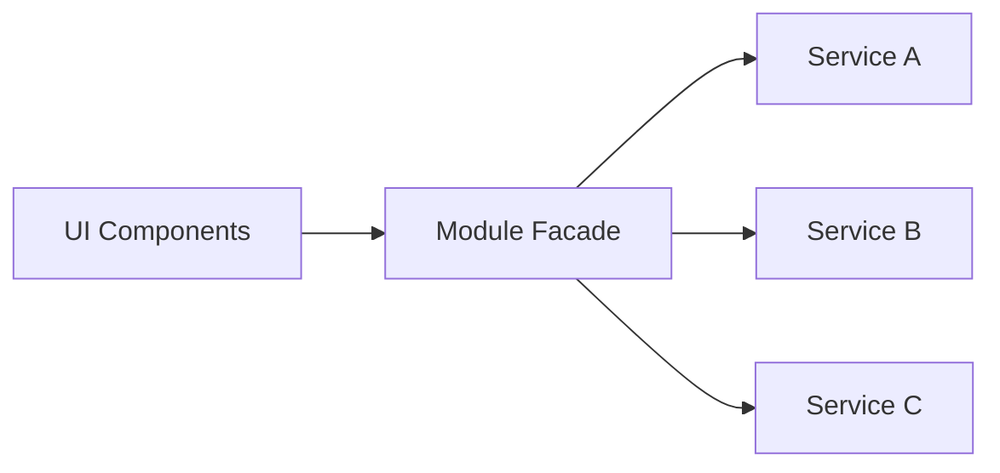

## Estructura de Directorios

```
src/
├── app/                    # Next.js App Router
│   ├── (pages)/           # Páginas agrupadas
│   ├── api/               # API Routes
│   └── globals.css        # Estilos globales
├── components/            # Componentes compartidos
│   ├── ui/               # Componentes base (shadcn/ui)
│   └── layout/           # Componentes de layout
├── modules/              # Módulos de dominio
│   ├── productos/        # Módulo de productos
│   ├── carrito/          # Módulo de carrito
│   ├── pedidos/          # Módulo de pedidos
│   └── clientes/         # Módulo de clientes
├── lib/                  # Utilidades y configuración
├── hooks/                # Hooks compartidos
├── stores/               # Stores de Zustand
├── utils/                # Funciones utilitarias
└── types/                # Tipos TypeScript globales
```

## Principios de Diseño

### SOLID Principles

1. **Single Responsibility**: Cada clase/módulo tiene una responsabilidad
2. **Open/Closed**: Abierto para extensión, cerrado para modificación
3. **Liskov Substitution**: Las implementaciones son intercambiables
4. **Interface Segregation**: Interfaces específicas y cohesivas
5. **Dependency Inversion**: Dependencias hacia abstracciones

### Clean Architecture

- **Independencia de Frameworks**: Lógica de negocio independiente
- **Testabilidad**: Fácil testing de componentes aislados
- **Independencia de UI**: Lógica separada de la presentación
- **Independencia de Base de Datos**: Abstracciones para persistencia

## Comunicación entre Módulos

### Eventos de Dominio

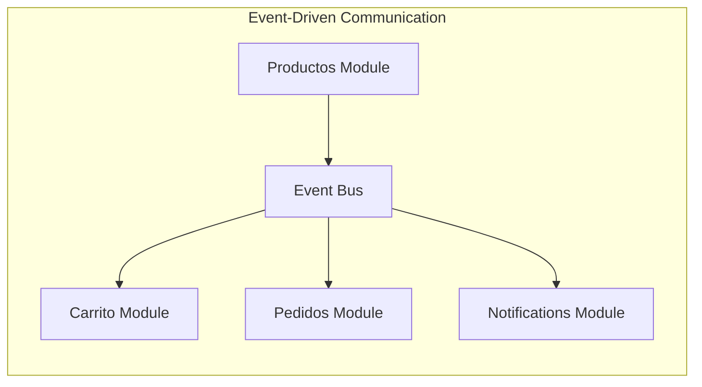

### Facades para UI

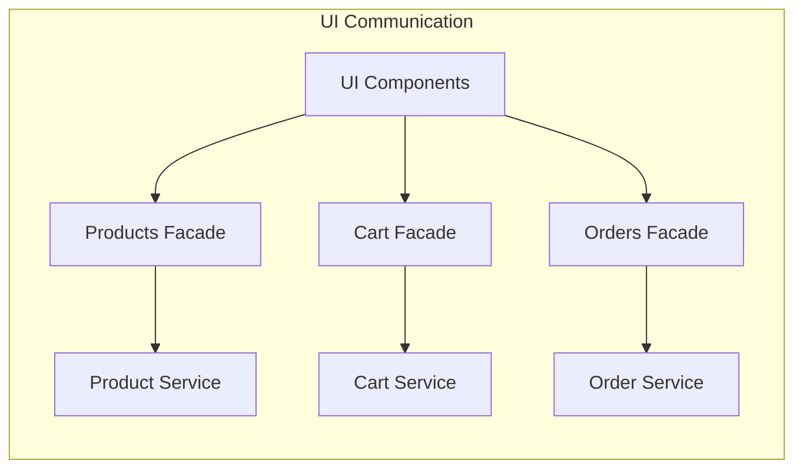

## Testing Strategy

### Pirámide de Testing

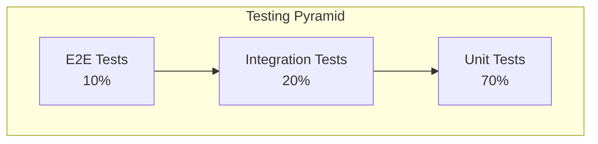

### Testing por Capa

- **Domain**: Unit tests para entidades y value objects
- **Application**: Unit tests para servicios con mocks
- **Infrastructure**: Integration tests para repositorios
- **Presentation**: Component tests para UI

## Performance & Optimization

### Code Splitting

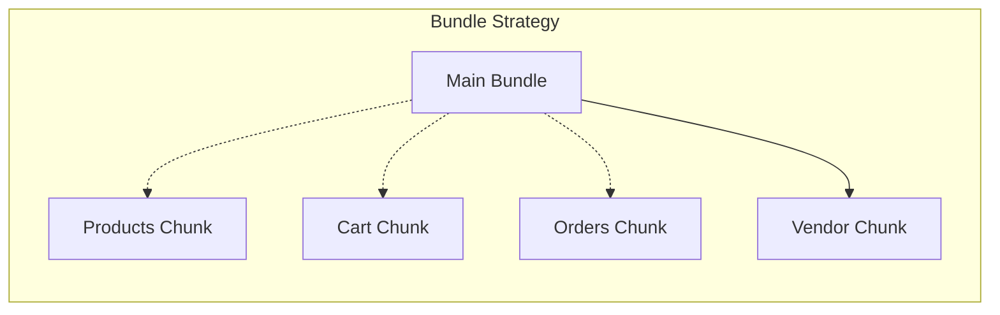

### Lazy Loading

- Módulos cargados bajo demanda
- Componentes pesados con React.lazy()
- Imágenes optimizadas con Next.js Image

## Security Considerations

### Data Validation

- Validación en frontend con Zod
- Sanitización de inputs
- Validación de tipos TypeScript

### Error Handling

- Errores tipados por dominio
- Logging estructurado
- Fallbacks para errores de UI

## Deployment Architecture

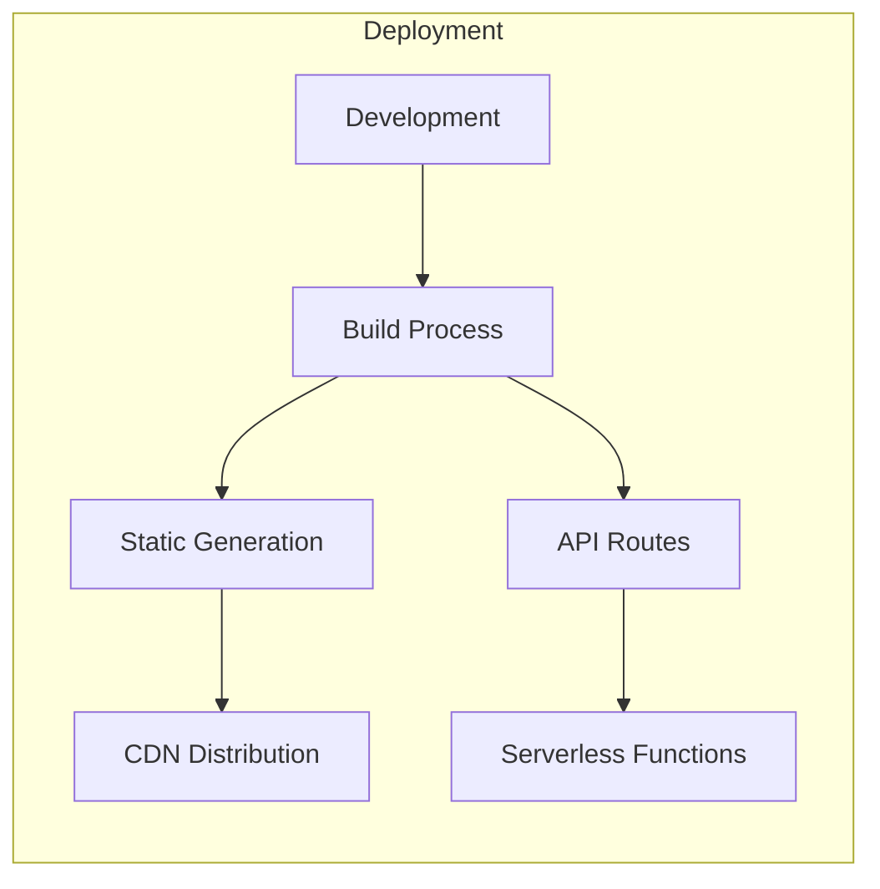

## Métricas y Monitoreo

### Performance Metrics

- Core Web Vitals
- Bundle size analysis
- Runtime performance
- Error tracking

### Business Metrics

- Conversion rates
- User engagement
- Feature usage
- Performance impact

## Roadmap Arquitectónico

### Fase Actual: Modular Foundation

- ✅ Arquitectura hexagonal implementada
- ✅ Módulos de productos, carrito, pedidos
- ✅ Testing strategy establecida
- ✅ Code splitting configurado

### Próximas Fases

- 🔄 Módulo de clientes completo
- 📋 Sistema de notificaciones
- 🔍 Búsqueda avanzada
- 📊 Analytics y métricas
- 🚀 Optimizaciones de performance

## Última Actualización

- **Fecha**: 2024-12-19
- **Cambios**:
  - Actualización completa de arquitectura general
  - Integración de módulos implementados
  - Documentación de patrones y principios
  - Roadmap arquitectónico actualizado

## Archivos Relacionados

- [Módulo Productos](./modules/productos.md)
- [Módulo Carrito](./modules/carrito.md)
- [Módulo Pedidos](./modules/pedidos.md)
- [Módulo Clientes](./modules/clientes.md)
- [Testing Architecture](./testing/product-testing-architecture.md)
- [API Documentation](./apis/overview.md)
