# Estrategia de Testing - Proyecto Mandorla

## Descripción

Estrategia integral de testing para el proyecto e-commerce Mandorla, definiendo patrones, herramientas y metodologías para asegurar la calidad del código en toda la arquitectura modular.

## Diagrama de Estrategia de Testing


## Testing por Módulo

### Módulo Productos


### Módulo Carrito


### Módulo Pedidos


### Módulo Clientes

```mermaid
graph LR
    subgraph "Clientes Testing"
        subgraph "Domain Tests ✅"
            CL_ENT[ClienteEntity - 13 tests]
            CL_VO[Cliente VOs - 8 tests]
            CL_ERR[Cliente Errors - 4 tests]
        end
        
        subgraph "Application Tests ✅"
            CL_SERV[ClienteService - 9 tests]
            CL_DTO[Cliente DTOs - 5 tests]
        end
        
        subgraph "Infrastructure Tests 📋"
            CL_REPO[Repository - 6 tests]
            CL_VALID[Validation - 4 tests]
        end
        
        subgraph "Presentation Tests 📋"
            CL_COMP[Components - 7 tests]
            CL_FORM[Forms - 5 tests]
        end
    end
```



## Patrones de Testing por Capa

### Domain Layer Testing

```typescript
// Patrón para tests de entidades
describe('ProductEntity', () => {
  describe('Creación de producto', () => {
    it('debería crear un producto válido correctamente', () => {
      // Arrange - Preparar datos de prueba
      const productData = {
        name: 'Pan Integral',
        price: Money.create(2500),
        category: ProductCategory.BREAD,
      };

      // Act - Ejecutar acción
      const product = ProductEntity.create(productData);

      // Assert - Verificar resultado
      expect(product.name).toBe('Pan Integral');
      expect(product.price.value).toBe(2500);
      expect(product.category).toBe(ProductCategory.BREAD);
    });
  });

  describe('Validaciones de negocio', () => {
    it('debería lanzar error con precio inválido', () => {
      // Arrange
      const invalidPrice = Money.create(-100);
      const product = createValidProduct();

      // Act & Assert
      expect(() => product.updatePrice(invalidPrice))
        .toThrow(InvalidProductPriceError);
    });
  });
});
```

### Application Layer Testing

```typescript
// Patrón para tests de servicios con mocks
describe('ProductService', () => {
  let service: ProductService;
  let mockRepository: jest.Mocked<IProductRepository>;

  beforeEach(() => {
    mockRepository = createMockRepository();
    service = new ProductService(mockRepository);
  });

  describe('createProduct', () => {
    it('debería crear producto correctamente', async () => {
      // Arrange
      const productData = createValidProductData();
      mockRepository.save.mockResolvedValue();

      // Act
      const result = await service.createProduct(productData);

      // Assert
      expect(result).toBeInstanceOf(ProductEntity);
      expect(mockRepository.save).toHaveBeenCalledWith(
        expect.any(ProductEntity)
      );
    });

    it('debería manejar errores de repositorio', async () => {
      // Arrange
      const productData = createValidProductData();
      mockRepository.save.mockRejectedValue(new Error('DB Error'));

      // Act & Assert
      await expect(service.createProduct(productData))
        .rejects
        .toThrow(ProductServiceError);
    });
  });
});
```

### Infrastructure Layer Testing

```typescript
// Patrón para tests de integración
describe('ProductRepository Integration', () => {
  let repository: ProductRepository;
  let testDb: TestDatabase;

  beforeEach(async () => {
    testDb = await createTestDatabase();
    repository = new ProductRepository(testDb);
  });

  afterEach(async () => {
    await testDb.cleanup();
  });

  it('debería persistir y recuperar producto', async () => {
    // Arrange
    const product = createTestProduct();

    // Act
    await repository.save(product);
    const retrieved = await repository.findById(product.id);

    // Assert
    expect(retrieved).toEqual(product);
  });
});
```

### Presentation Layer Testing

```typescript
// Patrón para tests de componentes React
describe('ProductCard', () => {
  const mockProduct = createMockProduct();

  it('debería renderizar información del producto', () => {
    // Arrange & Act
    render(<ProductCard producto={mockProduct} />);

    // Assert
    expect(screen.getByText(mockProduct.name)).toBeInTheDocument();
    expect(screen.getByText(`$${mockProduct.price}`)).toBeInTheDocument();
  });

  it('debería manejar click en agregar al carrito', async () => {
    // Arrange
    const mockAddToCart = jest.fn();
    render(
      <ProductCard 
        producto={mockProduct} 
        onAddToCart={mockAddToCart} 
      />
    );

    // Act
    await user.click(screen.getByRole('button', { name: /agregar/i }));

    // Assert
    expect(mockAddToCart).toHaveBeenCalledWith(mockProduct.id);
  });
});
```

## Test Fixtures y Mock Data

### Estructura de Fixtures


### Builders Pattern para Tests

```typescript
// Builder para crear datos de prueba
export class ProductTestBuilder {
  private data: Partial<ProductData> = {};

  static create(): ProductTestBuilder {
    return new ProductTestBuilder();
  }

  withName(name: string): ProductTestBuilder {
    this.data.name = name;
    return this;
  }

  withPrice(price: number): ProductTestBuilder {
    this.data.price = price;
    return this;
  }

  withCategory(category: ProductCategory): ProductTestBuilder {
    this.data.category = category;
    return this;
  }

  withoutStock(): ProductTestBuilder {
    this.data.stock = 0;
    this.data.available = false;
    return this;
  }

  build(): ProductEntity {
    const defaultData = {
      name: 'Producto de Prueba',
      price: 1000,
      category: ProductCategory.BREAD,
      description: 'Descripción de prueba',
      stock: 10,
      available: true,
    };

    return ProductEntity.create({ ...defaultData, ...this.data });
  }
}

// Uso del builder
const productWithoutStock = ProductTestBuilder
  .create()
  .withName('Pan Agotado')
  .withPrice(2500)
  .withoutStock()
  .build();
```

## Configuración de Testing

### Jest Configuration

```javascript
// jest.config.js
module.exports = {
  preset: 'ts-jest',
  testEnvironment: 'jsdom',
  setupFilesAfterEnv: ['<rootDir>/jest.setup.js'],
  testMatch: [
    '<rootDir>/src/**/__tests__/**/*.test.{ts,tsx}',
    '<rootDir>/src/**/*.test.{ts,tsx}'
  ],
  collectCoverageFrom: [
    'src/**/*.{ts,tsx}',
    '!src/**/*.d.ts',
    '!src/**/__tests__/**',
    '!src/**/index.ts'
  ],
  coverageThreshold: {
    global: {
      branches: 80,
      functions: 80,
      lines: 80,
      statements: 80
    },
    './src/modules/*/domain/': {
      branches: 95,
      functions: 95,
      lines: 95,
      statements: 95
    }
  },
  moduleNameMapping: {
    '^@/(.*)$': '<rootDir>/src/$1'
  }
};
```

### Testing Scripts

```json
{
  "scripts": {
    "test": "jest",
    "test:watch": "jest --watch",
    "test:coverage": "jest --coverage",
    "test:ci": "jest --ci --coverage --watchAll=false",
    "test:domain": "jest src/modules/*/domain",
    "test:application": "jest src/modules/*/application",
    "test:infrastructure": "jest src/modules/*/infrastructure",
    "test:presentation": "jest src/modules/*/presentation",
    "test:e2e": "playwright test",
    "test:unit": "jest --testPathIgnorePatterns=integration",
    "test:integration": "jest --testPathPattern=integration"
  }
}
```

## Métricas y Reportes

### Dashboard de Cobertura

```mermaid
graph TB
    subgraph "Coverage Dashboard"
        subgraph "Overall Coverage"
            OC1[Total: 92%]
            OC2[Statements: 94%]
            OC3[Branches: 89%]
            OC4[Functions: 95%]
            OC5[Lines: 93%]
        end
        
        subgraph "By Module"
            MC1[Productos: 95%]
            MC2[Carrito: 93%]
            MC3[Pedidos: 91%]
            MC4[Clientes: 89%]
        end
        
        subgraph "By Layer"
            LC1[Domain: 98%]
            LC2[Application: 94%]
            LC3[Infrastructure: 87%]
            LC4[Presentation: 85%]
        end
        
        subgraph "Quality Gates"
            QG1[✅ Domain > 95%]
            QG2[✅ Application > 90%]
            QG3[⚠️ Infrastructure > 85%]
            QG4[⚠️ Presentation > 80%]
        end
    end
```



### Test Execution Metrics

| Métrica | Valor | Objetivo | Estado |
|---------|-------|----------|--------|
| Tests Totales | 247 | 300+ | 🔄 |
| Tests Pasando | 245 | 100% | ✅ |
| Tiempo Ejecución | 12.3s | <15s | ✅ |
| Cobertura Global | 92% | >90% | ✅ |
| Cobertura Domain | 98% | >95% | ✅ |
| Tests Flaky | 0 | 0 | ✅ |

## Automatización y CI/CD

### Pipeline de Testing


### Quality Gates

```yaml
# .github/workflows/test.yml
quality_gates:
  coverage:
    overall: 90%
    domain: 95%
    application: 90%
    infrastructure: 85%
    presentation: 80%
  
  performance:
    unit_tests: <10s
    integration_tests: <30s
    e2e_tests: <5m
  
  reliability:
    flaky_tests: 0
    test_failures: 0%
```

## Beneficios de la Estrategia

### Para el Desarrollo

- **Confianza**: Cambios seguros con cobertura completa
- **Velocidad**: Feedback rápido en desarrollo
- **Calidad**: Detección temprana de bugs

### Para el Negocio

- **Fiabilidad**: Menos bugs en producción
- **Mantenimiento**: Código más fácil de evolucionar
- **ROI**: Menor costo de corrección de errores

### Para el Equipo

- **Documentación**: Tests como especificación viva
- **Onboarding**: Comprensión rápida del comportamiento
- **Colaboración**: Estándares claros de calidad

## Roadmap de Testing

### Fase Actual (Q1 2024)

- ✅ Tests de dominio completos
- ✅ Tests de aplicación básicos
- 🔄 Tests de infraestructura
- 📋 Tests de presentación

### Próximas Fases

- **Q2 2024**: Tests E2E completos
- **Q3 2024**: Performance testing
- **Q4 2024**: Visual regression testing

## Componentes Relacionados

- [Testing del Módulo Productos](../modules/productos-testing-architecture.md)
- [Arquitectura General](./mandorla-architecture-overview.md)
- [Patrones de Clean Code](../../guides/clean-code-patterns.md)
- [Guía de Testing](../../guides/testing-guide.md)

## Changelog

- **2024-01-20**: Creación de la estrategia de testing
- **2024-01-20**: Implementación de tests de ProductEntity
- **2024-01-20**: Definición de patrones y métricas
- **2024-01-20**: Configuración de herramientas y CI/CD
