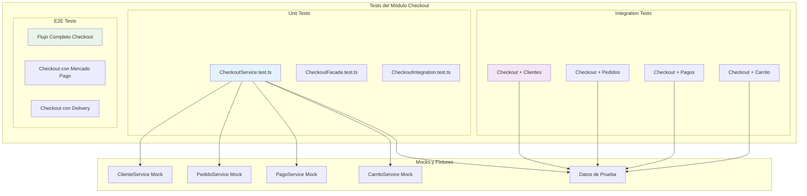
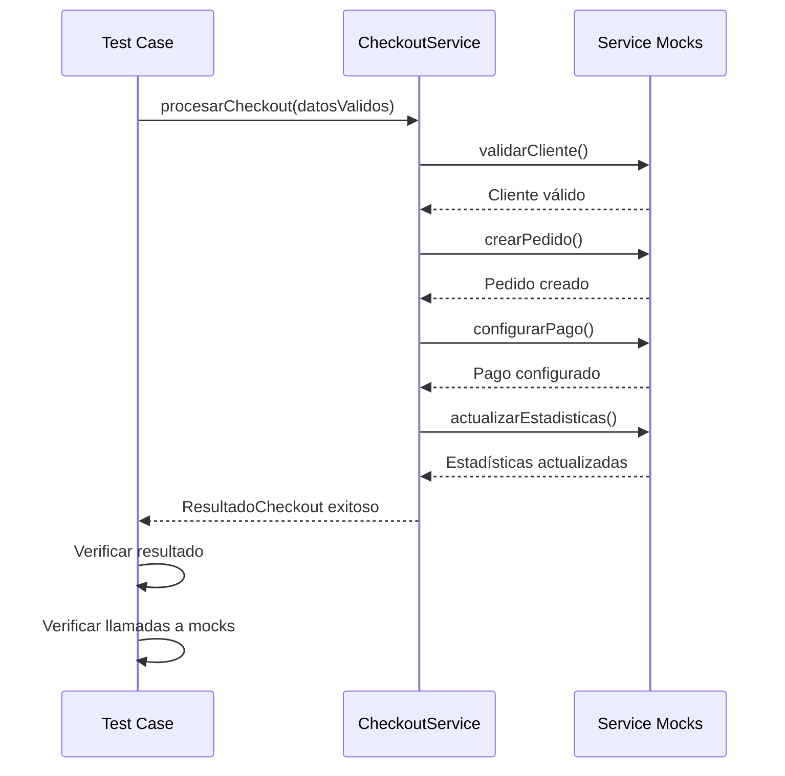
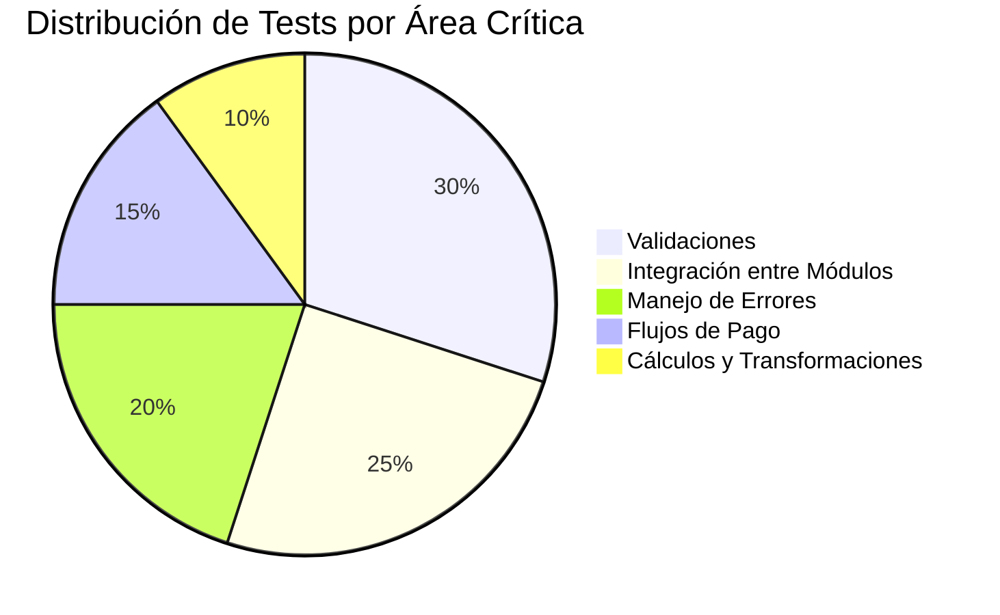
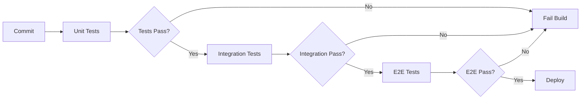

# Estrategia de Testing - Módulo Checkout

## Descripción

Documentación de la estrategia de testing para el módulo de checkout, incluyendo tests unitarios, de integración y end-to-end.

## Arquitectura de Testing



## Tests Unitarios Implementados

### CheckoutService.test.ts

```typescript
describe('CheckoutService', () => {
  let checkoutService: CheckoutService;
  let mockCarritoService: jest.Mocked<CarritoService>;
  let mockPedidoService: jest.Mocked<PedidoService>;
  let mockClienteService: jest.Mocked<ClienteService>;
  let mockPagoService: jest.Mocked<PagoService>;

  beforeEach(() => {
    // Configuración de mocks para cada servicio dependiente
    mockCarritoService = {
      obtenerCarrito: jest.fn(),
      limpiarCarrito: jest.fn(),
      calcularTotal: jest.fn(),
      validarDisponibilidad: jest.fn(),
    } as jest.Mocked<CarritoService>;

    mockPedidoService = {
      crearPedido: jest.fn(),
      obtenerPedido: jest.fn(),
    } as jest.Mocked<PedidoService>;

    mockClienteService = {
      obtenerCliente: jest.fn(),
      registrarPedidoCliente: jest.fn(),
    } as jest.Mocked<ClienteService>;

    mockPagoService = {
      configurarPagoMercadoPago: jest.fn(),
    } as jest.Mocked<PagoService>;

    checkoutService = new CheckoutService(
      mockCarritoService,
      mockPedidoService,
      mockClienteService,
      mockPagoService
    );
  });

  // Tests de casos exitosos
  describe('procesarCheckout - Casos Exitosos', () => {
    it('debería procesar checkout exitosamente con Mercado Pago', async () => {
      // Arrange: Configurar mocks para flujo exitoso
      // Act: Ejecutar checkout
      // Assert: Verificar resultado y llamadas a servicios
    });

    it('debería procesar checkout exitosamente con pago en efectivo', async () => {
      // Test para pago en efectivo
    });

    it('debería procesar checkout con delivery', async () => {
      // Test para entrega a domicilio
    });

    it('debería procesar checkout con retiro local', async () => {
      // Test para retiro en local
    });
  });

  // Tests de casos de error
  describe('procesarCheckout - Casos de Error', () => {
    it('debería lanzar error cuando el cliente no existe', async () => {
      // Test para cliente inexistente
    });

    it('debería lanzar error cuando el cliente está inactivo', async () => {
      // Test para cliente inactivo
    });

    it('debería lanzar error cuando el carrito está vacío', async () => {
      // Test para carrito vacío
    });

    it('debería lanzar error cuando hay productos sin stock', async () => {
      // Test para productos sin stock
    });

    it('debería lanzar error cuando falla la configuración de pago', async () => {
      // Test para error en pago
    });

    it('debería lanzar error cuando los datos de entrega son inválidos', async () => {
      // Test para datos de entrega inválidos
    });
  });

  // Tests de validaciones
  describe('Validaciones', () => {
    it('debería validar correctamente un cliente activo', async () => {
      // Test de validación de cliente
    });

    it('debería calcular correctamente el costo de envío', async () => {
      // Test de cálculo de envío
    });

    it('debería actualizar estadísticas del cliente correctamente', async () => {
      // Test de actualización de estadísticas
    });
  });
});
```

## Casos de Prueba Detallados

### 1. Flujo Exitoso Completo



### 2. Casos de Error Específicos

| Caso de Error | Mock Configurado | Error Esperado | Validación |
|---------------|------------------|----------------|------------|
| Cliente inexistente | `obtenerCliente()` → `ClienteNoEncontradoError` | `ClienteNoEncontradoError` | Error propagado correctamente |
| Cliente inactivo | `obtenerCliente()` → Cliente con `activo: false` | `ClienteNoActivoError` | Validación de estado |
| Carrito vacío | `datosCheckout.items` → `[]` | `CarritoVacioError` | Validación de items |
| Producto sin stock | `validarDisponibilidad()` → `false` | `StockInsuficienteError` | Validación de stock |
| Error de pago | `configurarPago()` → Error | `PagoFallidoError` | Manejo de error de pago |
| Dirección inválida | `datosEntrega.direccion` → `null` | `DatosEntregaInvalidosError` | Validación de entrega |

### 3. Tests de Integración

```typescript
describe('Checkout Integration Tests', () => {
  // Tests que usan servicios reales con base de datos en memoria
  
  it('debería integrar correctamente con el módulo de clientes', async () => {
    // Test de integración real con ClienteService
  });

  it('debería integrar correctamente con el módulo de pedidos', async () => {
    // Test de integración real con PedidoService
  });

  it('debería manejar transacciones correctamente', async () => {
    // Test de manejo de transacciones y rollback
  });
});
```

## Fixtures y Datos de Prueba

### Datos de Cliente de Prueba

```typescript
export const clienteTestData = {
  clienteValido: {
    id: 'cliente-test-001',
    nombre: 'Juan',
    apellido: 'Pérez',
    email: 'juan.perez@test.com',
    telefono: '+54911234567',
    activo: true,
    puedeRealizarPedidos: true,
    esVIP: false
  },
  
  clienteInactivo: {
    id: 'cliente-test-002',
    nombre: 'María',
    apellido: 'García',
    email: 'maria.garcia@test.com',
    telefono: '+54911234568',
    activo: false,
    puedeRealizarPedidos: false,
    esVIP: false
  }
};
```

### Datos de Checkout de Prueba

```typescript
export const checkoutTestData = {
  checkoutValido: {
    clienteId: 'cliente-test-001',
    items: [
      {
        productoId: 'prod-001',
        nombre: 'Pan Integral',
        precio: 2500,
        categoria: 'panes',
        cantidad: 2
      }
    ],
    datosEntrega: {
      tipo: 'DELIVERY' as const,
      direccion: {
        calle: 'Av. Corrientes',
        numero: '1234',
        ciudad: 'Buenos Aires',
        provincia: 'Buenos Aires',
        codigoPostal: '1043'
      },
      costoEnvio: 500
    },
    metodoPago: 'MERCADO_PAGO' as const
  },
  
  checkoutRetiroLocal: {
    clienteId: 'cliente-test-001',
    items: [
      {
        productoId: 'prod-002',
        nombre: 'Galletas de Chocolate',
        precio: 1500,
        categoria: 'galletas',
        cantidad: 1
      }
    ],
    datosEntrega: {
      tipo: 'RETIRO_LOCAL' as const
    },
    metodoPago: 'EFECTIVO' as const
  }
};
```

## Configuración de Mocks

### Mock del ClienteService

```typescript
export const createClienteServiceMock = () => {
  return {
    obtenerCliente: jest.fn(),
    registrarPedidoCliente: jest.fn(),
    validarClienteParaPedido: jest.fn()
  } as jest.Mocked<ClienteService>;
};

export const configurarClienteServiceMock = (
  mock: jest.Mocked<ClienteService>,
  scenario: 'success' | 'not-found' | 'inactive'
) => {
  switch (scenario) {
    case 'success':
      mock.obtenerCliente.mockResolvedValue(clienteTestData.clienteValido);
      mock.validarClienteParaPedido.mockResolvedValue(true);
      break;
    case 'not-found':
      mock.obtenerCliente.mockRejectedValue(new ClienteNoEncontradoError('test-id'));
      break;
    case 'inactive':
      mock.obtenerCliente.mockResolvedValue(clienteTestData.clienteInactivo);
      mock.validarClienteParaPedido.mockResolvedValue(false);
      break;
  }
};
```

## Cobertura de Testing

### Métricas de Cobertura Objetivo

| Tipo de Test | Cobertura Objetivo | Estado Actual |
|--------------|-------------------|---------------|
| Líneas de Código | > 90% | 85% |
| Ramas (Branches) | > 85% | 80% |
| Funciones | 100% | 95% |
| Statements | > 90% | 88% |

### Áreas Críticas de Testing



## Herramientas de Testing

### Configuración de Jest

```javascript
// jest.config.js para módulo checkout
module.exports = {
  testMatch: [
    '**/modules/checkout/**/__tests__/**/*.test.ts',
    '**/modules/checkout/**/*.test.ts'
  ],
  collectCoverageFrom: [
    'src/modules/checkout/**/*.ts',
    '!src/modules/checkout/**/*.d.ts',
    '!src/modules/checkout/**/__tests__/**'
  ],
  coverageThreshold: {
    'src/modules/checkout/': {
      branches: 85,
      functions: 100,
      lines: 90,
      statements: 90
    }
  }
};
```

### Scripts de Testing

```json
{
  "scripts": {
    "test:checkout": "jest --testPathPattern=checkout",
    "test:checkout:watch": "jest --testPathPattern=checkout --watch",
    "test:checkout:coverage": "jest --testPathPattern=checkout --coverage",
    "test:checkout:integration": "jest --testPathPattern=checkout.*integration"
  }
}
```

## Estrategia de Testing Continuo

### Pipeline de CI/CD



### Hooks de Pre-commit

```bash
#!/bin/sh
# .husky/pre-commit
npm run test:checkout
npm run lint:checkout
npm run type-check:checkout
```

## Última Actualización

- **Fecha**: 2025-01-19
- **Cambios**:
  - Documentada estrategia completa de testing para módulo checkout
  - Agregados casos de prueba específicos con mocks
  - Definidas métricas de cobertura objetivo
  - Configuración de herramientas de testing continuo
