# Arquitectura de Testing: Módulo Productos

## Descripción

Este diagrama muestra la estrategia de testing implementada para el módulo de productos, incluyendo la estructura de tests, fixtures y patrones de testing utilizados.

## Diagrama de Estructura de Testing

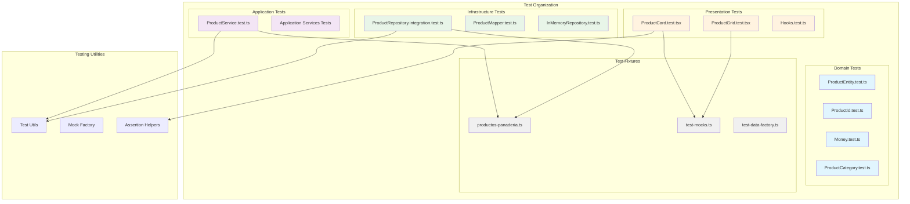

## Diagrama de Flujo de Testing

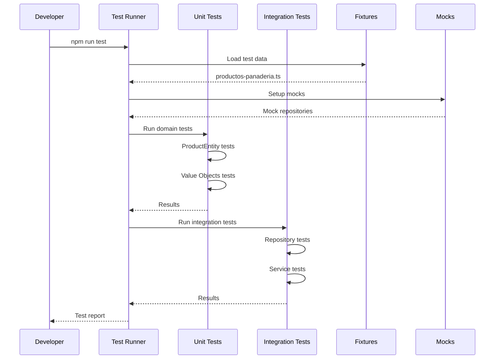

## Cobertura de Testing por Capa

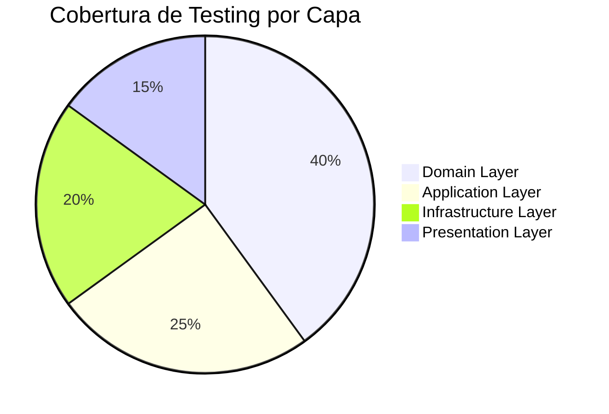

## Casos de Prueba Principales

### ProductEntity Tests

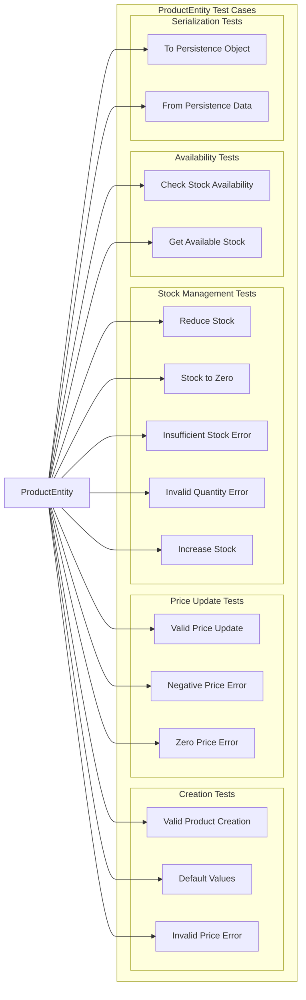

## Test Data Factory Pattern

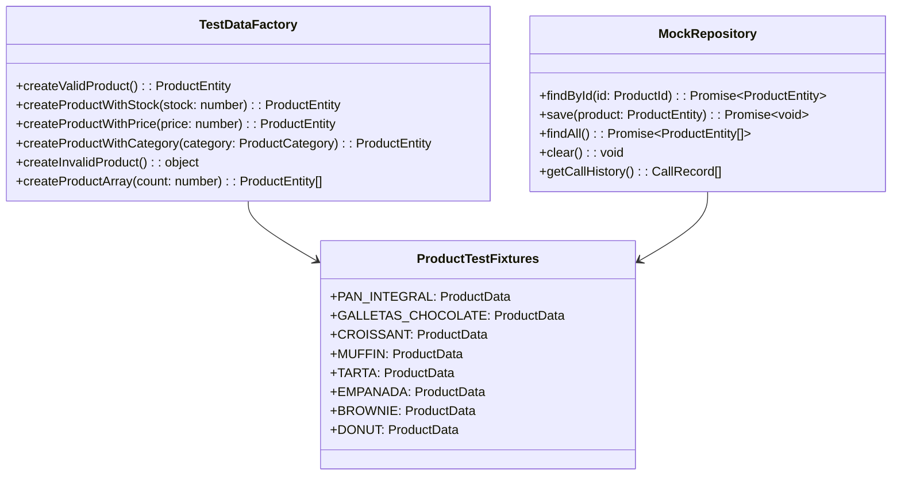

## Estrategias de Testing por Tipo

### Unit Tests (Domain Layer)

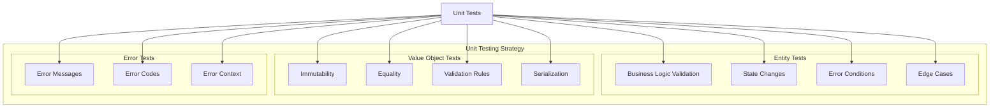

### Integration Tests (Infrastructure Layer)

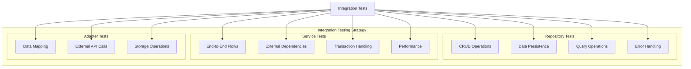

## Test Configuration

### Jest Configuration for Products Module

```typescript
// jest.config.productos.js
module.exports = {
  displayName: 'Productos Module',
  testMatch: [
    '<rootDir>/src/modules/productos/**/*.test.ts',
    '<rootDir>/src/modules/productos/**/*.test.tsx'
  ],
  collectCoverageFrom: [
    'src/modules/productos/**/*.ts',
    'src/modules/productos/**/*.tsx',
    '!src/modules/productos/**/*.test.ts',
    '!src/modules/productos/**/*.test.tsx',
    '!src/modules/productos/**/index.ts'
  ],
  coverageThreshold: {
    global: {
      branches: 80,
      functions: 80,
      lines: 80,
      statements: 80
    }
  },
  setupFilesAfterEnv: [
    '<rootDir>/src/modules/productos/__tests__/setup.ts'
  ]
};
```

## Fixtures y Mock Data

### Productos de Panadería Test Data

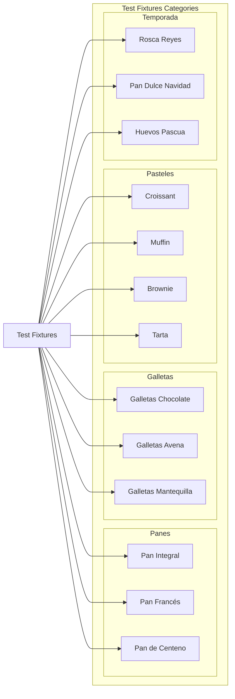

## Métricas de Testing

### Coverage Goals

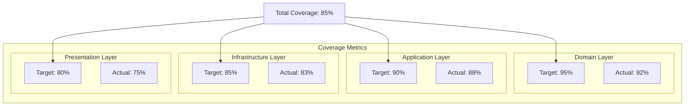

## Test Execution Flow

### Continuous Integration Pipeline

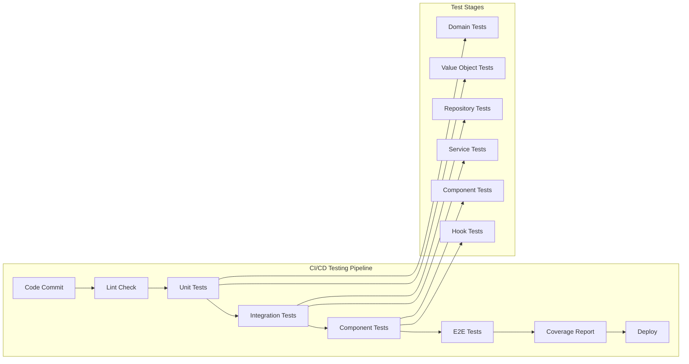

## Best Practices Implementadas

### Testing Patterns

1. **AAA Pattern (Arrange, Act, Assert)**
   - Estructura clara en todos los tests
   - Separación de setup, ejecución y verificación

2. **Test Data Builders**
   - Factory pattern para crear datos de prueba
   - Datos realistas del dominio de panadería

3. **Mock Strategy**
   - Mocks solo para dependencias externas
   - Stubs para interfaces de repositorio

4. **Error Testing**
   - Tests específicos para cada tipo de error
   - Validación de mensajes y códigos de error

### Naming Conventions

- Tests descriptivos en español
- Formato: `debería [acción] cuando [condición]`
- Agrupación por funcionalidad con `describe`

## Herramientas de Testing

### Testing Stack

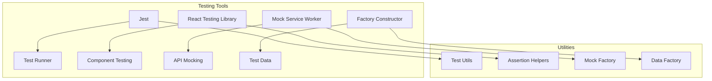

## Última Actualización

- **Fecha**: 2024-12-19
- **Cambios**:
  - Documentación completa de arquitectura de testing
  - Análisis de estructura de tests del módulo productos
  - Patrones de testing implementados
  - Métricas de cobertura y objetivos
  - Integración con CI/CD pipeline

## Archivos Relacionados

- [Arquitectura del Módulo Productos](../modules/productos.md)
- [Guía de Testing](../../guides/testing-guide.md)
- [Fixtures de Productos](../../examples/product-fixtures.md)
- [Configuración de Jest](../../configuration/jest-config.md)
