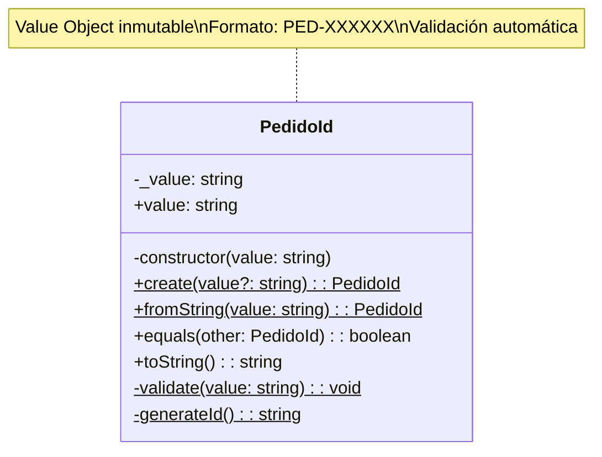
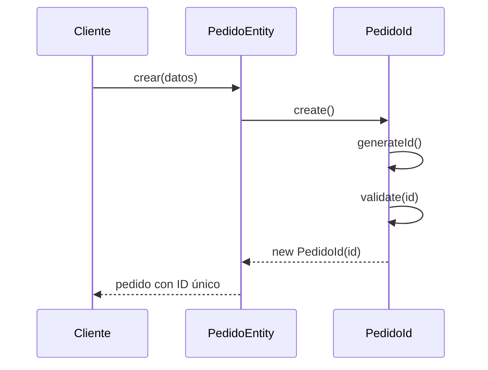
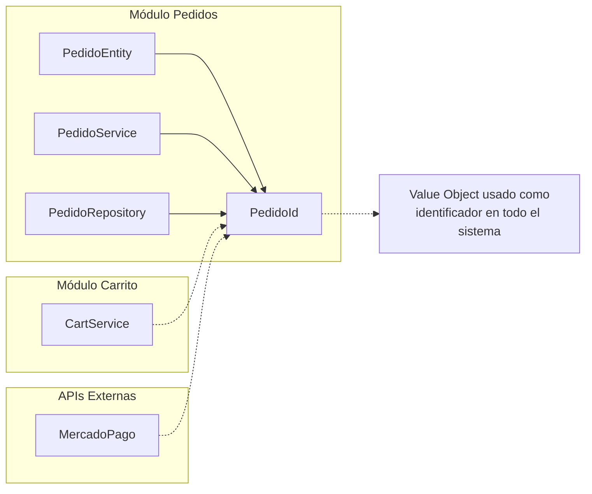

# PedidoId Value Object

## Descripción

Value Object que representa el identificador único de un pedido en el sistema Mandorla. Implementa validaciones específicas de formato y generación automática de IDs únicos.

## Diagrama de Clase



## Implementación

### Características Principales

**Inmutabilidad**

- El value object es inmutable una vez creado
- Constructor privado para controlar la creación
- Solo métodos de factory públicos

**Formato Específico**

- Patrón: `PED-XXXXXX` donde X son caracteres alfanuméricos
- Ejemplo: `PED-1A2B3C4D5E`
- Longitud: Entre 3 y 50 caracteres total

**Validación Robusta**

```typescript
private static validate(value: string): void {
  // No puede estar vacío
  if (!value || value.trim().length === 0) {
    throw new Error('El ID del pedido no puede estar vacío');
  }

  // Longitud válida
  if (value.length < 3 || value.length > 50) {
    throw new Error('El ID del pedido debe tener entre 3 y 50 caracteres');
  }

  // Formato específico
  const formatoValido = /^PED-[A-Z0-9]{6,}$/i.test(value);
  if (!formatoValido) {
    throw new Error('El ID del pedido debe tener el formato PED-XXXXXX');
  }
}
```

### Métodos de Factory

**create(value?: string)**

- Crea un nuevo PedidoId
- Si no se proporciona valor, genera uno automáticamente
- Valida el formato antes de crear

**fromString(value: string)**

- Crea PedidoId desde string existente
- Útil para deserialización
- Valida formato obligatoriamente

### Generación Automática

```typescript
private static generateId(): string {
  const timestamp = Date.now().toString(36);
  const random = Math.random().toString(36).substring(2, 8);
  return `PED-${timestamp}${random}`.toUpperCase();
}
```

**Características de la Generación**:

- Combina timestamp y componente aleatorio
- Garantiza unicidad temporal
- Formato legible y trazeable
- Siempre en mayúsculas

## Uso en el Dominio

### En PedidoEntity



### En Servicios de Aplicación

```typescript
// Crear pedido con ID automático
const pedido = PedidoEntity.crear(cliente, items, datosEntrega);
console.log(pedido.id.value); // "PED-1A2B3C4D5E"

// Buscar pedido por ID string
const pedidoId = PedidoId.fromString("PED-1A2B3C4D5E");
const pedido = await repository.buscarPorId(pedidoId);

// Comparar IDs
const id1 = PedidoId.create();
const id2 = PedidoId.fromString(id1.value);
console.log(id1.equals(id2)); // true
```

### En Repositorios

```typescript
interface IPedidoRepository {
  buscarPorId(id: PedidoId): Promise<PedidoEntity | null>;
  guardar(pedido: PedidoEntity): Promise<void>;
  buscarPorCliente(clienteId: string): Promise<PedidoEntity[]>;
}

// Implementación
class PedidoRepository implements IPedidoRepository {
  async buscarPorId(id: PedidoId): Promise<PedidoEntity | null> {
    const data = await this.db.findOne({ _id: id.value });
    return data ? PedidoEntity.fromPersistence(data) : null;
  }
}
```

## Validaciones y Errores

### Casos de Error

**ID Vacío**

```typescript
PedidoId.fromString(""); 
// Error: El ID del pedido no puede estar vacío
```

**Formato Inválido**

```typescript
PedidoId.fromString("INVALID-FORMAT");
// Error: El ID del pedido debe tener el formato PED-XXXXXX
```

**Longitud Inválida**

```typescript
PedidoId.fromString("PED-AB");
// Error: El ID del pedido debe tener entre 3 y 50 caracteres
```

### Manejo de Errores en Servicios

```typescript
export class PedidoService {
  async obtenerPedido(pedidoIdString: string): Promise<PedidoDetalleDto> {
    try {
      const pedidoId = PedidoId.fromString(pedidoIdString);
      const pedido = await this.repository.buscarPorId(pedidoId);
      
      if (!pedido) {
        throw new PedidoNoEncontradoError(pedidoIdString);
      }
      
      return this.convertirADto(pedido);
    } catch (error) {
      if (error.message.includes('formato PED-')) {
        throw new PedidoIdInvalidoError(pedidoIdString);
      }
      throw error;
    }
  }
}
```

## Testing

### Tests Unitarios

```typescript
describe('PedidoId', () => {
  describe('create', () => {
    it('debería generar ID automático con formato válido', () => {
      const id = PedidoId.create();
      expect(id.value).toMatch(/^PED-[A-Z0-9]{6,}$/);
    });

    it('debería usar valor proporcionado si es válido', () => {
      const customId = 'PED-CUSTOM123';
      const id = PedidoId.create(customId);
      expect(id.value).toBe(customId);
    });
  });

  describe('fromString', () => {
    it('debería crear ID desde string válido', () => {
      const idString = 'PED-ABC123DEF';
      const id = PedidoId.fromString(idString);
      expect(id.value).toBe(idString);
    });

    it('debería lanzar error con formato inválido', () => {
      expect(() => PedidoId.fromString('INVALID'))
        .toThrow('formato PED-XXXXXX');
    });
  });

  describe('equals', () => {
    it('debería comparar correctamente IDs iguales', () => {
      const id1 = PedidoId.fromString('PED-TEST123');
      const id2 = PedidoId.fromString('PED-TEST123');
      expect(id1.equals(id2)).toBe(true);
    });

    it('debería comparar correctamente IDs diferentes', () => {
      const id1 = PedidoId.create();
      const id2 = PedidoId.create();
      expect(id1.equals(id2)).toBe(false);
    });
  });
});
```

## Integración con Otros Módulos

### Relaciones de Dependencia



### Serialización para APIs

```typescript
// En respuestas de API
interface PedidoResponseDto {
  id: string; // PedidoId.value
  cliente: ClienteDto;
  items: ItemDto[];
  // ...
}

// En webhooks de Mercado Pago
interface MercadoPagoWebhook {
  external_reference: string; // PedidoId.value
  payment_id: string;
  status: string;
}
```

## Beneficios del Value Object

### Seguridad de Tipos

- Evita confusión entre diferentes tipos de IDs
- Compilador detecta errores de tipo
- Autocompletado mejorado en IDEs

### Validación Centralizada

- Una sola fuente de verdad para validación
- Consistencia en todo el sistema
- Errores descriptivos y específicos

### Inmutabilidad

- No puede ser modificado accidentalmente
- Thread-safe por diseño
- Fácil de razonar sobre el código

### Expresividad

- El código es más legible y autodocumentado
- Intención clara en signatures de métodos
- Mejor experiencia de desarrollo

## Consideraciones de Performance

### Creación de Instancias

- Constructor ligero, solo validación
- Generación de ID eficiente
- Sin overhead significativo

### Comparaciones

- Método equals optimizado
- Comparación por valor, no referencia
- Adecuado para uso en colecciones

### Serialización

- toString() simple y directo
- Fácil conversión a/desde JSON
- Compatible con APIs REST

## Evolución Futura

### Posibles Mejoras

- Soporte para diferentes formatos de ID
- Integración con UUID para mayor unicidad
- Metadatos adicionales en el ID (fecha, sucursal)

### Compatibilidad

- Mantener retrocompatibilidad en formato
- Migración gradual si se cambia formato
- Versionado de esquemas de ID

## Última Actualización

- **Fecha**: 2024-12-19
- **Cambios**: Implementación completa del value object PedidoId
- **Versión**: 1.0.0
- **Estado**: Estable y en producción
