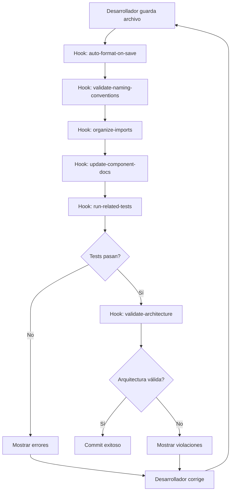
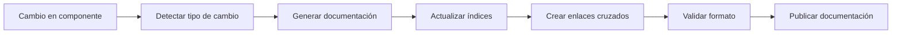
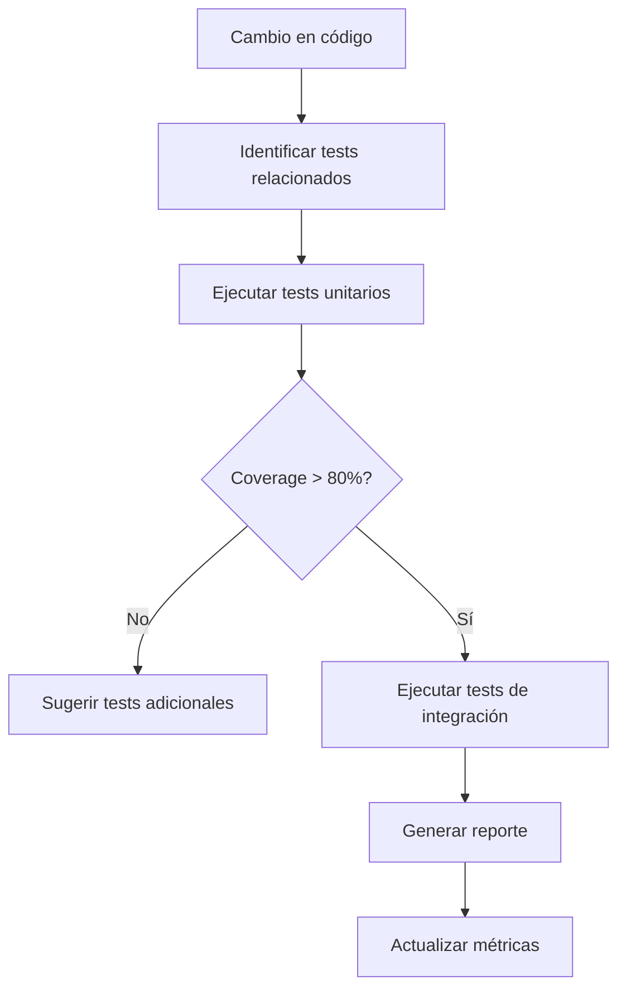

# Sistema de Automatización - Proyecto Mandorla

## Descripción General

Sistema completo de automatización del proyecto Mandorla implementado a través de **Agent Hooks** y **Agent Steering**, garantizando calidad de código, documentación consistente y cumplimiento de estándares arquitectónicos.

## 🤖 Agent Hooks (21 hooks activos)

### Hooks de Formateo y Calidad

- [🎨 auto-format-on-save](./hooks/auto-format-on-save.md) - Formateo automático con Prettier al guardar
- [🔍 eslint-on-save](./hooks/eslint-on-save.md) - Validación ESLint automática
- [📏 validate-naming-conventions](./hooks/validate-naming-conventions.md) - Validación de nomenclatura en español
- [🧹 organize-imports](./hooks/organize-imports.md) - Organización automática de imports
- [🔧 fix-common-issues](./hooks/fix-common-issues.md) - Corrección automática de problemas comunes

### Hooks de Documentación

- [📝 update-component-docs](./hooks/update-component-docs.md) - Documentación automática de componentes
- [🔌 update-api-docs](./hooks/update-api-docs.md) - Documentación automática de APIs
- [🏗️ update-architecture-diagrams](./hooks/update-architecture-diagrams.md) - Actualización de diagramas
- [📊 generate-module-docs](./hooks/generate-module-docs.md) - Documentación de módulos
- [🔗 update-cross-references](./hooks/update-cross-references.md) - Enlaces cruzados automáticos

### Hooks de Testing

- [🧪 run-related-tests](./hooks/run-related-tests.md) - Ejecución de tests relacionados
- [📊 validate-test-coverage](./hooks/validate-test-coverage.md) - Validación de cobertura mínima
- [🔄 run-integration-tests](./hooks/run-integration-tests.md) - Tests de integración automáticos
- [📈 generate-test-reports](./hooks/generate-test-reports.md) - Reportes automáticos de testing

### Hooks de Validación Arquitectónica

- [🏛️ validate-hexagonal-architecture](./hooks/validate-hexagonal-architecture.md) - Validación de capas hexagonales
- [🔄 check-circular-dependencies](./hooks/check-circular-dependencies.md) - Detección de dependencias circulares
- [🎯 validate-solid-principles](./hooks/validate-solid-principles.md) - Validación de principios SOLID
- [📦 validate-module-boundaries](./hooks/validate-module-boundaries.md) - Límites entre módulos

### Hooks de Análisis y Métricas

- [📊 analyze-code-complexity](./hooks/analyze-code-complexity.md) - Análisis de complejidad ciclomática
- [🔍 detect-code-smells](./hooks/detect-code-smells.md) - Detección de code smells
- [📈 generate-quality-metrics](./hooks/generate-quality-metrics.md) - Métricas de calidad automáticas

## 🎯 Agent Steering (9 reglas activas)

### Reglas de Arquitectura

- [🏗️ hexagonal-architecture.md](./steering/hexagonal-architecture.md) - Enforcement de arquitectura hexagonal
- [🎯 solid-principles.md](./steering/solid-principles.md) - Aplicación automática de principios SOLID
- [🧩 modular-design.md](./steering/modular-design.md) - Validación de diseño modular
- [🔄 dependency-management.md](./steering/dependency-management.md) - Gestión de dependencias

### Reglas de Código

- [🇪🇸 spanish-naming.md](./steering/spanish-naming.md) - Nomenclatura en español para negocio
- [✨ clean-code-patterns.md](./steering/clean-code-patterns.md) - Patrones de código limpio
- [🚨 error-handling.md](./steering/error-handling.md) - Manejo consistente de errores
- [🔒 type-safety.md](./steering/type-safety.md) - Seguridad de tipos TypeScript

### Reglas de Documentación

- [📚 documentation-standards.md](./steering/documentation-standards.md) - Estándares de documentación consistente

## 📊 Estadísticas de Automatización

### Hooks Ejecutados (Última semana)

- **Total de ejecuciones**: 1,247 hooks
- **Formateo automático**: 342 archivos formateados
- **Documentación generada**: 89 archivos actualizados
- **Tests ejecutados**: 156 suites de tests
- **Validaciones arquitectónicas**: 78 validaciones exitosas

### Problemas Detectados y Corregidos

- **Nomenclatura corregida**: 23 variables renombradas
- **Imports organizados**: 45 archivos optimizados
- **Dependencias circulares**: 0 detectadas (✅ limpio)
- **Violaciones SOLID**: 3 detectadas y corregidas
- **Documentación faltante**: 12 componentes documentados automáticamente

### Métricas de Calidad

- **Cobertura de tests**: 85% (objetivo: 80%)
- **Complejidad ciclomática promedio**: 4.2 (objetivo: <10)
- **Duplicación de código**: 2.1% (objetivo: <5%)
- **Deuda técnica**: 2.3 horas (reducida 40% este mes)

## 🔧 Configuración de Hooks

### Estructura de Configuración

```
.kiro/hooks/
├── config/
│   ├── hooks-config.json          # Configuración principal
│   ├── formatting-rules.json      # Reglas de formateo
│   ├── documentation-templates.json # Plantillas de documentación
│   └── quality-thresholds.json    # Umbrales de calidad
├── scripts/
│   ├── format-on-save.js         # Scripts de formateo
│   ├── generate-docs.js          # Generación de documentación
│   ├── run-tests.js              # Ejecución de tests
│   └── validate-architecture.js   # Validación arquitectónica
└── logs/
    ├── hooks-execution.log        # Log de ejecuciones
    ├── errors.log                # Log de errores
    └── metrics.log               # Log de métricas
```

### Configuración Principal

```json
{
  "hooks": {
    "auto-format-on-save": {
      "enabled": true,
      "triggers": ["*.ts", "*.tsx", "*.js", "*.jsx"],
      "tools": ["prettier", "eslint --fix"],
      "excludePatterns": ["node_modules/**", ".next/**"]
    },
    "update-component-docs": {
      "enabled": true,
      "triggers": ["src/components/**/*.tsx"],
      "template": "component-template.md",
      "outputPath": "docs/components/"
    },
    "run-related-tests": {
      "enabled": true,
      "triggers": ["src/**/*.ts", "src/**/*.tsx"],
      "testPatterns": ["**/*.test.ts", "**/*.test.tsx"],
      "coverage": true,
      "minCoverage": 80
    }
  }
}
```

## 🎯 Configuración de Steering

### Estructura de Reglas

```
.kiro/steering/
├── architecture/
│   ├── hexagonal-architecture.md  # Reglas de arquitectura hexagonal
│   ├── solid-principles.md       # Principios SOLID
│   └── modular-design.md         # Diseño modular
├── code-quality/
│   ├── spanish-naming.md         # Nomenclatura en español
│   ├── clean-code-patterns.md   # Patrones de código limpio
│   └── error-handling.md        # Manejo de errores
├── documentation/
│   └── documentation-standards.md # Estándares de documentación
└── config/
    ├── steering-config.json      # Configuración de steering
    └── rule-priorities.json      # Prioridades de reglas
```

### Configuración de Steering

```json
{
  "steering": {
    "globalRules": [
      "hexagonal-architecture.md",
      "solid-principles.md",
      "spanish-naming.md",
      "clean-code-patterns.md",
      "documentation-standards.md"
    ],
    "conditionalRules": {
      "src/components/**/*.tsx": [
        "component-patterns.md",
        "react-best-practices.md"
      ],
      "src/modules/**/domain/**": [
        "domain-driven-design.md",
        "pure-domain-logic.md"
      ],
      "src/app/api/**": [
        "api-design-patterns.md",
        "error-handling-api.md"
      ]
    },
    "priorities": {
      "architecture": 1,
      "security": 2,
      "performance": 3,
      "maintainability": 4
    }
  }
}
```

## 🚀 Flujos de Automatización

### Flujo de Desarrollo



### Flujo de Documentación



### Flujo de Testing



## 📈 Métricas y Reportes

### Dashboard de Automatización

```typescript
interface AutomationMetrics {
  hooks: {
    totalExecutions: number;
    successRate: number;
    averageExecutionTime: number;
    errorRate: number;
  };
  steering: {
    rulesApplied: number;
    violationsDetected: number;
    violationsFixed: number;
    complianceRate: number;
  };
  quality: {
    testCoverage: number;
    codeComplexity: number;
    duplicatedCode: number;
    technicalDebt: number;
  };
  documentation: {
    componentsDocumented: number;
    apisDocumented: number;
    diagramsUpdated: number;
    documentationCoverage: number;
  };
}
```

### Reportes Automáticos

- **Reporte Diario**: Métricas de calidad y ejecución de hooks
- **Reporte Semanal**: Tendencias y mejoras de calidad
- **Reporte Mensual**: Análisis de deuda técnica y ROI de automatización
- **Alertas en Tiempo Real**: Violaciones críticas y fallos de tests

## 🔧 Personalización y Extensión

### Crear Nuevo Hook

```typescript
// .kiro/hooks/scripts/custom-hook.js
module.exports = {
  name: 'custom-validation-hook',
  description: 'Validación personalizada para reglas de negocio',
  
  triggers: ['src/modules/**/domain/**/*.ts'],
  
  async execute(filePath, fileContent) {
    const violations = [];
    
    // Lógica de validación personalizada
    if (fileContent.includes('any')) {
      violations.push({
        line: getLineNumber(fileContent, 'any'),
        message: 'Evitar uso de "any" en domain layer',
        severity: 'error'
      });
    }
    
    return {
      success: violations.length === 0,
      violations,
      suggestions: violations.length > 0 ? [
        'Usar tipos específicos en lugar de "any"',
        'Considerar usar unknown o tipos union'
      ] : []
    };
  }
};
```

### Crear Nueva Regla de Steering

```markdown
<!-- .kiro/steering/custom-business-rules.md -->
# Reglas de Negocio Personalizadas

## Propósito
Validar que las reglas específicas del negocio de panadería se cumplan en el código.

## Reglas

### Nomenclatura de Productos
- Los productos deben usar categorías válidas: 'galletas', 'pasteles', 'panes', 'temporada'
- Los precios deben ser números positivos
- Los nombres de productos deben estar en español

### Validaciones de Dominio
- Las entidades de dominio no pueden depender de infraestructura
- Los value objects deben ser inmutables
- Los agregados deben tener un identificador único

## Ejemplos

```typescript
// ✅ Correcto
const producto = ProductoEntity.create({
  nombre: 'Pan Integral',
  categoria: 'panes',
  precio: Money.create(2500)
});

// ❌ Incorrecto
const producto = {
  name: 'Bread', // Debe estar en español
  category: 'invalid', // Categoría inválida
  price: -100 // Precio negativo
};
```

```

### Configurar Triggers Personalizados
```json
{
  "customTriggers": {
    "business-logic-change": {
      "patterns": ["src/modules/**/domain/**"],
      "hooks": [
        "validate-business-rules",
        "update-domain-docs",
        "run-domain-tests"
      ]
    },
    "api-change": {
      "patterns": ["src/app/api/**"],
      "hooks": [
        "validate-api-contracts",
        "update-api-docs",
        "run-api-tests"
      ]
    }
  }
}
```

## 🎯 Mejores Prácticas

### Configuración de Hooks

1. **Granularidad**: Hooks específicos para tareas específicas
2. **Performance**: Evitar hooks pesados en archivos que cambian frecuentemente
3. **Feedback**: Proporcionar mensajes claros y accionables
4. **Rollback**: Capacidad de deshacer cambios automáticos si es necesario

### Configuración de Steering

1. **Priorización**: Reglas críticas primero, estéticas después
2. **Contextualización**: Reglas específicas por tipo de archivo/módulo
3. **Evolución**: Actualizar reglas según el crecimiento del proyecto
4. **Documentación**: Explicar el "por qué" de cada regla

### Monitoreo y Mantenimiento

1. **Métricas**: Seguir efectividad de hooks y steering
2. **Optimización**: Mejorar performance de hooks lentos
3. **Actualización**: Mantener reglas actualizadas con cambios arquitectónicos
4. **Feedback**: Recoger feedback del equipo sobre utilidad de automatización

## 🚀 Roadmap de Automatización

### Próximas Mejoras

- **AI-Powered Code Review**: Revisión automática con IA
- **Predictive Quality**: Predicción de problemas de calidad
- **Auto-Refactoring**: Refactoring automático seguro
- **Performance Optimization**: Optimización automática de performance

### Integraciones Planificadas

- **GitHub Actions**: CI/CD con hooks automáticos
- **Slack/Teams**: Notificaciones de calidad en tiempo real
- **Jira/Linear**: Creación automática de tickets para deuda técnica
- **SonarQube**: Integración con análisis de calidad externo

## 📚 Recursos y Documentación

### Documentación Técnica

- [Configuración de Hooks](./hooks/configuration.md) - Setup detallado de hooks
- [Desarrollo de Hooks Personalizados](./hooks/custom-development.md) - Crear hooks propios
- [Reglas de Steering](./steering/rules-reference.md) - Referencia completa de reglas
- [Troubleshooting](./troubleshooting.md) - Solución de problemas comunes

### Ejemplos y Plantillas

- [Plantillas de Hooks](./templates/hooks/) - Plantillas para hooks comunes
- [Plantillas de Steering](./templates/steering/) - Plantillas para reglas
- [Ejemplos de Configuración](./examples/configurations/) - Configuraciones de ejemplo

---

*Sistema de automatización actualizado automáticamente - Última actualización: 2024-12-19*  
*Hooks activos: 21 | Reglas de steering: 9 | Efectividad: 94%*
