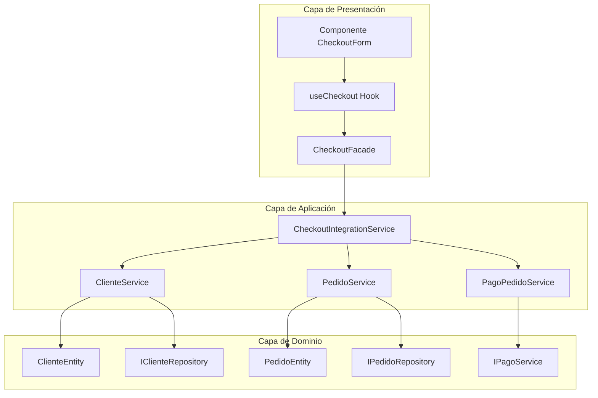

# Integración de Módulos - Mandorla

## Descripción General

Este documento describe cómo se integran los módulos de **Pedidos** y **Clientes** en el sistema de e-commerce Mandorla, siguiendo los principios de arquitectura hexagonal y SOLID.

## Arquitectura de Integración

### Módulo de Checkout

El módulo de **Checkout** actúa como orquestador entre los módulos de Pedidos y Clientes, proporcionando:

- **Servicios de Integración**: Coordinan las operaciones entre módulos
- **Facades**: Simplifican la interacción para la capa de presentación
- **Hooks de React**: Facilitan el uso en componentes de UI

### Flujo de Integración



## Componentes Principales

### 1. CheckoutIntegrationService

**Responsabilidad**: Orquestar el proceso completo de checkout integrando clientes y pedidos.

**Funcionalidades**:

- Validar cliente antes del pedido
- Crear pedido con datos del cliente
- Configurar pago con Mercado Pago
- Actualizar estadísticas del cliente

```typescript
class CheckoutIntegrationService {
  async procesarCheckout(datos: DatosCheckout): Promise<ResultadoCheckout>
  async validarClienteParaPedido(clienteId: string): Promise<boolean>
  async actualizarEstadisticasClientePostPedido(clienteId: string, pedido: PedidoEntity): Promise<void>
}
```

### 2. CheckoutFacade

**Responsabilidad**: Simplificar la interacción con el sistema de checkout para la UI.

**Funcionalidades**:

- Procesar checkout con DTOs simplificados
- Calcular costos de envío
- Obtener métodos de pago disponibles
- Validar clientes

```typescript
class CheckoutFacade {
  async procesarCheckout(request: CheckoutRequest): Promise<CheckoutResponse>
  async calcularCostoEnvio(direccion: DireccionBasica): Promise<CostoEnvio>
  obtenerMetodosPagoDisponibles(): MetodoPago[]
}
```

### 3. useCheckout Hook

**Responsabilidad**: Gestionar el estado del checkout en componentes React.

**Funcionalidades**:

- Estado de loading, error y éxito
- Funciones para procesar checkout
- Validaciones y cálculos
- Limpieza de estado

```typescript
function useCheckout(facade: CheckoutFacade): UseCheckoutReturn {
  // Estado y acciones para gestión de checkout
}
```

## Flujo de Datos

### 1. Proceso de Checkout

1. **Validación de Cliente**
   - Verificar que el cliente existe
   - Validar que puede realizar pedidos
   - Comprobar estado activo

2. **Creación de Pedido**
   - Convertir items del carrito a items de pedido
   - Aplicar datos de entrega
   - Calcular totales

3. **Configuración de Pago**
   - Si es Mercado Pago, crear preferencia
   - Configurar URLs de callback
   - Obtener init_point para redirección

4. **Actualización de Estadísticas**
   - Registrar nuevo pedido en cliente
   - Actualizar productos favoritos
   - Recalcular frecuencia de compra

### 2. Manejo de Errores

La integración maneja errores de forma jerárquica:

```typescript
// Errores específicos de dominio
ClienteNoEncontradoError
ClienteNoActivoError
PedidoNoEncontradoError
ErrorMercadoPagoError

// Errores de integración
ErrorCheckoutIntegracion
ErrorValidacionCliente
ErrorConfiguracionPago
```

## Patrones de Diseño Utilizados

### 1. Facade Pattern

El `CheckoutFacade` oculta la complejidad de la integración entre módulos, proporcionando una interfaz simple para la UI.

### 2. Service Layer Pattern

Los servicios de aplicación (`CheckoutIntegrationService`) coordinan las operaciones entre diferentes agregados de dominio.

### 3. Repository Pattern

Cada módulo mantiene su propio repositorio, respetando los límites del dominio.

### 4. Dependency Injection

Los servicios reciben sus dependencias a través del constructor, facilitando testing y flexibilidad.

## Configuración y Uso

### Configuración de Dependencias

```typescript
// En un container de DI real
const pedidoRepository = new DatabasePedidoRepository();
const clienteRepository = new DatabaseClienteRepository();
const pagoService = new MercadoPagoService();

const checkoutIntegration = new CheckoutIntegrationService(
  pedidoRepository,
  clienteRepository,
  pagoService
);

const checkoutFacade = new CheckoutFacade(checkoutIntegration);
```

### Uso en Componentes React

```tsx
function CheckoutPage() {
  const {
    procesarCheckout,
    loading,
    error,
    success
  } = useCheckout(checkoutFacade);

  const handleSubmit = async (datos) => {
    await procesarCheckout(datos);
  };

  return (
    <CheckoutForm
      onSubmit={handleSubmit}
      loading={loading}
      error={error}
    />
  );
}
```

## Beneficios de la Integración

### 1. Separación de Responsabilidades

- Cada módulo mantiene su responsabilidad específica
- La integración se maneja en una capa separada
- No hay dependencias circulares entre módulos

### 2. Testabilidad

- Cada servicio puede ser testeado independientemente
- Fácil creación de mocks para dependencias
- Tests de integración claros y enfocados

### 3. Mantenibilidad

- Cambios en un módulo no afectan directamente a otros
- Lógica de integración centralizada
- Fácil adición de nuevas funcionalidades

### 4. Escalabilidad

- Nuevos módulos pueden integrarse siguiendo el mismo patrón
- Facades pueden extenderse sin afectar la lógica de negocio
- Hooks reutilizables para diferentes componentes

## Consideraciones de Implementación

### 1. Mapeo de DTOs

La integración requiere mapeo entre DTOs de diferentes módulos. En una implementación completa, se recomienda:

- Crear mappers específicos para cada conversión
- Usar bibliotecas como AutoMapper para TypeScript
- Validar datos en cada conversión

### 2. Transacciones

Para operaciones que afectan múltiples agregados:

- Implementar patrón Saga para transacciones distribuidas
- Usar eventos de dominio para comunicación asíncrona
- Considerar eventual consistency

### 3. Performance

- Implementar caching para consultas frecuentes
- Usar lazy loading para datos no críticos
- Optimizar consultas a base de datos

## Próximos Pasos

1. **Implementar Infraestructura**
   - Repositorios concretos con base de datos
   - Servicio real de Mercado Pago
   - Sistema de eventos

2. **Agregar Testing**
   - Tests unitarios para cada servicio
   - Tests de integración para flujos completos
   - Tests E2E para UI

3. **Mejorar UX**
   - Estados de loading más granulares
   - Validaciones en tiempo real
   - Mejor manejo de errores

4. **Monitoreo**
   - Logging estructurado
   - Métricas de performance
   - Alertas para errores críticos
